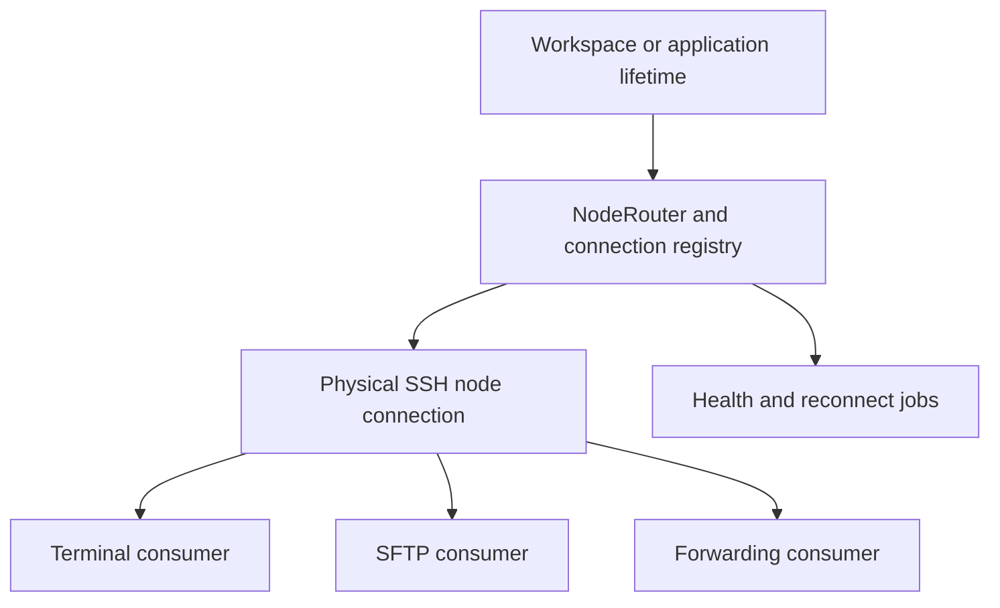

# OxideTerm Node Session Ownership

Use this skill whenever a change can alter which component creates, shares, closes, reconnects, or observes a remote session or background job.

## Core invariant

A connected SSH node is independent from any terminal pane that consumes it. UI lifetime must not silently become backend lifetime.



## Mandatory rules

- Node liveness belongs to the connection registry, `NodeRouter`, or an explicit node-disconnect operation.
- Closing a terminal pane removes that terminal consumer. It must not disconnect a shared node.
- SFTP must acquire a real node-backed SFTP session. A shell command that imitates file transfer is only a documented compatibility fallback.
- Port forwarding owns its listener and bridge tasks. Those tasks must remain alive without an open terminal pane and must stop when the forwarding rule or owning node stops.
- Reconnect, health checks, grace periods, and child-process bridges need an explicit owner and cancellation path tied to node, workspace, or application lifetime.
- Long-lived work must not run on a one-shot runtime that is dropped when a command handler returns.
- A child node connected through a jump host must retain the parent connection for as long as the child transport needs it.
- UI components observe runtime state through router or registry events. They must not infer node liveness from terminal existence.
- Add concise English comments at ownership transfers: creation, sharing, invalidation, reacquisition, cancellation, and deliberate survival after UI teardown.

## Forbidden bypasses

- Do not open a second unmanaged SSH transport because a node-backed API is inconvenient.
- Do not find a connection by selecting the first terminal pane associated with a host.
- Do not store a long-lived task only in a temporary dialog, command handler, or terminal view.
- Do not mark a node disconnected merely because one channel, pane, SFTP request, or forwarding consumer closes.
- Do not leave spawned child processes or Tokio tasks detached without a shutdown signal and a bounded completion path.

## Recommended practices

- Express each backend dependency as a consumer or owner in the registry instead of relying on incidental `Arc` retention.
- Keep physical transport state on the connection entry and logical topology in `NodeRouter`.
- Make disconnect cascades follow recorded parent-child connection identities, not matching host strings.
- Keep task handles or cancellation senders on the object whose lifetime defines the job.
- Prefer event-driven UI updates over polling terminal state.

## Compatibility paths

Compatibility fallbacks are allowed only when they are explicit, bounded, and reported accurately. They must not be described as a native SFTP, forwarding, or node-session implementation. Record the owner and cleanup path even for temporary fallbacks.

## Examples

Incorrect:

```rust
// Closing the pane accidentally destroys the only owner of the shared node.
struct TerminalPane {
    ssh_transport: SshTransport,
}
```

Correct shape:

```rust
// The pane owns only its consumer registration; the registry owns transport liveness.
struct TerminalPane {
    connection_id: String,
    terminal_consumer: ConnectionConsumer,
}
```

Incorrect:

```rust
tokio::runtime::Runtime::new()?.spawn(run_forward_listener());
// The runtime is dropped when the command returns.
```

Correct shape:

```rust
// The forwarding owner retains both cancellation and completion handles.
struct ForwardingJob {
    shutdown_tx: Option<oneshot::Sender<()>>,
    worker: JoinHandle<()>,
}
```

## Review checklist

1. Identify the physical connection owner.
2. List every terminal, SFTP, forwarding, reconnect, health, and child-node consumer.
3. Verify that closing one consumer does not close unrelated consumers.
4. Verify that explicit node disconnect stops dependent jobs and child transports.
5. Inspect every spawned task or process for a retained owner, cancellation signal, and cleanup path.
6. Check that UI state consumes node events rather than terminal-derived liveness.
7. State any remaining compatibility fallback precisely.

## Verification

- Close the last terminal and prove the node remains usable by another registered consumer.
- Open SFTP without requiring a terminal pane.
- Start local, remote, and dynamic forwarding and verify listeners survive pane closure.
- Disconnect a parent node and verify dependent child nodes and jobs transition consistently.
- Reconnect within the grace period without losing unrelated UI state.
- Confirm that task/process cleanup completes after explicit disconnect and application shutdown.
