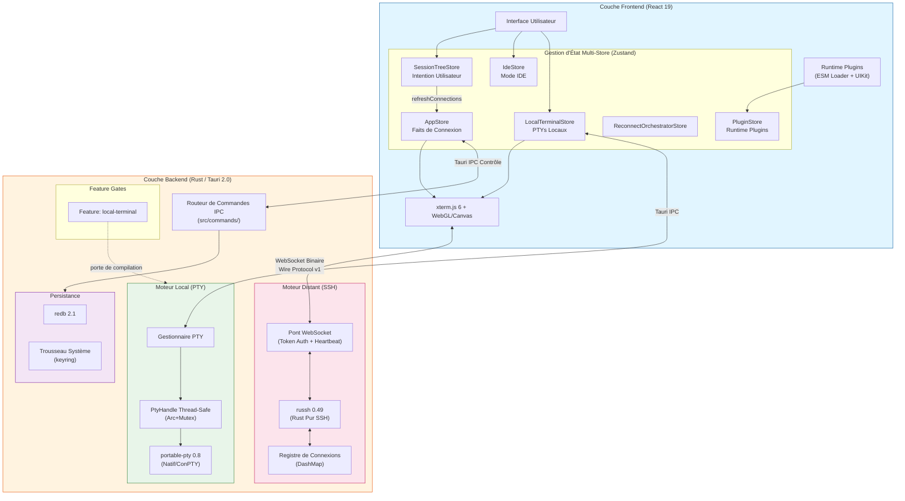

<p align="center">
  
</p>

<h1 align="center">⚡ OxideTerm</h1>

<p align="center">
  <strong>Moteur de Terminal Universel en Rust</strong>
  <br>
  <em>Évolué d'un connecteur distant vers une solution terminal multiplateforme</em>
</p>

<p align="center">
  
  
  
  
  
</p>

<p align="center">
  <a href="README.md">English</a> | <a href="README.zh-CN.md">简体中文</a> | <a href="README.fr.md">Français</a>
</p>

---

## 📖 Évolution Fondamentale

OxideTerm v1.6.2 représente une refonte architecturale complète. Nous ne sommes plus seulement un client SSH, mais un **moteur de terminal** avec plus de **90 000 lignes** de code Rust + TypeScript méticuleusement conçu.

### ⚙️ Percée Backend : Terminal Local & Modèle de Concurrence
Nous avons introduit un support de terminal local basé sur `portable-pty`, résolvant complètement les défis de concurrence dans le runtime async de Rust :
- **Encapsulation Thread-Safe** : Envelopper `MasterPty` non-`Sync` avec `std::sync::Mutex` et implémenter manuellement le trait `unsafe impl Sync` pour construire un `PtyHandle` thread-safe.
- **Threads I/O Dédiés** : Allocation de handles de lecture/écriture indépendants (`Arc<Mutex<Box<dyn Read + Send>>>`) pour chaque session PTY garantit que les I/O bloquantes n'affectent jamais la boucle d'événements principale de Tokio.
- **Cohérence Multiplateforme** : Unification des différences sous-jacentes entre macOS/Linux (PTY) et Windows (ConPTY), exposant une interface de streaming standardisée.

### 🧩 Architecture Noyau : Feature Gating
Pour supporter les futures constructions mobiles (iOS/Android ne supportent pas le PTY natif), nous avons refactoré le système de build :
- **Build Modulaire** : La fonctionnalité PTY est encapsulée dans la feature `local-terminal`.
- **Compilation à la Demande** : Utilisez `cargo build --no-default-features` pour supprimer complètement les dépendances `portable-pty`, générant un noyau léger contenant seulement les fonctionnalités SSH/SFTP (ouvrant la voie au portage mobile).

### ⚛️ Évolution Frontend : Architecture Multi-Store
Face aux besoins de gestion d'état drastiquement différents entre sessions locales, distantes et IDE, le frontend adopte un modèle **Multi-Store** :
- **SessionTreeStore** : Couche d'intention utilisateur — structure arborescente, flux de connexion, organisation des sessions.
- **AppStore** : Couche factuelle — état réel des connexions SSH via `connections` Map, synchronisé depuis SessionTreeStore.
- **IdeStore** : Gestion d'état du mode IDE, incluant l'édition de fichiers distants, le suivi de statut Git et l'éditeur multi-onglets.
- **LocalTerminalStore** : Gestion du cycle de vie des instances PTY locales, surveillance des processus Shell et pipelines I/O indépendants.
- **ReconnectOrchestratorStore** : Orchestration du pipeline de reconnexion automatique (snapshot → ssh-connect → await-terminal → restore).
- **TransferStore / PluginStore / ProfilerStore / AiChatStore / SettingsStore** : Stores spécialisés pour les transferts SFTP, le runtime de plugins, le profilage de ressources, le chat AI et les paramètres.
- **Couche de Vue Unifiée** : Malgré différentes sources d'état, la logique de rendu est unifiée via les composants `TerminalView` et `IdeView` au niveau UI.

---

## 🏗️ Architecture Système

v1.6.2 emploie une architecture de flux de données hybride qui route intelligemment le trafic selon le type de session :



---

## 🔥 Capacités Fondamentales Différenciées

OxideTerm ne fait aucun compromis dans le polissage des détails sous-jacents, offrant une expérience de qualité industrielle.

### 🛡️ Pool de Connexions Intelligent
Nous avons construit un `SshConnectionRegistry` basé sur le comptage de références implémentant un véritable SSH Multiplexing :
- **Réutilisation de Connexion** : Plusieurs fenêtres de terminal, tâches de transfert SFTP et règles de redirection de ports partagent une seule connexion SSH physique—poignée de main une seule fois.
- **Isolation des Ressources** : Chaque connexion physique a sa propre machine d'état et son ordonnanceur de tâches, fonctionnant indépendamment.
- **Cycle de Vie Intelligent** : Gère automatiquement le timeout d'inactivité (30 min) et le keep-alive (intervalle de 15s). Pendant les fluctuations réseau, entre automatiquement en mode verrouillage d'entrée et tente une reconnexion transparente, maximisant la préservation du contexte.

### 📡 ProxyJump Conscient de la Topologie
- **Sauts en Chaîne Illimitée** : Supporte une cascade de profondeur arbitraire comme `Client -> Saut A -> Saut B -> Cible`.
- **Graphe de Routage Intelligent** : Parse automatiquement SSH Config, construit la topologie de connexion et calcule les chemins optimaux.
- **Réutilisation de Nœuds Logiques** : Les nœuds de saut peuvent eux-mêmes fonctionner comme des sessions indépendantes et être réutilisés par les connexions en aval, réduisant drastiquement la surcharge de poignée de main redondante.

### 🪟 Optimisation Profonde Windows
- **Intégration ConPTY Native** : Abandonnant le WinPTY obsolète, invoquant directement l'API Windows Pseudo Console (ConPTY) pour un support parfait de TrueColor et des séquences d'échappement ANSI.
- **Détection Intelligente de Shell** : Moteur de scan intégré détectant automatiquement **PowerShell 7 (pwsh)**, **Git Bash**, **WSL2** et CMD traditionnel via le Registre et PATH.
- **Expérience Native** : Adaptations spéciales pour le gestionnaire de fenêtres Windows, avec Rust gérant directement les événements de fenêtre—vitesse de réponse dépassant largement les applications Electron.

### 🔐 Chiffrement de Niveau Militaire
- **Format de Fichier .oxide** :
  - **ChaCha20-Poly1305 AEAD** : Chiffrement authentifié empêchant les attaques de falsification et de replay.
  - **Argon2id KDF** : Fonction de dérivation de clé (coût mémoire 256MB, 4 itérations) résistant au brute-force GPU.
  - **Somme de Contrôle SHA-256** : Vérification d'intégrité double détectant toute corruption de données.
  - **[v1.4.4+] Intégration de Clés Privées** : Intégration optionnelle de clés privées pour des sauvegardes entièrement portables.
  - **[v1.4.4+] Vérification Préalable** : Analyse intelligente des connexions sélectionnées avec répartition des types d'authentification et détection des clés manquantes.
  - **Design Git-Friendly** : Métadonnées stockées en clair, supportant le déchiffrement hors ligne.

### 📊 Tampon de Défilement Backend
- **Persistance Haute Capacité** : **100 000 lignes** par défaut de sortie terminal, sérialisable sur disque (format MessagePack).
- **Recherche Haute Performance** : `spawn_blocking` isole les tâches de recherche regex, évitant de bloquer le runtime Tokio.
- **Efficacité Mémoire** : Design de tampon circulaire évacuant automatiquement les données les plus anciennes, gardant l'utilisation mémoire contrôlée.

### 🔀 Redirection de Ports Complète
- **Redirection Locale (-L)** : Mapper les services distants vers les ports locaux (ex : débogage de base de données).
- **Redirection Distante (-R)** : Exposer les services locaux aux réseaux distants (ex : pénétration intranet).
- **Proxy Dynamique (-D)** : Implémentation complète du protocole SOCKS5 supportant IPv4/IPv6/résolution de domaine, associée aux canaux `direct-tcpip` pour un proxy transparent.
- **Surveillance de Santé** : Stats en temps réel sur les connexions, le débit et les sessions actives.
- **Rapport de Décès** : Les tâches de transfert signalent activement les changements d'état lorsque SSH se déconnecte.
- **I/O Sans Verrou** : Utilise une architecture de passage de messages au lieu de `Arc<Mutex<Channel>>`, éliminant la contention de verrou.

### 🤖 Assistant Terminal AI
- **Double Mode** : Panneau rapide inline (`⌘I`) + Chat persistant dans la barre latérale avec historique des conversations.
- **API Compatible OpenAI** : Supporte OpenAI, Ollama, DeepSeek, OneAPI et tous les endpoints compatibles.
- **Capture de Contexte Intelligente** : Capture automatiquement le contenu du tampon terminal via le pattern Terminal Registry.
- **Insertion de Code** : Insertion en un clic des commandes générées par l'AI dans le terminal actif (multiligne supporté via bracketed paste).
- **Réponse en Streaming** : Affichage en temps réel du contenu généré via Server-Sent Events (SSE).
- **Priorité à la Vie Privée** : Clés API stockées dans le trousseau système (macOS Keychain / Windows Credential Manager), jamais routées via des tiers.

---

## 🛠️ Stack Technique (v1.6.2)

| Couche | Technologie Clé | Description |
|--------|----------------|-------------|
| **Core** | **Tauri 2.0** | Framework d'application multiplateforme nouvelle génération |
| **Runtime** | **Tokio** | Runtime Rust async complet, associé à `dashmap` pour les maps concurrentes |
| **Noyau Local** | **portable-pty 0.8** | Abstraction PTY multiplateforme implémentant le modèle de threading `Sync` + `Send` |
| **Noyau Distant** | **russh 0.49** | Implémentation SSH en Rust pur, sans dépendances C, sécurisé en mémoire |
| **SFTP** | **russh-sftp 2.0** | Protocole de Transfert de Fichiers SSH |
| **WebSocket** | **tokio-tungstenite 0.24** | Implémentation WebSocket async |
| **Frontend** | **React 19** | Développement UI type-safe avec TypeScript 5.8 |
| **État** | **Zustand 5** | Architecture Multi-Store (10 stores spécialisés), séparation des préoccupations |
| **Rendu** | **xterm.js 6 + WebGL/Canvas** | Rendu accéléré GPU, sortie haute fréquence 60fps+ |
| **Protocole** | **Wire Protocol v1** | Binaire `[Type:1][Longueur:4][Charge:n]` via WebSocket, Tauri IPC pour le contrôle |
| **Éditeur** | **CodeMirror 6** | Édition de fichiers distants avec 30+ modes de langage (14 natifs + legacy modes) |
| **Chiffrement** | **ChaCha20-Poly1305 + Argon2id** | Chiffrement authentifié AEAD + dérivation de clé à dureté mémoire |
| **Persistance** | **redb 2.1** | Base de données embarquée pour le stockage de configuration |
| **Sérialisation** | **MessagePack (rmp-serde)** | Sérialisation binaire efficace |
| **Plugins** | **ESM Runtime** | Chargement dynamique de plugins avec API PluginContext gelée |

---

## ✨ Points Forts des Fonctionnalités

### 🚀 Expérience Terminal Hybride
- **Shell Local à Latence Nulle** : Interaction IPC directe avec les processus Shell locaux, latence quasi nulle.
- **SSH Distant Haute Performance** : Transmission de flux binaire basée sur WebSocket, contournant la surcharge HTTP traditionnelle.
- **Conscience Environnementale Intelligente** : Détecte automatiquement les shells installés comme `zsh`, `bash`, `fish`, `powershell`.
- **Héritage Environnemental Complet** : Hérite de PATH utilisateur, HOME et autres variables d'environnement, correspondant à l'expérience du terminal système.

### 🔐 Méthodes d'Authentification Diverses
- **Auth par Mot de Passe** : Stockage sécurisé dans le trousseau système.
- **Auth par Clé** : Supporte RSA / Ed25519 / ECDSA.
- **Détection de Clé par Défaut** : Scanne automatiquement `~/.ssh/id_*`.
- **Auth par Certificat** : Certificats OpenSSH (expérimental).
- **2FA/MFA** : Authentification interactive Keyboard-Interactive (expérimental).
- **Known Hosts** : Vérification et gestion des clés d'hôte.

### 💻 Mode IDE (v1.3.0)
Édition de code distante sans dépendance serveur—aucune installation côté serveur requise :
- **Navigateur d'Arborescence** : Chargement paresseux SFTP avec indicateurs de statut Git.
- **Éditeur de Code** : Basé sur CodeMirror 6, supportant 30+ langages avec coloration syntaxique.
- **Gestion Multi-Onglets** : Stratégie de cache LRU, détection d'état modifié, résolution de conflits.
- **Terminal Intégré** : Terminal en panneau inférieur avec partage de session.
- **Statut Git Piloté par Événements** : Rafraîchissement auto lors de sauvegarde/création/suppression/renommage/commande terminal.

### 🔍 Recherche Plein-Texte
Recherche de contenu de fichiers à l'échelle du projet avec mise en cache intelligente :
- **Recherche en Temps Réel** : Entrée avec debounce 300ms et résultats instantanés.
- **Mise en Cache des Résultats** : Cache TTL 60 secondes pour éviter les scans répétés.
- **Regroupement des Résultats** : Groupés par fichier avec positionnement par numéro de ligne.
- **Mise en Surbrillance** : Termes de recherche surlignés dans les aperçus.
- **Effacement Auto** : Cache de recherche effacé automatiquement lors des changements de fichiers.

### 📦 Gestion de Fichiers Avancée
- **Protocole SFTP v3** : Gestionnaire de fichiers double panneau complet.
- **Transferts par Glisser-Déposer** : Supporte les opérations par lot multi-fichiers et dossiers.
- **Aperçu Intelligent** :
  - 🎨 Images (JPEG/PNG/GIF/WebP)
  - 🎬 Vidéos (MP4/WebM)
  - 💻 Coloration syntaxique (30+ langages)
  - 📄 Documents PDF
  - 🔍 Visualiseur Hex (fichiers binaires)
- **Suivi de Progression** : Vitesse de transfert en temps réel, barres de progression, ETA.

### 🌍 Internationalisation (i18n)
Internationalisation complète de l'UI supportant 11 langues :
- **Langues** : English, 简体中文, 繁體中文, 日本語, Français, Deutsch, Español, Italiano, 한국어, Português, Tiếng Việt.
- **Chargement Dynamique** : Chargement à la demande des packs de langue via i18next.
- **Type-Safe** : Définitions de types TypeScript pour toutes les clés de traduction.

### 🌐 Optimisation Réseau
- **Architecture Dual-Plane** : Séparation du plan de données (direct WebSocket) et du plan de contrôle (IPC Tauri).
- **Protocole Binaire Personnalisé** : `[Type:1][Longueur:4][Charge:n]`, pas de surcharge de sérialisation JSON.
- **Contrôle de Contre-Pression** : Empêche le débordement mémoire.
- **Reconnexion Auto** : Réessai avec recul exponentiel, jusqu'à 5 tentatives.

---

## 🚀 Démarrage Rapide

### Exigences
- **Rust** : 1.75+ (requis)
- **Node.js** : 18+
- **Outils de Build** : 
  - macOS : XCode Command Line Tools
  - Windows : Visual Studio C++ Build Tools
  - Linux : build-essential

### Build de Développement

```bash
# Cloner le dépôt
git clone https://github.com/AnalyseDeCircuit/OxideTerm.git
cd OxideTerm

# Installer les dépendances
pnpm install

# Démarrer l'environnement de dev complet (avec support PTY local)
pnpm tauri dev

# Construire la version production
pnpm tauri build

# Construire le noyau optimisé mobile (supprimer PTY)
cd src-tauri
cargo build --no-default-features --release
```

### Exigences Système
- **Mémoire** : Recommandé 4GB+ disponible
- **Stockage** : Au moins 500MB d'espace disponible
- **Réseau** : Support de connexion WebSocket

---

## 🗺️ Feuille de Route

### ✅ Complété (v1.6.2)
- [x] Support de terminal local (PTY)
- [x] Pool de connexions SSH & multiplexage
- [x] Mécanisme de reconnexion auto
- [x] ProxyJump bastion illimité
- [x] Redirection de ports (local/distant/dynamique)
- [x] Gestion de fichiers SFTP & aperçu
- [x] Export chiffré .oxide
- [x] Tampon de défilement backend
- [x] Assistant terminal AI (inline + chat latéral)
- [x] Auth Keyboard-Interactive (expérimental)
- [x] Capture de contexte terminal pour AI
- [x] Support i18n (11 langues)
- [x] Système de plugins runtime (PluginContext + UI Kit)
- [x] Clés API AI stockées dans le trousseau système
- [x] Détection d'environnement distant pour l'IA
- [x] Fractionnement de terminal (panneaux divisés avec raccourcis clavier)

### 🚧 En Cours
- [ ] Palette de commandes (`⌘K`)
- [ ] Recherche & filtrage de sessions

### 📋 Planifié
- [ ] Transfert SSH Agent (en attente de l'implémentation russh upstream)
- [ ] Enregistrement & lecture de sessions
- [ ] Transfert X11
- [ ] Adaptation mobile (iOS/Android)

---

## 🔒 Considérations de Sécurité

### Stockage des Identifiants
- **Fichiers de Config Locaux** : Configurations de connexion sauvegardées dans `~/.oxideterm/connections.json` (Windows : `%APPDATA%\OxideTerm`)
- **Stockage Séparé des Mots de Passe** : Les fichiers de config stockent uniquement les IDs de référence du trousseau (comme `oxideterm-{uuid}`), les mots de passe réels stockés dans le trousseau système (macOS Keychain / Windows Credential Manager / Linux libsecret)
- **Clés API AI** : Stockées dans le trousseau système sous le service `com.oxideterm.ai` — même protection OS que les mots de passe SSH (depuis v1.6.0)
- **Double Protection** : Même si les fichiers de config fuient, les attaquants ne peuvent pas accéder aux vrais mots de passe ni aux clés API

### Clés d'Hôte SSH
- Vérification d'empreinte d'hôte lors de la première connexion
- Stocké dans `~/.ssh/known_hosts`

### Sécurité Mémoire
- Utilise le crate `zeroize` pour effacer en toute sécurité les données sensibles
- Le compilateur Rust garantit la sécurité mémoire, éliminant les débordements de tampon

---

## 📝 Licence

Ce projet est sous licence **PolyForm Noncommercial 1.0.0**.

- ✅ **Usage Personnel/Non-Lucratif** : Complètement gratuit.
- 🚫 **Usage Commercial** : Nécessite une licence commerciale.
- ⚖️ **Défense de Brevet** : Inclut une clause de rétorsion de brevet (Clause Nucléaire) pour protéger l'écosystème open-source.

Texte complet de la licence : https://polyformproject.org/licenses/noncommercial/1.0.0/

---

## 🙏 Remerciements

Remerciements spéciaux à ces projets open-source :

- [russh](https://github.com/warp-tech/russh) - Implémentation SSH en Rust pur
- [portable-pty](https://github.com/wez/wezterm/tree/main/pty) - Abstraction PTY multiplateforme
- [Tauri](https://tauri.app/) - Framework d'application multiplateforme
- [xterm.js](https://xtermjs.org/) - Émulateur de terminal Web
- [Radix UI](https://www.radix-ui.com/) - Composants UI accessibles

---

<p align="center">
  <sub>Construit avec ❤️ en utilisant Rust et Tauri | 90 000+ Lignes de Code</sub>
</p>
