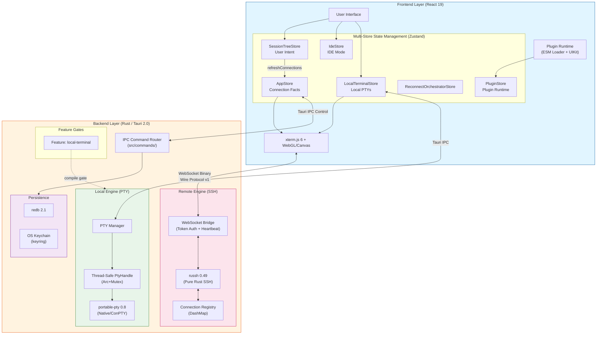

<p align="center">
  
</p>

<h1 align="center">⚡ OxideTerm</h1>

<p align="center">
  <strong>Rust-powered Universal Terminal Engine</strong>
  <br>
  <em>Evolved from a remote connector to a cross-platform terminal solution</em>
</p>

<p align="center">
  
  
  
  
  
</p>

<p align="center">
  <a href="README.md">English</a> | <a href="README.zh-CN.md">简体中文</a> | <a href="README.fr.md">Français</a>
</p>

---

## 📖 Core Evolution

OxideTerm v1.6.2 represents a complete architectural overhaul. We are no longer just an SSH client, but a **terminal engine** with over **90,000 lines** of meticulously crafted Rust + TypeScript code.

### ⚙️ Backend Breakthrough: Local Terminal & Concurrency Model
We've introduced local terminal support based on `portable-pty`, completely solving concurrency challenges in Rust's async runtime:
- **Thread-Safe Encapsulation**: Wrapping non-`Sync` `MasterPty` with `std::sync::Mutex` and manually implementing `unsafe impl Sync` trait to build thread-safe `PtyHandle`.
- **Dedicated I/O Threads**: Allocating independent read/write handles (`Arc<Mutex<Box<dyn Read + Send>>>`) for each PTY session ensures blocking I/O never affects the Tokio main event loop.
- **Cross-Platform Consistency**: Unified macOS/Linux (PTY) and Windows (ConPTY) underlying differences, exposing a standardized streaming interface.

### 🧩 Kernel Architecture: Feature Gating
To support future mobile builds (iOS/Android don't support native PTY), we've refactored the build system:
- **Modular Build**: Core PTY functionality is encapsulated in the `local-terminal` feature.
- **On-Demand Compilation**: Use `cargo build --no-default-features` to completely strip `portable-pty` dependencies, generating a lightweight kernel containing only SSH/SFTP functionality (clearing the path for mobile porting).

### ⚛️ Frontend Evolution: Multi-Store Architecture
Facing drastically different state management needs for local, remote, and IDE sessions, the frontend adopts a **Multi-Store** pattern:
- **SessionTreeStore**: User intent layer — tree structure, connection flow, session organization.
- **AppStore**: Fact layer — actual SSH connection state via `connections` Map, synced from SessionTreeStore.
- **IdeStore**: IDE mode state management, including remote file editing, Git status tracking, and multi-tab editor.
- **LocalTerminalStore**: Local PTY instance lifecycle management, Shell process monitoring, and independent I/O pipelines.
- **ReconnectOrchestratorStore**: Auto-reconnect pipeline orchestration (snapshot → ssh-connect → await-terminal → restore).
- **TransferStore / PluginStore / ProfilerStore / AiChatStore / SettingsStore**: Domain-specific stores for SFTP transfers, plugin runtime, resource profiling, AI chat, and settings.
- **Unified View Layer**: Despite different state sources, rendering logic is unified through the `TerminalView` and `IdeView` components at the UI level.

---

## 🏗️ System Architecture

v1.6.2 employs a hybrid dataflow architecture that intelligently routes traffic based on session type:



---

## 🔥 Differentiated Core Capabilities

OxideTerm is uncompromising in polishing underlying details, delivering an industrial-grade experience.

### 🛡️ Intelligent Connection Pool
We've built a reference-counted `SshConnectionRegistry` implementing true SSH Multiplexing:
- **Connection Reuse**: Multiple terminal windows, SFTP transfer tasks, and port forwarding rules share a single physical SSH connection—handshake only once.
- **Resource Isolation**: Each physical connection has its own state machine and task scheduler, operating independently.
- **Intelligent Lifecycle**: Auto-manages idle timeout (30 min) and keep-alive (15s interval). During network fluctuations, automatically enters input lock mode and attempts seamless reconnection, maximizing context preservation.

### 📡 Topology-Aware ProxyJump
- **Unlimited Chain Jumps**: Supports arbitrary depth cascading like `Client -> Jump A -> Jump B -> Target`.
- **Intelligent Routing Graph**: Auto-parses SSH Config, builds connection topology, and calculates optimal paths.
- **Logical Node Reuse**: Jump nodes themselves can operate as independent sessions and be reused by downstream connections, drastically reducing redundant handshake overhead.

### 🪟 Deep Windows Optimization
- **Native ConPTY Integration**: Ditching outdated WinPTY, directly invoking Windows Pseudo Console (ConPTY) API for perfect TrueColor and ANSI escape sequence support.
- **Intelligent Shell Detection**: Built-in scanning engine auto-detects **PowerShell 7 (pwsh)**, **Git Bash**, **WSL2**, and legacy CMD via Registry and PATH.
- **Native Experience**: Special adaptations for Windows window manager, with Rust directly handling window events—response speed far exceeds Electron apps.

### 🔐 Military-Grade Encryption
- **.oxide File Format**:
  - **ChaCha20-Poly1305 AEAD**: Authenticated encryption preventing tampering and replay attacks.
  - **Argon2id KDF**: Key derivation function (256MB memory cost, 4 iterations) resisting GPU brute-force.
  - **SHA-256 Checksum**: Dual integrity verification detecting any data corruption.
  - **[v1.4.4+] Embed Private Keys**: Optional private key embedding for fully portable backups.
  - **[v1.4.4+] Pre-flight Check**: Smart analysis of selected connections with authentication type breakdown and missing key detection.
  - **Git-Friendly Design**: Metadata stored in plaintext, supporting offline decryption.

### 📊 Backend Scroll Buffer
- **High-Capacity Persistence**: Default **100,000 lines** of terminal output, serializable to disk (MessagePack format).
- **High-Performance Search**: `spawn_blocking` isolates regex search tasks, avoiding blocking Tokio runtime.
- **Memory Efficient**: Circular buffer design auto-evicts oldest data, keeping memory usage controlled.

### 🔀 Full-Featured Port Forwarding
- **Local Forward (-L)**: Map remote services to local ports (e.g., database debugging).
- **Remote Forward (-R)**: Expose local services to remote networks (e.g., intranet penetration).
- **Dynamic Proxy (-D)**: Complete SOCKS5 protocol implementation supporting IPv4/IPv6/domain resolution, paired with `direct-tcpip` channels for transparent proxying.
- **Health Monitoring**: Real-time stats on connections, throughput, and active sessions.
- **Death Reporting**: Forward tasks actively report status changes when SSH disconnects.
- **Lock-Free I/O**: Uses message-passing architecture instead of `Arc<Mutex<Channel>>`, eliminating lock contention.

### 🤖 AI Terminal Assistant
- **Dual Mode**: Inline quick panel (`⌘I`) + Sidebar persistent chat with conversation history.
- **OpenAI-Compatible API**: Supports OpenAI, Ollama, DeepSeek, OneAPI, and any compatible endpoints.
- **Smart Context Capture**: Auto-captures terminal buffer content via Terminal Registry pattern.
- **Code Insertion**: One-click insert AI-generated commands into active terminal (multiline supported via bracketed paste).
- **Streaming Response**: Real-time display of generated content via Server-Sent Events (SSE).
- **Privacy First**: API Keys stored in system keychain (macOS Keychain / Windows Credential Manager), never routed through third parties.

---

## 🛠️ Tech Stack (v1.6.2)

| Layer | Key Technology | Description |
|-------|---------------|-------------|
| **Core** | **Tauri 2.0** | Next-gen cross-platform app framework |
| **Runtime** | **Tokio** | Full async Rust runtime, paired with `dashmap` for concurrent maps |
| **Local Kernel** | **portable-pty 0.8** | Cross-platform PTY abstraction implementing `Sync` + `Send` threading model |
| **Remote Kernel** | **russh 0.49** | Pure Rust SSH implementation, no C dependencies, memory-safe |
| **SFTP** | **russh-sftp 2.0** | SSH File Transfer Protocol |
| **WebSocket** | **tokio-tungstenite 0.24** | Async WebSocket implementation |
| **Frontend** | **React 19** | Type-safe UI development with TypeScript 5.8 |
| **State** | **Zustand 5** | Multi-Store architecture (10 specialized stores), separation of concerns |
| **Rendering** | **xterm.js 6 + WebGL/Canvas** | GPU-accelerated rendering, 60fps+ high framerate output |
| **Protocol** | **Wire Protocol v1** | Binary `[Type:1][Length:4][Payload:n]` over WebSocket, Tauri IPC for control |
| **Editor** | **CodeMirror 6** | Remote file editing with 30+ language modes (14 native + legacy modes) |
| **Encryption** | **ChaCha20-Poly1305 + Argon2id** | AEAD authenticated encryption + memory-hard key derivation |
| **Persistence** | **redb 2.1** | Embedded database for config storage |
| **Serialization** | **MessagePack (rmp-serde)** | Efficient binary serialization |
| **Plugins** | **ESM Runtime** | Dynamic plugin loading with frozen PluginContext API |

---

## ✨ Feature Highlights

### 🚀 Hybrid Terminal Experience
- **Zero-Latency Local Shell**: Direct IPC interaction with local Shell processes, near-zero latency.
- **High-Performance Remote SSH**: WebSocket-based binary stream transmission, bypassing traditional HTTP overhead.
- **Intelligent Environment Awareness**: Auto-detects installed shells like `zsh`, `bash`, `fish`, `powershell`.
- **Complete Environment Inheritance**: Inherits user PATH, HOME, and other environment variables, matching system terminal experience.

### 🔐 Diverse Authentication Methods
- **Password Auth**: Securely stored in system keychain.
- **Key Auth**: Supports RSA / Ed25519 / ECDSA.
- **Default Key Detection**: Auto-scans `~/.ssh/id_*`.
- **Certificate Auth**: OpenSSH Certificates (experimental).
- **2FA/MFA**: Keyboard-Interactive authentication (experimental).
- **Known Hosts**: Host key verification and management.

### 💻 IDE Mode (v1.3.0)
Zero-dependency remote code editing—no server-side installation required:
- **File Tree Browser**: SFTP-driven lazy loading with Git status indicators.
- **Code Editor**: Based on CodeMirror 6, supporting 30+ languages with syntax highlighting.
- **Multi-Tab Management**: LRU cache strategy, dirty state detection, conflict resolution.
- **Integrated Terminal**: Bottom panel terminal with session sharing.
- **Event-Driven Git Status**: Auto-refresh on file save/create/delete/rename/terminal command.

### 🔍 Full-Text Search
Project-wide file content search with intelligent caching:
- **Real-Time Search**: 300ms debounced input with instant results.
- **Result Caching**: 60-second TTL cache to avoid repeated scans.
- **Result Grouping**: Grouped by file with line number positioning.
- **Highlight Matching**: Search terms highlighted in preview snippets.
- **Auto-Clear**: Search cache automatically cleared on file changes.

### 📦 Advanced File Management
- **SFTP v3 Protocol**: Full dual-pane file manager.
- **Drag-and-Drop Transfers**: Supports multi-file and folder batch operations.
- **Intelligent Preview**:
  - 🎨 Images (JPEG/PNG/GIF/WebP)
  - 🎬 Videos (MP4/WebM)
  - 💻 Code highlighting (30+ languages)
  - 📄 PDF documents
  - 🔍 Hex viewer (binary files)
- **Progress Tracking**: Real-time transfer speed, progress bars, ETA.

### 🌍 Internationalization (i18n)
Full UI internationalization supporting 11 languages:
- **Languages**: English, 简体中文, 繁體中文, 日本語, Français, Deutsch, Español, Italiano, 한국어, Português, Tiếng Việt.
- **Dynamic Loading**: On-demand language pack loading via i18next.
- **Type-Safe**: TypeScript type definitions for all translation keys.

### 🌐 Network Optimization
- **Dual-Plane Architecture**: Separation of data plane (WebSocket direct) and control plane (Tauri IPC).
- **Custom Binary Protocol**: `[Type:1][Length:4][Payload:n]`, no JSON serialization overhead.
- **Backpressure Control**: Prevents memory overflow.
- **Auto-Reconnect**: Exponential backoff retry, up to 5 attempts.

---

## 🚀 Quick Start

### Requirements
- **Rust**: 1.75+ (required)
- **Node.js**: 18+
- **Build Tools**: 
  - macOS: XCode Command Line Tools
  - Windows: Visual Studio C++ Build Tools
  - Linux: build-essential

### Development Build

```bash
# Clone repository
git clone https://github.com/AnalyseDeCircuit/OxideTerm.git
cd OxideTerm

# Install dependencies
pnpm install

# Start full dev environment (with local PTY support)
pnpm tauri dev

# Build production version
pnpm tauri build

# Build mobile-optimized kernel (strip PTY)
cd src-tauri
cargo build --no-default-features --release
```

### System Requirements
- **Memory**: Recommended 4GB+ available
- **Storage**: At least 500MB available space
- **Network**: WebSocket connection support

---

## 📁 Project Structure

```
OxideTerm/
├── src/                        # Frontend (React/TypeScript)
│   ├── components/             # UI Components
│   │   ├── ui/                 # Atomic components (Radix UI)
│   │   ├── terminal/           # Terminal views
│   │   ├── sftp/               # SFTP file browser
│   │   ├── ide/                # IDE mode (editor, file tree, dialogs)
│   │   ├── ai/                 # AI chat (sidebar + inline)
│   │   ├── plugin/             # Plugin manager UI
│   │   ├── forwards/           # Port forwarding management
│   │   ├── connections/        # Connection creation & management
│   │   ├── sessions/           # Session tabs & switching
│   │   ├── sessionManager/     # Session lifecycle UI
│   │   ├── topology/           # Network topology visualization
│   │   ├── settings/           # Settings UI (tab mode)
│   │   ├── layout/             # Sidebar, header, split panes
│   │   ├── local/              # Local terminal components
│   │   ├── editor/             # Code editor components
│   │   ├── fileManager/        # Local file browser
│   │   └── modals/             # Modal dialogs
│   ├── store/                  # Zustand state management (10 stores)
│   │   ├── sessionTreeStore.ts # User intent (tree, connection flow)
│   │   ├── appStore.ts         # Connection facts (synced from tree)
│   │   ├── ideStore.ts         # IDE mode state
│   │   ├── localTerminalStore.ts  # Local PTY state
│   │   ├── reconnectOrchestratorStore.ts  # Auto-reconnect pipeline
│   │   ├── transferStore.ts    # SFTP transfer queue
│   │   ├── pluginStore.ts      # Plugin runtime state
│   │   ├── profilerStore.ts    # Resource profiler metrics
│   │   ├── settingsStore.ts    # Application settings
│   │   └── aiChatStore.ts      # AI chat state
│   ├── lib/                    # API wrappers & utilities
│   │   ├── api.ts              # Tauri IPC invoke layer
│   │   ├── ai/                 # AI provider registry
│   │   ├── plugin/             # Plugin runtime (loader, context, UIKit)
│   │   ├── codemirror/         # CodeMirror language loader
│   │   ├── terminalRegistry.ts # Terminal session registry
│   │   └── themes.ts           # Terminal theme definitions
│   ├── hooks/                  # Custom React hooks
│   ├── types/                  # TypeScript type definitions
│   └── locales/                # i18n (11 languages × 18 namespaces)
│
├── src-tauri/                  # Backend (Rust)
│   └── src/
│       ├── ssh/                # SSH client (12 modules)
│       │   ├── connection_registry.rs  # Connection pool (DashMap)
│       │   ├── client.rs       # SSH client wrapper
│       │   ├── session.rs      # SSH session lifecycle
│       │   ├── proxy.rs        # ProxyJump multi-hop
│       │   ├── preflight.rs    # Host key verification (TOFU)
│       │   ├── known_hosts.rs  # Known hosts management
│       │   ├── keyboard_interactive.rs  # 2FA/KBI auth
│       │   └── handle_owner.rs # Handle ownership tracking
│       ├── local/              # Local terminal (feature-gated)
│       │   ├── pty.rs          # PTY wrapper (thread-safe)
│       │   ├── session.rs      # Local terminal session
│       │   ├── shell.rs        # Shell detection & config
│       │   └── registry.rs     # Local terminal registry
│       ├── bridge/             # WebSocket bridge
│       │   ├── server.rs       # WS server (token auth, heartbeat)
│       │   ├── protocol.rs     # Wire Protocol v1 (TLP frames)
│       │   └── manager.rs      # Bridge lifecycle
│       ├── session/            # Session management (16 modules)
│       │   ├── registry.rs     # Session registry (DashMap)
│       │   ├── tree.rs         # Session tree structure
│       │   ├── auto_reconnect.rs  # Auto-reconnect logic
│       │   ├── reconnect.rs    # Reconnect orchestration
│       │   ├── scroll_buffer.rs   # Scroll buffer (100K lines)
│       │   ├── health.rs       # Health monitoring
│       │   ├── profiler.rs     # Resource profiling
│       │   ├── env_detector.rs # Remote env detection
│       │   └── topology_graph.rs  # Network topology
│       ├── forwarding/         # Port forwarding
│       │   ├── manager.rs      # Forwarding orchestration
│       │   ├── local.rs        # Local forward (-L)
│       │   ├── remote.rs       # Remote forward (-R)
│       │   └── dynamic.rs      # SOCKS5 proxy (-D)
│       ├── sftp/               # SFTP implementation
│       │   ├── session.rs      # SFTP session management
│       │   ├── transfer.rs     # File transfer tracking
│       │   ├── progress.rs     # Transfer progress
│       │   └── retry.rs        # Transfer retry logic
│       ├── config/             # Configuration
│       │   ├── vault.rs        # Encrypted credential storage
│       │   ├── keychain.rs     # OS keychain integration
│       │   ├── ssh_config.rs   # SSH config parsing
│       │   └── storage.rs      # Persistent storage (redb)
│       ├── oxide_file/         # .oxide file format
│       │   ├── crypto.rs       # ChaCha20-Poly1305 encryption
│       │   └── format.rs       # Format definition
│       ├── state/              # Global state management
│       └── commands/           # Tauri IPC command handlers (18 files)
│
└── docs/                       # Architecture & feature documentation
```

---

## 🗺️ Roadmap

### ✅ Completed (v1.6.2)
- [x] Local terminal support (PTY)
- [x] SSH connection pool & multiplexing
- [x] Auto-reconnect mechanism
- [x] ProxyJump unlimited bastion
- [x] Port forwarding (local/remote/dynamic)
- [x] SFTP file management & preview
- [x] .oxide encrypted export
- [x] Backend scroll buffer
- [x] AI terminal assistant (inline + sidebar chat)
- [x] Keyboard-Interactive auth (experimental)
- [x] Terminal context capture for AI
- [x] i18n support (11 languages)
- [x] Runtime plugin system (PluginContext + UI kit)
- [x] AI API keys in OS keychain
- [x] Remote environment detection for AI
- [x] Terminal splitting (split pane with keyboard shortcuts)

### 🚧 In Progress
- [ ] Command palette (`⌘K`)
- [ ] Session search & filtering

### 📋 Planned
- [ ] SSH Agent forwarding (awaiting upstream russh implementation)
- [ ] Session recording & playback
- [ ] X11 forwarding
- [ ] Mobile adaptation (iOS/Android)

---

## 🔒 Security Considerations

### Credential Storage
- **Local Config Files**: Connection configs saved in `~/.oxideterm/connections.json` (Windows: `%APPDATA%\OxideTerm`)
- **Separate Password Storage**: Config files only store keychain reference IDs (like `oxideterm-{uuid}`), actual passwords stored in system keychain (macOS Keychain / Windows Credential Manager / Linux libsecret)
- **AI API Keys**: Stored in system keychain under `com.oxideterm.ai` service — same OS-level protection as SSH passwords (since v1.6.0)
- **Double Protection**: Even if config files leak, attackers cannot access real passwords or API keys

### SSH Host Keys
- First-connection host fingerprint verification
- Stored in `~/.ssh/known_hosts`

### Memory Safety
- Uses `zeroize` crate to securely clear sensitive data
- Rust compiler guarantees memory safety, eliminating buffer overflows

---

## 📝 License

This project is licensed under **PolyForm Noncommercial 1.0.0**.

- ✅ **Personal/Non-profit Use**: Completely free.
- 🚫 **Commercial Use**: Requires commercial licensing.
- ⚖️ **Patent Defense**: Includes patent retaliation clause (Nuclear Clause) to protect the open-source ecosystem.

Full license text: https://polyformproject.org/licenses/noncommercial/1.0.0/

---

## 🙏 Acknowledgments

Special thanks to these open-source projects:

- [russh](https://github.com/warp-tech/russh) - Pure Rust SSH implementation
- [portable-pty](https://github.com/wez/wezterm/tree/main/pty) - Cross-platform PTY abstraction
- [Tauri](https://tauri.app/) - Cross-platform app framework
- [xterm.js](https://xtermjs.org/) - Web terminal emulator
- [Radix UI](https://www.radix-ui.com/) - Accessible UI components

---

<p align="center">
  <sub>Built with ❤️ using Rust and Tauri | 90,000+ Lines of Code</sub>
</p>
