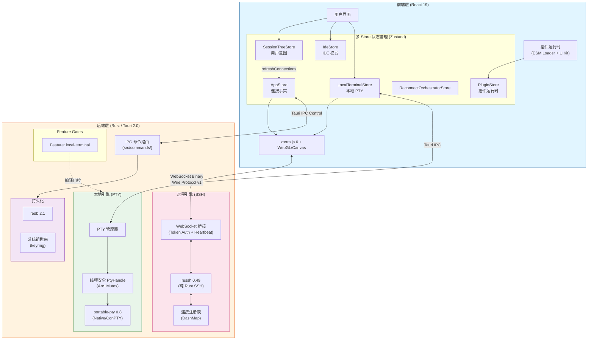

<p align="center">
  
</p>

<h1 align="center">⚡ OxideTerm</h1>

<p align="center">
  <strong>基于 Rust 的全能终端引擎</strong>
  <br>
  <em>从远程连接器进化为全平台终端解决方案</em>
</p>

<p align="center">
  
  
  
  
  
</p>

<p align="center">
  <a href="README.md">English</a> | <a href="README.zh-CN.md">简体中文</a> | <a href="README.fr.md">Français</a>
</p>

---

## 📖 核心进化

OxideTerm v1.6.2 是一次彻底的架构重构。我们不再只是一个 SSH 客户端，而是一个**终端引擎**，拥有超过 **90,000 行** 精心设计的 Rust + TypeScript 代码。

### ⚙️ 后端突破：本地终端与并发模型
我们引入了基于 `portable-pty` 的本地终端支持，彻底解决了 Rust 异步运行时中的并发难题：
- **线程安全封装**：通过 `std::sync::Mutex` 包装非 `Sync` 的 `MasterPty`，并手动实现 `unsafe impl Sync` trait，构建了线程安全的 `PtyHandle`。
- **专用 I/O 线程**：为每个 PTY 会话分配独立的读写句柄（`Arc<Mutex<Box<dyn Read + Send>>>`），确保在高并发 I/O 下即便发生阻塞也不会影响 Tokio 主事件循环。
- **跨平台一致性**：统一了 macOS/Linux (PTY) 和 Windows (ConPTY) 的底层差异，对外暴露标准化的流式接口。

### 🧩 内核架构：Feature Gating
为了适配未来的移动端构建（iOS/Android 不支持原生 PTY），我们重构了构建系统：
- **模块化构建**：核心 PTY 功能被封装在 `local-terminal` feature 中。
- **按需编译**：通过 `cargo build --no-default-features` 即可完全剥离 `portable-pty` 依赖，生成仅包含 SSH/SFTP 功能的轻量级内核（为移动端移植扫清障碍）。

### ⚛️ 前端进化：多 Store 架构
面对本地、远程和 IDE 会话截然不同的状态管理需求，前端采用了 **多 Store** 模式：
- **SessionTreeStore**：用户意图层——树结构、连接流程、会话组织。
- **AppStore**：事实层——通过 `connections` Map 维护实际 SSH 连接状态，从 SessionTreeStore 同步。
- **IdeStore**：IDE 模式状态管理，包括远程文件编辑、Git 状态跟踪和多标签编辑器。
- **LocalTerminalStore**：本地 PTY 实例的生命周期管理、Shell 进程监控和独立的 I/O 管道。
- **ReconnectOrchestratorStore**：自动重连管道编排（snapshot → ssh-connect → await-terminal → restore）。
- **TransferStore / PluginStore / ProfilerStore / AiChatStore / SettingsStore**：SFTP 传输、插件运行时、资源分析、AI 聊天和设置的领域专用 Store。
- **统一视图层**：尽管状态源不同，但在 UI 层通过 `TerminalView` 和 `IdeView` 组件实现了渲染逻辑的统一。

---

## 🏗️ 系统架构

v1.6.2 采用了混合数据流架构，根据会话类型智能路由流量：



---

## 🔥 差异化核心能力

OxideTerm 在底层细节的打磨上毫不妥协，为您提供工业级的使用体验。

### 🛡️ 智能连接池 (Connection Pool)
我们构建了基于引用计数的 `SshConnectionRegistry`，实现了真正的 SSH Multiplexing：
- **连接复用**：多个终端窗口、SFTP 传输任务、端口转发规则共享同一条物理 SSH 连接，握手只需一次。
- **资源隔离**：每个物理连接拥有独立的状态机和任务调度器，互不干扰。
- **智能生命周期**：自动管理空闲超时 (Idle Timeout 30 分钟) 和心跳保活 (Keep-Alive 15 秒间隔)。网络波动时，自动进入输入锁定模式并尝试无缝重连，最大程度保护现场。

### 📡 拓扑感知跳板机 (Topology-Aware ProxyJump)
- **无限链式跳转**：支持 `Client -> Jump A -> Jump B -> Target` 的任意深度级联。
- **智能路由图**：自动解析 SSH Config，构建连接拓扑图，自动计算最优路径。
- **逻辑节点复用**：跳板机节点本身也可作为独立会话操作，且被下游连接复用，极大减少重复握手开销。

### 🪟 Windows 深度优化
- **ConPTY 原生集成**：抛弃过时的 WinPTY，直接调用 Windows Pseudo Console (ConPTY) API，完美支持真彩色 (TrueColor) 和 ANSI 转义序列。
- **Shell 智能探测**：内置扫描引擎，自动通过注册表和 PATH 识别 **PowerShell 7 (pwsh)**、**Git Bash**、**WSL2** 及传统的 CMD。
- **原生体验**：针对 Windows 窗口管理器特性做了专门适配，由 Rust 直接处理窗口事件，响应速度远超 Electron 应用。

### 🔐 军事级加密体系
- **.oxide 文件格式**：
  - **ChaCha20-Poly1305 AEAD**：认证加密，防篡改防重放。
  - **Argon2id KDF**：密钥派生函数（256MB 内存成本，4 迭代），抵抗 GPU 暴力破解。
  - **SHA-256 校验和**：双重完整性验证，检测任何数据损坏。  - **[v1.4.4+] 私钥内嵌**：可选的私钥嵌入功能，实现完全可移植备份。
  - **[v1.4.4+] 智能体检**：导出前自动分析连接，提供认证类型统计和缺失密钥检测。  - **Git 友好设计**：元数据明文存储，支持离线解密。

### 📊 后端滚动缓冲区 (Scroll Buffer)
- **大容量持久化**：默认保存 **100,000 行**终端输出，支持序列化到磁盘（MessagePack 格式）。
- **高性能搜索**：通过 `spawn_blocking` 隔离正则搜索任务，避免阻塞 Tokio 运行时。
- **内存高效**：循环缓冲区设计，自动淘汰最旧数据，保持内存占用可控。

### 🔀 全功能端口转发
- **本地转发 (-L)**：将远程服务映射到本地端口（例如：数据库调试）。
- **远程转发 (-R)**：将本地服务暴露给远程网络（例如：内网穿透）。
- **动态代理 (-D)**：完整实现 SOCKS5 协议，支持 IPv4/IPv6/域名解析，配合 `direct-tcpip` 通道实现透明代理。
- **健康监控**：实时统计连接数、吞吐量、活跃会话数。
- **死亡报告**：转发任务在 SSH 断开时主动上报状态变更，保持一致性。
- **无锁 I/O**：采用消息传递架构替代 `Arc<Mutex<Channel>>`，消除锁竞争。

### 🤖 AI 终端助手
- **双模式交互**：内联快捷面板 (`⌘I`) + 侧边栏持久化聊天（支持对话历史）。
- **OpenAI 兼容 API**：支持 OpenAI、Ollama、DeepSeek、OneAPI 等任意兼容端点。
- **智能上下文捕获**：通过 Terminal Registry 模式自动获取终端缓冲区内容。
- **命令一键插入**：点击即可将 AI 生成的命令插入活动终端（多行命令通过 Bracketed Paste 模式支持）。
- **流式响应**：通过 Server-Sent Events (SSE) 实时显示生成内容。
- **隐私优先**：API Key 存储于系统钥匙串（macOS Keychain / Windows Credential Manager），绝不经过第三方中转。

---

## 🛠️ 技术栈 (v1.6.2)

| 层级 | 关键技术 | 说明 |
|------|----------|------|
| **Core** | **Tauri 2.0** | 下一代跨平台应用构建框架 |
| **Runtime** | **Tokio** | 全异步 Rust 运行时，配合 `dashmap` 实现并发映射 |
| **Local Kernel** | **portable-pty 0.8** | 跨平台伪终端抽象，实现 `Sync` + `Send` 线程模型 |
| **Remote Kernel** | **russh 0.49** | 纯 Rust SSH 实现，无 C 依赖，内存安全 |
| **SFTP** | **russh-sftp 2.0** | SSH 文件传输协议 |
| **WebSocket** | **tokio-tungstenite 0.24** | 异步 WebSocket 实现 |
| **Frontend** | **React 19** | 配合 TypeScript 5.8 实现类型安全的 UI 开发 |
| **State** | **Zustand 5** | 多 Store 架构（10 个专用 Store），分离关注点 |
| **Rendering** | **xterm.js 6 + WebGL/Canvas** | GPU 加速渲染，支持 60fps+ 高帧率输出 |
| **Protocol** | **Wire Protocol v1** | 二进制 `[Type:1][Length:4][Payload:n]` 走 WebSocket，控制走 Tauri IPC |
| **Editor** | **CodeMirror 6** | 远程文件编辑，支持 30+ 语言模式（14 原生 + legacy modes） |
| **Encryption** | **ChaCha20-Poly1305 + Argon2id** | AEAD 认证加密 + 内存硬化密钥派生 |
| **Persistence** | **redb 2.1** | 嵌入式数据库，配置存储 |
| **Serialization** | **MessagePack (rmp-serde)** | 高效二进制序列化 |
| **Plugins** | **ESM Runtime** | 动态插件加载，冻结 PluginContext API |

---

## ✨ 功能特性

### 🚀 混合终端体验
- **零延迟本地 Shell**：通过 IPC 直接与本地 Shell 进程交互，几乎无延迟。
- **高性能远程 SSH**：基于 WebSocket 的二进制流传输，绕过传统 HTTP 开销。
- **智能环境感知**：自动检测 `zsh`, `bash`, `fish`, `powershell` 等已安装 Shell。
- **完整环境继承**：继承用户 PATH、HOME 等环境变量，与系统终端体验一致。

### 🔐 多样化认证方式
- **密码认证**：安全存储于系统钥匙串。
- **密钥认证**：支持 RSA / Ed25519 / ECDSA。
- **默认密钥检测**：自动扫描 `~/.ssh/id_*`。
- **证书认证**：OpenSSH Certificates（实验性）。
- **2FA/MFA**：Keyboard-Interactive 交互式认证（实验性）。
- **Known Hosts**：主机密钥验证与管理。

### 💻 IDE 模式 (v1.3.0)
零服务器端依赖的远程代码编辑：
- **文件树浏览器**：基于 SFTP 的懒加载，带 Git 状态指示。
- **代码编辑器**：基于 CodeMirror 6，支持 30+ 语言语法高亮。
- **多标签管理**：LRU 缓存策略、脏状态检测、冲突解决。
- **集成终端**：底部面板终端，与会话共享连接。
- **事件驱动 Git 状态**：文件保存/创建/删除/重命名/终端命令后自动刷新。

### 🔍 全文搜索
项目级文件内容搜索，带智能缓存：
- **实时搜索**：300ms 防抖输入，即时结果。
- **结果缓存**：60 秒 TTL 缓存，避免重复扫描。
- **结果分组**：按文件分组，带行号定位。
- **高亮匹配**：预览片段中高亮搜索词。
- **自动清除**：文件变更时自动清除搜索缓存。

### 📦 高级文件管理
- **SFTP v3 协议**：完整的双面板文件管理器。
- **拖拽上传下载**：支持多文件、文件夹批量操作。
- **智能预览**：
  - 🎨 图片（JPEG/PNG/GIF/WebP）
  - 🎬 视频（MP4/WebM）
  - 💻 代码高亮（30+ 语言）
  - 📄 PDF 文档
  - 🔍 Hex 查看器（二进制文件）
- **进度追踪**：实时传输速度、进度条、ETA。

### 🌍 国际化 (i18n)
完整的 UI 国际化支持，涵盖 11 种语言：
- **语言**：English, 简体中文, 繁體中文, 日本語, Français, Deutsch, Español, Italiano, 한국어, Português, Tiếng Việt。
- **动态加载**：通过 i18next 按需加载语言包。
- **类型安全**：所有翻译键的 TypeScript 类型定义。

### 🌐 网络优化
- **双平面架构**：数据平面（WebSocket 直连）与控制平面（Tauri IPC）分离。
- **自定义二进制协议**：`[Type:1][Length:4][Payload:n]`，无 JSON 序列化开销。
- **背压控制**：防止内存溢出。
- **自动重连**：指数退避重试，最多 5 次尝试。

---

## 🚀 快速开始

### 环境需求
- **Rust**: 1.75+ (必须)
- **Node.js**: 18+
- **构建工具**: 
  - macOS: XCode Command Line Tools
  - Windows: Visual Studio C++ Build Tools
  - Linux: build-essential

### 开发构建

```bash
# 克隆仓库
git clone https://github.com/AnalyseDeCircuit/OxideTerm.git
cd OxideTerm

# 安装依赖
pnpm install

# 启动完整开发环境 (开启本地 PTY 支持)
pnpm tauri dev

# 构建生产版本
pnpm tauri build

# 构建移动端适配内核 (剥离 PTY)
cd src-tauri
cargo build --no-default-features --release
```

### 系统要求
- **内存**: 建议 4GB+ 可用内存
- **存储**: 至少 500MB 可用空间
- **网络**: 支持 WebSocket 连接

---

## 📁 项目结构

```
OxideTerm/
├── src/                        # 前端 (React/TypeScript)
│   ├── components/             # UI 组件
│   │   ├── ui/                 # 原子组件 (Radix UI)
│   │   ├── terminal/           # 终端视图
│   │   ├── sftp/               # SFTP 文件浏览器
│   │   ├── ide/                # IDE 模式 (编辑器、文件树、对话框)
│   │   ├── ai/                 # AI 聊天 (侧边栏 + 内联)
│   │   ├── plugin/             # 插件管理 UI
│   │   ├── forwards/           # 端口转发管理
│   │   ├── connections/        # 连接创建与管理
│   │   ├── sessions/           # 会话标签与切换
│   │   ├── sessionManager/     # 会话生命周期 UI
│   │   ├── topology/           # 网络拓扑可视化
│   │   ├── settings/           # 设置 UI (标签模式)
│   │   ├── layout/             # 侧边栏、头部、分屏
│   │   ├── local/              # 本地终端组件
│   │   ├── editor/             # 代码编辑器组件
│   │   ├── fileManager/        # 本地文件浏览器
│   │   └── modals/             # 弹窗组件
│   ├── store/                  # Zustand 状态管理 (10 个 Store)
│   │   ├── sessionTreeStore.ts # 用户意图 (树结构、连接流程)
│   │   ├── appStore.ts         # 连接事实 (从树同步)
│   │   ├── ideStore.ts         # IDE 模式状态
│   │   ├── localTerminalStore.ts  # 本地 PTY 状态
│   │   ├── reconnectOrchestratorStore.ts  # 自动重连管道
│   │   ├── transferStore.ts    # SFTP 传输队列
│   │   ├── pluginStore.ts      # 插件运行时状态
│   │   ├── profilerStore.ts    # 资源分析指标
│   │   ├── settingsStore.ts    # 应用设置
│   │   └── aiChatStore.ts      # AI 聊天状态
│   ├── lib/                    # API 封装与工具
│   │   ├── api.ts              # Tauri IPC 调用层
│   │   ├── ai/                 # AI 提供者注册表
│   │   ├── plugin/             # 插件运行时 (loader, context, UIKit)
│   │   ├── codemirror/         # CodeMirror 语言加载器
│   │   ├── terminalRegistry.ts # 终端会话注册表
│   │   └── themes.ts           # 终端主题定义
│   ├── hooks/                  # 自定义 React Hooks
│   ├── types/                  # TypeScript 类型定义
│   └── locales/                # i18n (11 种语言 × 18 命名空间)
│
├── src-tauri/                  # 后端 (Rust)
│   └── src/
│       ├── ssh/                # SSH 客户端 (12 模块)
│       │   ├── connection_registry.rs  # 连接池 (DashMap)
│       │   ├── client.rs       # SSH 客户端封装
│       │   ├── session.rs      # SSH 会话生命周期
│       │   ├── proxy.rs        # ProxyJump 多跳
│       │   ├── preflight.rs    # 主机密钥验证 (TOFU)
│       │   ├── known_hosts.rs  # Known Hosts 管理
│       │   ├── keyboard_interactive.rs  # 2FA/KBI 认证
│       │   └── handle_owner.rs # Handle 所有权追踪
│       ├── local/              # 本地终端 (feature-gated)
│       │   ├── pty.rs          # PTY 封装 (线程安全)
│       │   ├── session.rs      # 本地终端会话
│       │   ├── shell.rs        # Shell 检测与配置
│       │   └── registry.rs     # 本地终端注册表
│       ├── bridge/             # WebSocket 桥接
│       │   ├── server.rs       # WS 服务器 (token auth, heartbeat)
│       │   ├── protocol.rs     # Wire Protocol v1 (TLP 帧)
│       │   └── manager.rs      # 桥接生命周期
│       ├── session/            # 会话管理 (16 模块)
│       │   ├── registry.rs     # 会话注册表 (DashMap)
│       │   ├── tree.rs         # 会话树结构
│       │   ├── auto_reconnect.rs  # 自动重连逻辑
│       │   ├── reconnect.rs    # 重连编排
│       │   ├── scroll_buffer.rs   # 滚动缓冲区 (100K 行)
│       │   ├── health.rs       # 健康监控
│       │   ├── profiler.rs     # 资源分析
│       │   ├── env_detector.rs # 远程环境检测
│       │   └── topology_graph.rs  # 网络拓扑
│       ├── forwarding/         # 端口转发
│       │   ├── manager.rs      # 转发编排
│       │   ├── local.rs        # 本地转发 (-L)
│       │   ├── remote.rs       # 远程转发 (-R)
│       │   └── dynamic.rs      # SOCKS5 代理 (-D)
│       ├── sftp/               # SFTP 实现
│       │   ├── session.rs      # SFTP 会话管理
│       │   ├── transfer.rs     # 文件传输追踪
│       │   ├── progress.rs     # 传输进度
│       │   └── retry.rs        # 传输重试逻辑
│       ├── config/             # 配置
│       │   ├── vault.rs        # 加密凭据存储
│       │   ├── keychain.rs     # 系统钥匙串集成
│       │   ├── ssh_config.rs   # SSH Config 解析
│       │   └── storage.rs      # 持久化存储 (redb)
│       ├── oxide_file/         # .oxide 文件格式
│       │   ├── crypto.rs       # ChaCha20-Poly1305 加密
│       │   └── format.rs       # 格式定义
│       ├── state/              # 全局状态管理
│       └── commands/           # Tauri IPC 命令处理 (18 文件)
│
└── docs/                       # 架构与功能文档
```

---

## 🗺️ 路线图

### ✅ 已完成（v1.6.2）
- [x] 本地终端支持（PTY）
- [x] SSH 连接池与多路复用
- [x] 自动重连机制
- [x] ProxyJump 无限跳板
- [x] 端口转发（本地/远程/动态）
- [x] SFTP 文件管理与预览
- [x] .oxide 加密导出
- [x] 后端滚动缓冲区
- [x] AI 终端助手（内联 + 侧边栏聊天）
- [x] Keyboard-Interactive 认证（实验性）
- [x] 终端上下文捕获（AI 集成）
- [x] 国际化支持（11 种语言）
- [x] 运行时插件系统（PluginContext + UI Kit）
- [x] AI API Key 系统钥匙串存储
- [x] AI 远程环境检测
- [x] 终端分屏（分屏面板 + 快捷键）

### 🚧 进行中
- [ ] 命令面板 (`⌘K`)
- [ ] 会话搜索与过滤

### 📋 计划中
- [ ] SSH Agent 转发（等待上游russh库实现）
- [ ] 会话录制与回放
- [ ] X11 转发
- [ ] 移动端适配（iOS/Android）

---

## 🔒 安全考虑

### 凭据存储
- **配置文件本地存储**：连接配置保存在 `~/.oxideterm/connections.json`（Windows: `%APPDATA%\OxideTerm`）
- **密码分离存储**：配置文件中仅保存 keychain 引用 ID（如 `oxideterm-{uuid}`），真实密码存储在系统钥匙串（macOS Keychain / Windows Credential Manager / Linux libsecret）
- **AI API Key**：存储在系统钥匙串 `com.oxideterm.ai` 服务下，与 SSH 密码享有同等 OS 级别保护（v1.6.0 起）
- **双重保护**：即使配置文件泄露，攻击者也无法获取真实密码或 API Key

### SSH 主机密钥
- 首次连接验证主机指纹
- 存储于 `~/.ssh/known_hosts`

### 内存安全
- 使用 `zeroize` crate 安全清除敏感数据
- Rust 编译器保证内存安全，杜绝缓冲区溢出

---

## 📝 许可证

本项目采用 **PolyForm Noncommercial 1.0.0** 协议。

- ✅ **个人/非营利使用**：完全免费。
- 🚫 **商业使用**：需获取商业授权。
- ⚖️ **专利防御**：包含专利报复条款（Nuclear Clause），保障开源生态安全。

完整协议文本：https://polyformproject.org/licenses/noncommercial/1.0.0/

---

## 🙏 致谢

特别感谢以下开源项目：

- [russh](https://github.com/warp-tech/russh) - 纯 Rust SSH 实现
- [portable-pty](https://github.com/wez/wezterm/tree/main/pty) - 跨平台 PTY 抽象
- [Tauri](https://tauri.app/) - 跨平台应用框架
- [xterm.js](https://xtermjs.org/) - Web 终端模拟器
- [Radix UI](https://www.radix-ui.com/) - 无障碍 UI 组件

---

<p align="center">
  <sub>Built with ❤️ using Rust and Tauri | 90,000+ Lines of Code</sub>
</p>
