# OxideTerm 架构设计 (v1.3.0)

> **版本**: v1.1.0 (2026-01-19)
> **上次更新**: 2026-01-19
> 本文档描述 OxideTerm 的系统架构、设计决策和核心组件。

## 目录

1. [设计理念](#设计理念)
2. [整体架构概览](#整体架构概览)
3. [双平面架构](#双平面架构)
4. [后端架构](#后端架构-rust)
5. **[本地终端架构 (v1.1.0)](#本地终端架构)**
6. **[Oxide 文件加密格式](#oxide-文件加密格式)**
7. [前端架构](#前端架构-react)
8. **[双 Store 架构 (v1.1.0)](#双-store-架构)**
9. [SSH 连接池](#ssh-连接池)
10. [数据流与协议](#数据流与协议)
11. [会话生命周期](#会话生命周期)
12. [重连机制](#重连机制)
13. [安全设计](#安全设计)
14. [性能优化](#性能优化)

---

## 设计理念

### 核心原则

1. **性能优先** - 终端交互必须是极低延迟的，追求接近实时的响应速度
2. **安全至上** - 使用纯 Rust 实现 SSH，避免内存安全问题
3. **现代体验** - 提供与 VS Code / iTerm2 相当的用户体验
4. **可维护性** - 清晰的模块边界，易于扩展和测试

### 为什么选择 Tauri + Rust

| 对比项 | Electron | Tauri |
|--------|----------|-------|
| 包体积 | ~150MB | ~10MB |
| 内存占用 | ~300MB | ~50MB |
| 安全性 | Chromium 安全模型 | Rust 内存安全 + 沙箱 |
| SSH 实现 | 需要 Node.js 绑定 (ssh2) | 纯 Rust (russh) |

---

## 整体架构概览

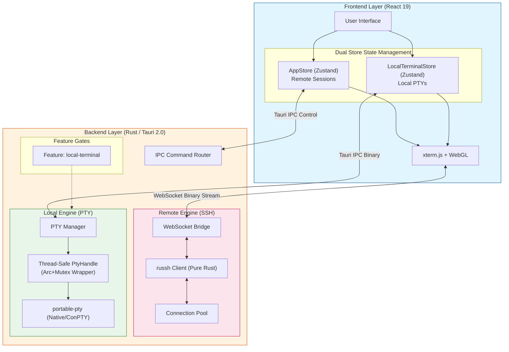

---

## 双平面架构

OxideTerm 将通信分为两个平面：

### 数据平面 (Data Plane)

处理高频、极低延迟的终端 I/O：

```
┌─────────────┐     WebSocket (Binary)     ┌─────────────┐
│   xterm.js  │ ◄──────────────────────────► │  WS Bridge  │
│  (Frontend) │     每帧 < 1ms               │   (Rust)    │
└─────────────┘                             └──────┬──────┘
                                                   │
                                            ┌──────▼──────┐
                                            │ SSH Channel │
                                            │   (russh)   │
                                            └─────────────┘
```

**特点：**
- 二进制帧传输，无 JSON 序列化开销
- 绕过 Tauri IPC，直接 WebSocket 连接
- 心跳保活，30秒间隔，90秒超时断开
- 支持数据、调整大小、心跳等多种帧类型

#### 数据平面 (Local: Tauri IPC)

```
┌─────────────┐     Tauri IPC (Binary)     ┌─────────────┐
│ LocalTermView│ ◄──────────────────────────► │  Local PTY  │
│  (Frontend) │     invoke('write', ...)     │   (Rust)    │
└─────────────┘                             └──────┬──────┘
                                                   │
                                            ┌──────▼──────┐
                                            │ portable-pty│
                                            │ (Native/OS) │
                                            └─────────────┘
```

### 控制平面 (Control Plane)

处理低频的管理操作：

```
┌─────────────┐     Tauri IPC (JSON)       ┌─────────────┐
│   React UI  │ ◄──────────────────────────► │  Commands   │
│  (Frontend) │     invoke('connect', ...)   │   (Rust)    │
└─────────────┘                             └─────────────┘
```

**特点：**
- 使用 Tauri Commands，类型安全
- 支持异步操作和错误处理
- 事件系统用于状态推送

---

## 后端架构 (Rust)

### 模块结构

```
src-tauri/src/
├── main.rs                 # 应用入口
├── lib.rs                  # 库入口，注册 Tauri 命令
│
├── ssh/                    # SSH 客户端核心
│   ├── mod.rs
│   ├── client.rs           # SSH 连接建立
│   ├── session.rs          # 会话管理 (Handle Owner Task)
│   ├── config.rs           # SSH Config 解析
│   ├── proxy.rs            # 代理跳板支持
│   ├── error.rs            # SSH 错误类型
│   ├── agent.rs            # SSH Agent (仅 UI/Types，核心待实现)
│   ├── keyboard_interactive.rs  # 2FA/KBI 认证
│   ├── known_hosts.rs      # 主机密钥验证
│   ├── handle_owner.rs     # Handle 控制器
│   └── connection_registry.rs  # 连接池
│
├── local/                  # 本地终端模块 (Feature: local-terminal)
│   ├── mod.rs              # 模块导出
│   ├── pty.rs              # PTY 封装 (portable-pty)
│   ├── session.rs          # 本地终端会话
│   ├── registry.rs         # 本地终端注册表
│   └── shell.rs            # Shell 扫描与检测
│
├── bridge/                 # WebSocket 桥接
│   ├── mod.rs
│   ├── server.rs           # WS 服务器
│   ├── protocol.rs         # 帧协议定义
│   └── manager.rs          # 连接管理
│
├── session/                # 会话管理
│   ├── mod.rs
│   ├── registry.rs         # 全局会话注册表
│   ├── state.rs            # 会话状态机
│   ├── health.rs           # 健康检查
│   ├── reconnect.rs        # 重连逻辑
│   ├── auto_reconnect.rs   # 自动重连任务
│   ├── auth.rs             # 认证流程
│   ├── events.rs           # 事件定义
│   ├── parser.rs           # 输出解析
│   ├── scroll_buffer.rs    # 滚动缓冲区 (100,000 行)
│   ├── search.rs           # 终端搜索
│   ├── tree.rs             # 会话树管理
│   ├── topology_graph.rs   # 拓扑图
│   └── types.rs            # 类型定义
│
├── sftp/                   # SFTP 实现
│   ├── mod.rs
│   ├── session.rs          # SFTP 会话
│   ├── types.rs            # 文件类型定义
│   └── error.rs            # SFTP 错误
│
├── forwarding/             # 端口转发
│   ├── mod.rs
│   ├── manager.rs          # 转发规则管理
│   ├── local.rs            # 本地转发 (-L)
│   ├── remote.rs           # 远程转发 (-R)
│   └── dynamic.rs          # 动态转发 (-D, SOCKS5)
│
├── config/                 # 配置管理
│   ├── mod.rs
│   ├── storage.rs          # 配置存储 (~/.oxideterm/connections.json)
│   ├── keychain.rs         # 系统密钥链 (macOS/Windows/Linux)
│   ├── ssh_config.rs       # ~/.ssh/config 解析
│   └── types.rs            # 配置类型
│
├── oxide_file/             # .oxide 文件加密格式
│   ├── mod.rs              # 模块导出
│   ├── format.rs           # 文件格式定义
│   ├── crypto.rs           # ChaCha20-Poly1305 + Argon2 加密
│   └── error.rs            # 错误类型
│
├── state/                  # 全局状态管理
│   ├── mod.rs
│   ├── store.rs            # 持久化存储 (redb)
│   ├── session.rs          # 会话状态
│   └── forwarding.rs       # 转发状态
│
└── commands/               # Tauri 命令
    ├── mod.rs
    ├── connect_v2.rs       # 连接命令 (主要连接流程)
    ├── local.rs            # 本地终端命令
    ├── ssh.rs              # SSH 通用命令
    ├── config.rs           # 配置命令
    ├── sftp.rs             # SFTP 命令
    ├── forwarding.rs       # 转发命令
    ├── health.rs           # 健康检查命令
    ├── kbi.rs              # KBI/2FA 命令
    ├── network.rs          # 网络状态命令
    ├── oxide_export.rs     # .oxide 导出
    ├── oxide_import.rs     # .oxide 导入
    ├── scroll.rs           # 滚动缓冲区命令
    └── session_tree.rs     # 会话树命令
```

### 核心组件关系图

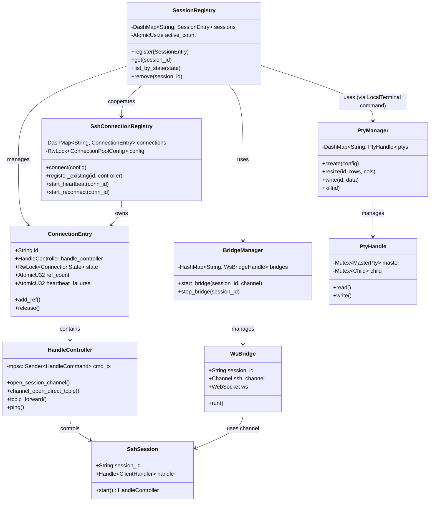

## 本地终端架构 (v1.1.0)

### Feature Gate 机制

OxideTerm v1.1.0 引入了模块化构建系统，核心 PTY 功能被封装在 `local-terminal` feature 中：

```toml
# src-tauri/Cargo.toml
[features]
default = ["local-terminal"]
local-terminal = ["dep:portable-pty"]

[dependencies]
portable-pty = { version = "0.8", optional = true }
```

**用途**：
- ✅ 桌面端：完整本地终端支持
- ⚠️ 移动端：通过 `--no-default-features` 剥离 PTY 依赖，生成仅包含 SSH/SFTP 的轻量级内核

### PTY 线程安全封装

`portable-pty` 提供的 `MasterPty` trait 不是 `Sync`，这在 Tokio 异步环境中会导致编译错误。我们的解决方案：

```rust
// src-tauri/src/local/pty.rs
pub struct PtyHandle {
    master: StdMutex<Box<dyn MasterPty + Send>>,
    child: StdMutex<Box<dyn portable_pty::Child + Send + Sync>>,
    reader: Arc<StdMutex<Box<dyn Read + Send>>>,
    writer: Arc<StdMutex<Box<dyn Write + Send>>>,
}

// 手动实现 Sync
unsafe impl Sync for PtyHandle {}
```

**关键设计决策**：
1. **使用 `std::sync::Mutex`**：而非 `tokio::sync::Mutex`，因为 PTY 操作本质上是阻塞的。
2. **Arc 包装读写句柄**：允许跨任务共享，同时通过独立锁避免死锁。
3. **unsafe impl Sync**：经过审查确认所有操作都通过 Mutex 同步，这是安全的。

### 本地终端数据流

与远程 SSH 不同，本地终端使用 Tauri IPC 进行 I/O：

```
┌─────────────────┐
│ LocalTerminalView│
│   (Frontend)    │
└────────┬────────┘
         │ Tauri IPC
         │ invoke('local_write_terminal', data)
         ▼
┌─────────────────┐
│ LocalSession    │
│   (Backend)     │
└────────┬────────┘
         │
         ▼
┌─────────────────┐
│   PtyHandle     │
│ (Arc+Mutex)     │
└────────┬────────┘
         │
         ▼
┌─────────────────┐
│ portable-pty    │
│ (Native/ConPTY) │
└─────────────────┘
```

**优势**：
- 零延迟：直接与本地 Shell 进程交互，无网络开销
- 跨平台：macOS/Linux (PTY) 和 Windows (ConPTY) 统一接口

### Shell 智能检测

```rust
// src-tauri/src/local/shell.rs
pub fn scan_shells() -> Vec<ShellInfo> {
    #[cfg(unix)]
    {
        // 1. 解析 /etc/shells
        // 2. 使用 `which` 检测常见 shell (zsh, bash, fish, etc.)
    }
    
    #[cfg(target_os = "windows")]
    {
        // 1. Command Prompt (cmd.exe)
        // 2. PowerShell 5.1 (powershell.exe)
        // 3. PowerShell 7+ (pwsh.exe) - 检查 PATH 和常见安装路径
        // 4. Git Bash - 检查 C:\Program Files\Git\bin\bash.exe
        // 5. WSL - 检查 C:\Windows\System32\wsl.exe
    }
}
```

### 渲染器资源回收 (Canvas Addon Fix)
针对 xterm-addon-canvas 插件在销毁时可能导致的竞态崩溃，OxideTerm 采取了以下策略：

显式引用持有：使用 useRef 持有插件实例，脱离 React 渲染闭包。

强制销毁顺序：在 useEffect 清理函数中，确保先调用 canvasAddon.dispose()，后调用 terminal.dispose()。

---

## Oxide 文件加密格式

### 加密体系

OxideTerm 实现了军事级的配置文件加密：

```
.oxide File Structure:
┌──────────────────────┐
│  Metadata (明文)      │  ← JSON：exported_at, num_connections, etc.
├──────────────────────┤
│  Salt (32 bytes)     │  ← Argon2id 随机盐值
├──────────────────────┤
│  Nonce (12 bytes)    │  ← ChaCha20 随机 nonce
├──────────────────────┤
│  Encrypted Data      │  ← MessagePack序列化的连接配置
├──────────────────────┤
│  Auth Tag (16 bytes) │  ← ChaCha20-Poly1305 认证标签
└──────────────────────┘
```

### 密钥派生

```rust
// src-tauri/src/oxide_file/crypto.rs
pub fn derive_key(password: &str, salt: &[u8]) -> Result<Zeroizing<[u8; 32]>> {
    let params = Params::new(
        262144,   // 256 MB 内存成本
        4,        // 4 次迭代
        4,        // 并行度 = 4
        Some(32), // 32 字节输出
    )?;
    
    let argon2 = Argon2::new(Algorithm::Argon2id, Version::V0x13, params);
    // ...
}
```

**参数选择理由**：
- **256MB 内存**：在消费级硬件上约需 2 秒，抵抗 GPU 暴力破解
- **Argon2id**：结合 Argon2i (侧信道防护) 和 Argon2d (GPU 抵抗)

### 完整性校验

双重保护：
1. **AEAD 认证标签**：ChaCha20-Poly1305 内置，防篡改/重放攻击
2. **SHA-256 内部校验和**：对连接配置的额外完整性验证

```rust
pub fn compute_checksum(connections: &[EncryptedConnection]) -> Result<String> {
    let mut hasher = Sha256::new();
    for conn in connections {
        let conn_bytes = rmp_serde::to_vec_named(conn)?;
        hasher.update(&conn_bytes);
    }
    Ok(format!("sha256:{:x}", hasher.finalize()))
}
```

---

## 前端架构 (React)

### 组件层次结构

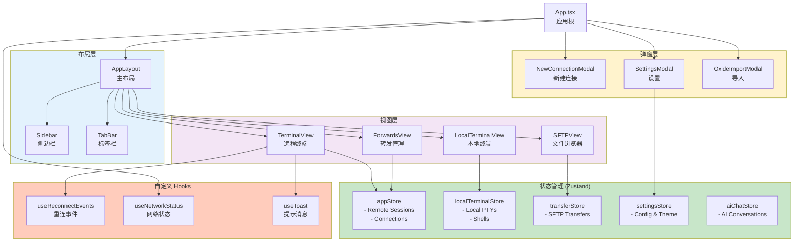

### 组件结构

#### SessionRegistry

全局会话注册表，管理所有活跃会话：

```rust
pub struct SessionRegistry {
    // session_id -> SessionInfo
    sessions: DashMap<String, SessionInfo>,
    // session_id -> HandleController (用于开启新 channel)
    controllers: DashMap<String, HandleController>,
}
```

#### HandleController

SSH 连接句柄控制器，允许在同一连接上开启多个 channel：

```rust
pub struct HandleController {
    tx: mpsc::Sender<HandleCommand>,
}

impl HandleController {
    // 开启新的 SSH channel (用于 SFTP、端口转发等)
    pub async fn open_session_channel(&self) -> Result<Channel>;
    pub async fn open_direct_tcpip(&self, host: &str, port: u16) -> Result<Channel>;
}
```

#### ForwardingManager

每个会话拥有独立的转发管理器：

```rust
pub struct ForwardingManager {
    session_id: String,
    forwards: HashMap<String, ForwardHandle>,
    stopped_forwards: HashMap<String, StoppedForward>,
    handle_controller: HandleController,
}
```

---

## 前端架构 (React)

### 组件结构

```
src/
├── App.tsx                 # 应用根组件
├── main.tsx                # React 入口
│
├── components/
│   ├── ui/                 # 原子组件 (Radix UI 封装)
│   │   ├── button.tsx
│   │   ├── dialog.tsx
│   │   ├── input.tsx
│   │   └── ...
│   │
│   ├── layout/             # 布局组件
│   │   ├── AppLayout.tsx   # 主布局
│   │   ├── Sidebar.tsx     # 侧边栏
│   │   └── TabBar.tsx      # 标签栏
│   │
│   ├── terminal/           # 终端组件
│   │   ├── TerminalView.tsx         # 远程SSH终端
│   │   └── LocalTerminalView.tsx    # 本地PTY终端
│   │
│   ├── sftp/               # SFTP 组件
│   │   ├── SFTPView.tsx    # 文件浏览器
│   │   └── TransferQueue.tsx
│   │
│   ├── forwards/           # 端口转发组件
│   │   └── ForwardsView.tsx
│   │
│   ├── ai/                 # AI 聊天组件 (v1.3.0)
│   │   ├── AiChatPanel.tsx      # 侧边栏聊天面板
│   │   ├── ChatMessage.tsx      # 消息气泡（支持代码块）
│   │   └── ChatInput.tsx        # 输入区域（支持上下文捕获）
│   │
│   └── modals/             # 弹窗组件
│       ├── NewConnectionModal.tsx
│       └── SettingsModal.tsx
│
├── store/                  # Zustand 状态管理 (双Store架构)
│   ├── appStore.ts         # 远程会话状态 (SSH连接)
│   ├── localTerminalStore.ts  # 本地PTY状态
│   ├── sessionTreeStore.ts    # 会话树状态
│   ├── settingsStore.ts       # 统一设置存储
│   ├── transferStore.ts       # SFTP传输队列状态
│   └── aiChatStore.ts         # AI聊天状态 (v1.3.0)
│
├── lib/                    # 工具库
│   ├── api.ts              # Tauri API 封装
│   ├── terminalRegistry.ts # 终端缓冲区注册表 (v1.3.0)
│   └── utils.ts            # 通用工具函数
│
├── hooks/                  # 自定义 Hooks
│   └── useToast.ts
│
└── types/                  # TypeScript 类型
    └── index.ts
```

### 状态管理

使用 Zustand 管理全局状态：

```typescript
interface AppState {
  // 会话列表
  sessions: SessionInfo[];
  
  // 标签页
  tabs: Tab[];
  activeTabId: string | null;
  
  // UI 状态
  sidebarCollapsed: boolean;
  activeModal: ModalType | null;
  
  // Actions
  addSession: (session: SessionInfo) => void;
  removeSession: (id: string) => void;
  setActiveTab: (id: string) => void;
  // ...
}
```

### 终端组件

TerminalView 使用 xterm.js 并通过 WebSocket 连接：

```typescript
const TerminalView = ({ sessionId, wsUrl }: Props) => {
  const termRef = useRef<Terminal>();
  const wsRef = useRef<WebSocket>();
  
  useEffect(() => {
    // 初始化 xterm.js
    const term = new Terminal({
      fontFamily: 'JetBrains Mono, monospace',
      fontSize: 14,
      theme: catppuccinMocha,
    });
    
    // 加载插件
    term.loadAddon(new WebglAddon());
    term.loadAddon(new FitAddon());
    
    // WebSocket 连接
    const ws = new WebSocket(wsUrl);
    ws.binaryType = 'arraybuffer';
    
    ws.onmessage = (e) => {
      // 解析帧协议，写入终端
      const frame = parseFrame(e.data);
      if (frame.type === FrameType.Data) {
        term.write(frame.payload);
      }
    };
    
    term.onData((data) => {
      // 发送用户输入
      ws.send(createDataFrame(data));
    });
    
    return () => ws.close();
  }, [wsUrl]);
};
```

---

## 双 Store 架构 (v1.3.0)

### 架构概览

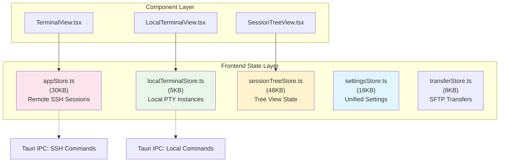

### AppStore (远程会话)

**职责**：
- SSH 连接生命周期管理
- 远程终端会话状态
- 端口转发规则
- SFTP 会话管理

**关键状态**：
```typescript
interface AppState {
  sessions: Map<string, SessionInfo>;        // 远程SSH会话
  connections: Map<string, ConnectionInfo>;  // 连接池条目
  forwards: Map<string, ForwardInfo>;        // 端口转发规则
  // ...
}
```

### LocalTerminalStore (本地终端)

**职责**：
- 本地 PTY 实例生命周期
- Shell 进程监控
- 本地终端 I/O 管道

**关键API**：
```typescript
interface LocalTerminalStore {
  terminals: Map<string, LocalTerminalInfo>;  // 本地PTY实例
  shells: ShellInfo[];                         // 已扫描的shell列表
  defaultShell: ShellInfo | null;              // 用户首选shell
  
  createTerminal(request?: CreateLocalTerminalRequest): Promise<LocalTerminalInfo>;
  closeTerminal(sessionId: string): Promise<void>;
  writeTerminal(sessionId: string, data: Uint8Array): Promise<void>;
}
```

### SessionTreeStore (会话树)

**职责**：
- 分层会话树（Group -> Connection -> Session）
- 拓扑感知跳板机路径展示
- 树节点展开/折叠状态

**特性**：
- 48KB 代码，包含复杂的树节点操作逻辑
- 支持 ProxyJump 链式节点渲染
- 与 `settingsStore.treeUI` 集成，持久化 UI 状态

### SettingsStore (统一设置)

**职责**：
- 所有用户偏好的单一数据源
- 立即持久化到 localStorage
- 版本化迁移机制

**设计亮点**：
```typescript
interface PersistedSettingsV2 {
  version: 2;
  terminal: TerminalSettings;    // xterm.js 配置
  buffer: BufferSettings;         // 后端滚动缓冲区配置
  appearance: AppearanceSettings; // UI 外观
  connectionDefaults: ConnectionDefaults;
  treeUI: TreeUIState;            // 树展开状态持久化
  sidebarUI: SidebarUIState;
  ai: AiSettings;
  localTerminal: LocalTerminalSettings;  // v1.1.0新增
}
```

**版本检测**：
- 检测 `SETTINGS_VERSION = 2`
- 自动清理遗留 localStorage 键值
- 无需数据库迁移，直接重置为默认值

---

## AI 侧边栏聊天 (v1.3.0)

### 架构概览

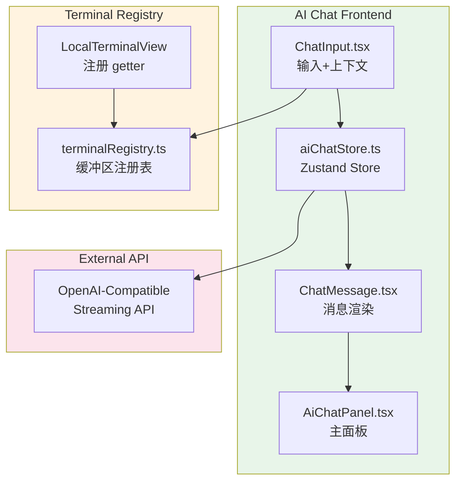

### Terminal Registry 模式

为了让 AI 聊天能够安全地获取终端上下文，我们实现了 Terminal Registry 模式：

```typescript
// src/lib/terminalRegistry.ts
interface TerminalEntry {
  getter: () => string;      // 缓冲区获取函数
  registeredAt: number;      // 注册时间戳
  tabId: string;             // 关联的 Tab ID
}

// 安全特性：
// 1. Tab ID 验证：防止跨 Tab 上下文泄漏
// 2. 过期检查：5 分钟未刷新自动失效
// 3. 错误隔离：getter 失败返回 null
```

### 数据流

```
用户输入
    ↓
ChatInput (可选：捕获终端上下文)
    ↓
aiChatStore.sendMessage()
    ↓
streamChatCompletion() (OpenAI API)
    ↓
流式响应 → ChatMessage 渲染
    ↓
命令插入 (可选) → 活动终端
```

### 多行命令插入

使用 Bracketed Paste Mode 确保多行命令作为整体粘贴：

```typescript
// 多行命令包装
const bracketedPaste = `\x1b[200~${command}\x1b[201~`;
```

---

## 会话生命周期

```
┌─────────────┐
│   Created   │  用户点击 "Connect"
└──────┬──────┘
       │ connect_v2()
       ▼
┌─────────────┐
│ Connecting  │  建立 TCP + SSH 握手
└──────┬──────┘
       │ 认证成功
       ▼
┌─────────────┐
│  Connected  │  开启 PTY channel + WS bridge
└──────┬──────┘
       │
       ├─────────────────────────────────┐
       │                                 │
       ▼                                 ▼
┌─────────────┐                   ┌─────────────┐
│   Active    │ ◄─── 心跳 ──────► │   Healthy   │
└──────┬──────┘                   └─────────────┘
       │
       │ 网络断开 / 用户关闭
       ▼
┌─────────────┐
│ Reconnecting│  (可选) 自动重连
└──────┬──────┘
       │ 重连失败 / 主动断开
       ▼
┌─────────────┐
│Disconnected │  清理资源
└─────────────┘
```

---

## 安全设计

### SSH 密钥处理

1. **密钥从不离开后端** - 私钥只在 Rust 代码中读取和使用
2. **内存中加密** - 密钥解密后使用 zeroize 安全清除
3. **系统密钥链** - 密码存储在 OS 安全存储中

### 密码存储 (分离模型)

OxideTerm 采用双层安全模型（分离存储）：

1. **配置文件 (`connections.json`)**：仅存储 Keychain 引用 ID (如 `oxideterm-uuid`)，不存储任何敏感信息。
2. **系统钥匙串 (System Keychain)**：存储真实的密码数据，由操作系统提供底层保护。

**优势**：
- 即使配置文件泄露，攻击者也无法获取真实密码
- 支持云同步配置文件 (`.oxide` / json) 而不暴露凭据

```rust
// macOS: Keychain Services
// Windows: Credential Manager  
// Linux: Secret Service (libsecret)

pub fn save_password(host: &str, username: &str, password: &str) -> Result<()> {
    let entry = keyring::Entry::new("oxideterm", &format!("{}@{}", username, host))?;
    entry.set_password(password)?;
    Ok(())
}
```

### 沙箱隔离

Tauri 2.0 提供细粒度的权限控制：

```json
// capabilities/default.json
{
  "permissions": [
    "core:default",
    "fs:default",
    "shell:allow-open"
  ]
}
```

---

## 性能优化

### 终端渲染

- WebGL 渲染替代 DOM 渲染，显著提升性能
- 使用 FitAddon 自适应容器大小
- 滚动缓冲区限制 (默认 10000 行)
- 支持终端内搜索 (`⌘F` / `Ctrl+F`)
- 后端滚动缓冲区优化（参见 BACKEND_SCROLL_BUFFER.md）

### 网络传输

- 二进制帧协议，无 Base64 编码
- 批量写入减少系统调用
- 心跳检测避免僵尸连接

### 内存管理

- Rust 后端零 GC 开销
- 会话资源及时清理
- 传输缓冲区池化复用

---

## 后端滚动缓冲区 (v1.3.0)

### 后端实现

```rust
// src-tauri/src/session/scroll_buffer.rs
pub struct ScrollBuffer {
    lines: RwLock<VecDeque<TerminalLine>>,  // 循环缓冲区
    max_lines: usize,                         // 默认 100,000 行
    total_lines: AtomicU64,                   // 历史累计行数
}

impl ScrollBuffer {
    pub async fn append_batch(&self, new_lines: Vec<TerminalLine>) {
        let mut lines = self.lines.write().await;
        for line in new_lines {
            if lines.len() >= self.max_lines {
                lines.pop_front();  // 淘汰最旧行
            }
            lines.push_back(line);
        }
    }
    
    pub async fn search(&self, options: SearchOptions) -> SearchResult {
        let lines = self.get_all().await;
        // 使用 spawn_blocking 避免阻塞 Tokio 运行时
        tokio::task::spawn_blocking(move || search_lines(&lines, options))
            .await
            .unwrap_or_default()
    }
}
```

**性能优化**：
- **VecDeque**：O(1) 首尾插入/删除
- **spawn_blocking**：正则搜索在独立线程执行
- **MessagePack 序列化**：持久化到磁盘（计划中）---

## 连接池与重连机制

### SSH 连接池架构

OxideTerm 实现了独立的 SSH 连接池，支持连接复用和自动重连：

```
┌─────────────────────────────────────────────────────┐
│              SshConnectionRegistry                  │
│  ┌──────────────────────────────────────────────┐   │
│  │  ConnectionEntry (host:port)                 │   │
│  │  ├── HandleController                         │   │
│  │  ├── ref_count (Terminal + SFTP + Forward)   │   │
│  │  ├── state (Active/LinkDown/Reconnecting)    │   │
│  │  ├── heartbeat_task (15s interval)           │   │
│  │  └── reconnect_task (exponential backoff)    │   │
│  └──────────────────────────────────────────────┘   │
└─────────────────────────────────────────────────────┘
           │
           ├───> Terminal 1 (shared connection)
           ├───> Terminal 2 (shared connection)
           ├───> SFTP Session
           └───> Port Forwards
```

**核心特性**：
- **连接复用**：多个终端会话共享同一 SSH 连接
- **空闲超时**：引用计数归零后 30 分钟自动断开
- **心跳检测**：15s 间隔，2 次失败触发重连
- **状态守卫**：避免重复发送相同状态事件

### 心跳与重连流程

```
┌──────────┐   Heartbeat (15s)   ┌───────────┐
│  Active  │ ────────────────────>│  Ping OK  │
└──────────┘                      └───────────┘
     │                                   
     │ Ping timeout × 2                  
     ▼                                   
┌──────────┐                             
│ LinkDown │                             
└────┬─────┘                             
     │                                   
     │ start_reconnect()                 
     ▼                                   
┌──────────────┐   Retry 1 (1s)         
│ Reconnecting │ ──────────────> Connect SSH
└──────────────┘                         │
     │                                   │
     │ Success                           │ Fail
     │                                   ▼
     │                           Retry 2 (2s)
     │                                   │
     ▼                                   │ Fail
┌──────────┐                            ▼
│  Active  │                    Retry 3 (4s)...
└──────────┘                    (exponential backoff)
```

**重连行为**：
- **Terminal**: 输入锁定，显示 Input Lock Overlay，保留历史输出
- **SFTP**: 传输中断，标记为 error，支持断点续传（计划中）
- **Port Forward**: 自动恢复所有转发规则

### 事件系统

连接状态变更通过 Tauri 事件广播到前端：

```typescript
// 前端监听连接状态
listen('connection_status_changed', (event) => {
  const { connection_id, status } = event.payload;
  // status: 'active' | 'link_down' | 'reconnecting' | 'connected' | 'disconnected'
});
```

**状态守卫**：只有状态真正变化时才发送事件，避免事件风暴
**AppHandle 缓存**：启动时 AppHandle 未就绪的事件会被缓存，就绪后立即发送

---

## SSH 连接池

### 连接池架构图

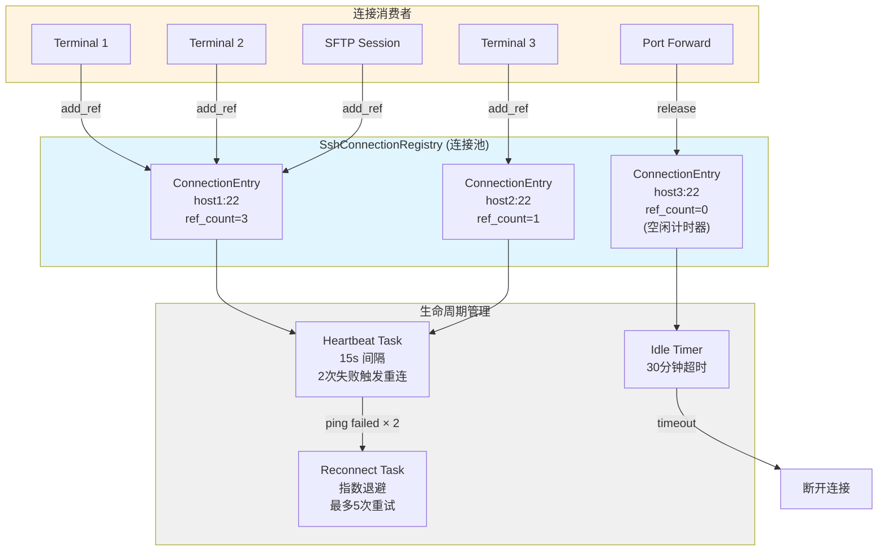

### 连接复用流程

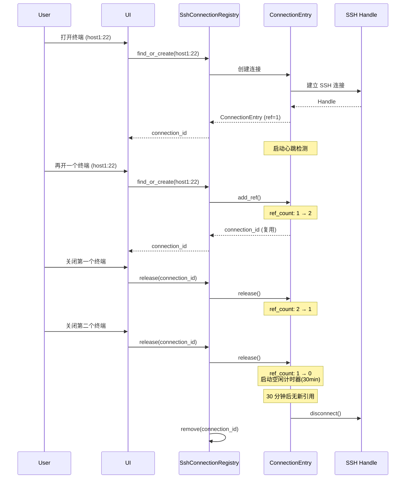

---

## 数据流与协议

### WebSocket 数据流

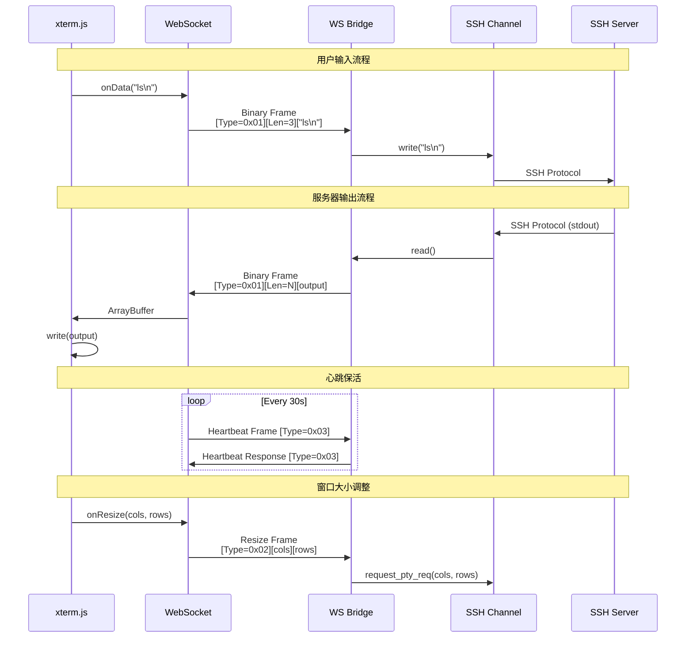

### 帧协议定义

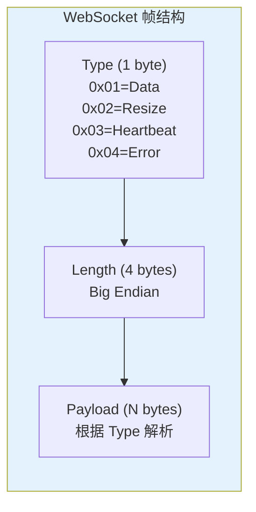

---

## 会话生命周期

### 状态机流程

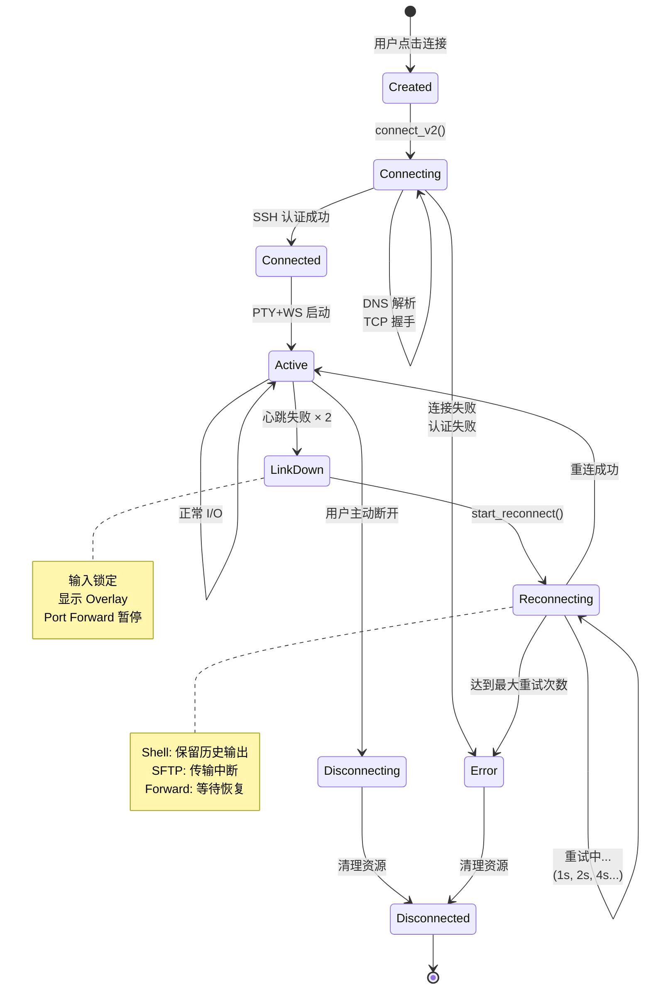

---

## 重连机制

### 心跳检测与重连

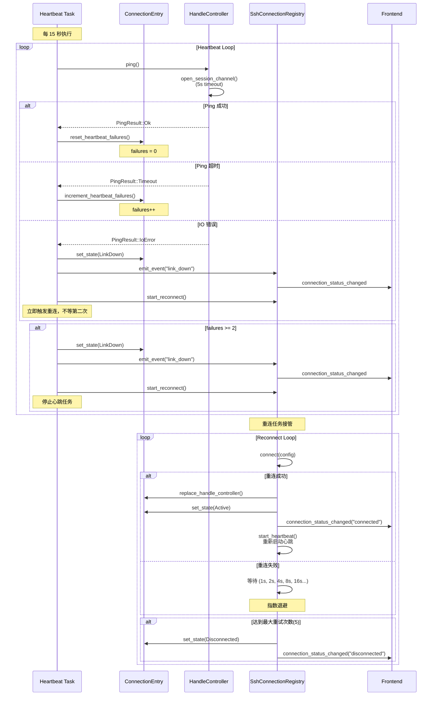

### 状态守卫机制

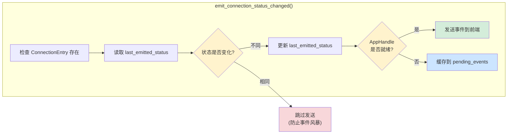

---

*本文档持续更新，反映最新架构变更*