# OxideTerm 架构设计 (v1.8.0)

> **版本**: v1.8.0 (2026-02-10)
> **上次更新**: 2026-02-10
> 本文档描述 OxideTerm 的系统架构、设计决策和核心组件。

## 目录

1. [设计理念](#设计理念)
2. [整体架构概览](#整体架构概览)
3. [双平面架构](#双平面架构)
4. [后端架构](#后端架构-rust)
5. **[本地终端架构 (v1.1.0)](#本地终端架构)**
6. **[IDE 模式架构 (v1.3.0)](#ide-模式架构)**
7. **[Git 集成设计](#git-集成设计)**
8. **[搜索架构](#搜索架构)**
9. **[Oxide 文件加密格式](#oxide-文件加密格式)**
10. [前端架构](#前端架构-react)
11. **[运行时插件系统 (v1.6.2)](#运行时插件系统-v162)**
12. **[多 Store 架构 (v1.4.0)](#多-store-架构)**
13. **[异常链路架构 (v1.4.0)](#异常链路架构)**
14. [AI 侧边栏聊天 (v1.3.0)](#ai-侧边栏聊天-v130)
15. [SSH 连接池](#ssh-连接池)
16. [数据流与协议](#数据流与协议)
17. [会话生命周期](#会话生命周期)
18. [重连机制](#重连机制)
19. [安全设计](#安全设计)
20. [性能优化](#性能优化)

---

## 设计理念

### 核心原则

1. **性能优先** - 终端交互必须是极低延迟的，追求接近实时的响应速度
2. **安全至上** - 使用纯 Rust 实现 SSH，避免内存安全问题
3. **现代体验** - 提供与 VS Code / iTerm2 相当的用户体验
4. **可维护性** - 清晰的模块边界，易于扩展和测试

### 为什么选择 Tauri + Rust

| 对比项 | Electron | Tauri |
|--------|----------|-------|
| 包体积 | ~150MB | ~10MB |
| 内存占用 | ~300MB | ~50MB |
| 安全性 | Chromium 安全模型 | Rust 内存安全 + 沙箱 |
| SSH 实现 | 需要 Node.js 绑定 (ssh2) | 纯 Rust (russh) |

---

## 整体架构概览


---

## 双平面架构

OxideTerm 将通信分为两个平面：

### 数据平面 (Data Plane)

处理高频、极低延迟的终端 I/O：

```
┌─────────────┐     WebSocket (Binary)     ┌─────────────┐
│   xterm.js  │ ◄──────────────────────────► │  WS Bridge  │
│  (Frontend) │     每帧 < 1ms               │   (Rust)    │
└─────────────┘                             └──────┬──────┘
                                                   │
                                            ┌──────▼──────┐
                                            │ SSH Channel │
                                            │   (russh)   │
                                            └─────────────┘
```

**特点：**
- 二进制帧传输，无 JSON 序列化开销
- 绕过 Tauri IPC，直接 WebSocket 连接
- 心跳保活，30秒间隔，90秒超时断开
- 支持数据、调整大小、心跳等多种帧类型

#### 数据平面 (Local: Tauri IPC)

```
┌─────────────┐     Tauri IPC (Binary)     ┌─────────────┐
│ LocalTermView│ ◄──────────────────────────► │  Local PTY  │
│  (Frontend) │     invoke('write', ...)     │   (Rust)    │
└─────────────┘                             └──────┬──────┘
                                                   │
                                            ┌──────▼──────┐
                                            │ portable-pty│
                                            │ (Native/OS) │
                                            └─────────────┘
```

### 控制平面 (Control Plane)

处理低频的管理操作：

```
┌─────────────┐     Tauri IPC (JSON)       ┌─────────────┐
│   React UI  │ ◄──────────────────────────► │  Commands   │
│  (Frontend) │     invoke('connect', ...)   │   (Rust)    │
└─────────────┘                             └─────────────┘
```

**特点：**
- 使用 Tauri Commands，类型安全
- 支持异步操作和错误处理
- 事件系统用于状态推送

---

## 后端架构 (Rust)

### 模块结构

```
src-tauri/src/
├── main.rs                 # 应用入口
├── lib.rs                  # 库入口，注册 Tauri 命令
│
├── ssh/                    # SSH 客户端核心
│   ├── mod.rs
│   ├── client.rs           # SSH 连接建立
│   ├── session.rs          # 会话管理 (Handle Owner Task)
│   ├── config.rs           # SSH Config 解析
│   ├── proxy.rs            # 代理跳板支持
│   ├── error.rs            # SSH 错误类型
│   ├── agent.rs            # SSH Agent (仅 UI/Types，核心待实现)
│   ├── keyboard_interactive.rs  # 2FA/KBI 认证
│   ├── known_hosts.rs      # 主机密钥验证
│   ├── preflight.rs        # 连接预检 (TOFU 主机密钥验证)
│   ├── handle_owner.rs     # Handle 控制器
│   └── connection_registry.rs  # 连接池
│
├── local/                  # 本地终端模块 (Feature: local-terminal)
│   ├── mod.rs              # 模块导出
│   ├── pty.rs              # PTY 封装 (portable-pty)
│   ├── session.rs          # 本地终端会话
│   ├── registry.rs         # 本地终端注册表
│   └── shell.rs            # Shell 扫描与检测
│
├── bridge/                 # WebSocket 桥接
│   ├── mod.rs
│   ├── server.rs           # WS 服务器
│   ├── protocol.rs         # 帧协议定义
│   └── manager.rs          # 连接管理
│
├── session/                # 会话管理
│   ├── mod.rs
│   ├── registry.rs         # 全局会话注册表
│   ├── state.rs            # 会话状态机
│   ├── health.rs           # 健康检查
│   ├── reconnect.rs        # 重连逻辑
│   ├── auto_reconnect.rs   # 自动重连任务
│   ├── auth.rs             # 认证流程
│   ├── events.rs           # 事件定义
│   ├── parser.rs           # 输出解析
│   ├── scroll_buffer.rs    # 滚动缓冲区 (100,000 行)
│   ├── search.rs           # 终端搜索
│   ├── tree.rs             # 会话树管理
│   ├── topology_graph.rs   # 拓扑图
│   ├── env_detector.rs     # 远程环境检测
│   ├── profiler.rs         # 资源性能分析
│   └── types.rs            # 类型定义
│
├── sftp/                   # SFTP 实现
│   ├── mod.rs
│   ├── session.rs          # SFTP 会话
│   ├── types.rs            # 文件类型定义
│   ├── error.rs            # SFTP 错误
│   ├── path_utils.rs       # 路径处理工具
│   ├── progress.rs         # 传输进度跟踪
│   ├── retry.rs            # 断点续传支持
│   └── transfer.rs         # 传输任务管理
│
├── forwarding/             # 端口转发
│   ├── mod.rs
│   ├── manager.rs          # 转发规则管理
│   ├── local.rs            # 本地转发 (-L)
│   ├── remote.rs           # 远程转发 (-R)
│   ├── events.rs           # 转发事件发射器
│   └── dynamic.rs          # 动态转发 (-D, SOCKS5)
│
├── config/                 # 配置管理
│   ├── mod.rs
│   ├── storage.rs          # 配置存储 (~/.oxideterm/connections.json)
│   ├── keychain.rs         # 系统密钥链 (macOS/Windows/Linux)
│   ├── ssh_config.rs       # ~/.ssh/config 解析
│   ├── vault.rs            # 加密凭证存储
│   └── types.rs            # 配置类型
│
├── oxide_file/             # .oxide 文件加密格式
│   ├── mod.rs              # 模块导出
│   ├── format.rs           # 文件格式定义
│   ├── crypto.rs           # ChaCha20-Poly1305 + Argon2 加密
│   └── error.rs            # 错误类型
│
├── state/                  # 全局状态管理
│   ├── mod.rs
│   ├── store.rs            # 持久化存储 (redb)
│   ├── session.rs          # 会话状态
│   ├── forwarding.rs       # 转发状态
│   └── ai_chat.rs          # AI 聊天状态持久化
│
├── router/                 # Oxide-Next 节点路由器
│   ├── mod.rs
│   ├── emitter.rs          # NodeEventEmitter
│   ├── sequencer.rs        # NodeEventSequencer
│   └── types.rs            # 路由类型
│
└── commands/               # Tauri 命令
    ├── mod.rs
    ├── connect_v2.rs       # 连接命令 (主要连接流程)
    ├── local.rs            # 本地终端命令
    ├── ssh.rs              # SSH 通用命令
    ├── config.rs           # 配置命令
    ├── sftp.rs             # SFTP 命令
    ├── forwarding.rs       # 转发命令
    ├── health.rs           # 健康检查命令
    ├── ide.rs              # IDE 模式命令
    ├── kbi.rs              # KBI/2FA 命令
    ├── network.rs          # 网络状态命令
    ├── oxide_export.rs     # .oxide 导出
    ├── oxide_import.rs     # .oxide 导入
    ├── scroll.rs           # 滚动缓冲区命令
    ├── session_tree.rs     # 会话树命令
    ├── ai_chat.rs          # AI 聊天命令
    ├── archive.rs          # 归档操作命令
    ├── plugin.rs           # 插件管理命令
    ├── node_forwarding.rs  # Node 转发命令
    ├── node_sftp.rs        # Node SFTP 命令
    ├── plugin_registry.rs  # 插件注册表命令
    └── plugin_server.rs    # 插件服务端
```

### 核心组件关系图


## 本地终端架构 (v1.1.0)

### Feature Gate 机制

OxideTerm v1.1.0 引入了模块化构建系统，核心 PTY 功能被封装在 `local-terminal` feature 中：

```toml
# src-tauri/Cargo.toml
[features]
default = ["local-terminal"]
local-terminal = ["dep:portable-pty"]

[dependencies]
portable-pty = { version = "0.8", optional = true }
```

**用途**：
- ✅ 桌面端：完整本地终端支持
- ⚠️ 移动端：通过 `--no-default-features` 剥离 PTY 依赖，生成仅包含 SSH/SFTP 的轻量级内核

### PTY 线程安全封装

`portable-pty` 提供的 `MasterPty` trait 不是 `Sync`，这在 Tokio 异步环境中会导致编译错误。我们的解决方案：

```rust
// src-tauri/src/local/pty.rs
pub struct PtyHandle {
    master: StdMutex<Box<dyn MasterPty + Send>>,
    child: StdMutex<Box<dyn portable_pty::Child + Send + Sync>>,
    reader: Arc<StdMutex<Box<dyn Read + Send>>>,
    writer: Arc<StdMutex<Box<dyn Write + Send>>>,
}

// 手动实现 Sync
unsafe impl Sync for PtyHandle {}
```

**关键设计决策**：
1. **使用 `std::sync::Mutex`**：而非 `tokio::sync::Mutex`，因为 PTY 操作本质上是阻塞的。
2. **Arc 包装读写句柄**：允许跨任务共享，同时通过独立锁避免死锁。
3. **unsafe impl Sync**：经过审查确认所有操作都通过 Mutex 同步，这是安全的。

### 本地终端数据流

与远程 SSH 不同，本地终端使用 Tauri IPC 进行 I/O：

```mermaid
graph TD
    View["LocalTerminalView<br/>(Frontend)"]
    Session["LocalSession<br/>(Backend)"]
    Handle["PtyHandle<br/>(Arc+Mutex)"]
    Native["portable-pty<br/>(Native/ConPTY)"]

    View -->|Tauri IPC<br/>invoke('local_write_terminal')| Session
    Session --> Handle
    Handle --> Native
```

**优势**：
- 零延迟：直接与本地 Shell 进程交互，无网络开销
- 跨平台：macOS/Linux (PTY) 和 Windows (ConPTY) 统一接口

### Shell 智能检测

```rust
// src-tauri/src/local/shell.rs
pub fn scan_shells() -> Vec<ShellInfo> {
    #[cfg(unix)]
    {
        // 1. 解析 /etc/shells
        // 2. 使用 `which` 检测常见 shell (zsh, bash, fish, etc.)
    }
    
    #[cfg(target_os = "windows")]
    {
        // 1. Command Prompt (cmd.exe)
        // 2. PowerShell 5.1 (powershell.exe)
        // 3. PowerShell 7+ (pwsh.exe) - 检查 PATH 和常见安装路径
        // 4. Git Bash - 检查 C:\Program Files\Git\bin\bash.exe
        // 5. WSL - 检查 C:\Windows\System32\wsl.exe
    }
}
```

### 渲染器资源回收 (Canvas Addon Fix)
针对 xterm-addon-canvas 插件在销毁时可能导致的竞态崩溃，OxideTerm 采取了以下策略：

显式引用持有：使用 useRef 持有插件实例，脱离 React 渲染闭包。

强制销毁顺序：在 useEffect 清理函数中，确保先调用 canvasAddon.dispose()，后调用 terminal.dispose()。

---

## IDE 模式架构 (v1.3.0)

### 架构定位

IDE 模式是 OxideTerm 的核心差异化功能，定位为 **"VS Code Remote 的轻量替代品"**，适用于：
- 临时修改远程服务器配置
- 轻量级脚本开发
- 查看和分析日志文件
- 零服务器端依赖的远程编辑

### 双面板布局架构

```mermaid
graph TB
    subgraph IDE["IDE Mode Layout"]
        subgraph LeftPanel["左侧面板 - 文件树"]
            FileTree["IdeTree.tsx<br/>SFTP 文件浏览器"]
            GitStatus["Git 状态指示<br/>修改/新增/未跟踪"]
            SearchPanel["IdeSearchPanel.tsx<br/>全文搜索面板"]
        end

        subgraph RightPanel["右侧面板 - 编辑器"]
            EditorArea["编辑器区域"]
            BottomPanel["底部面板 - 集成终端"]
        end

        subgraph State["状态管理"]
            IdeStore["ideStore.ts<br/>IDE 核心状态"]
            GitStore["useGitStatus.ts<br/>Git 状态管理"]
            SearchCache["搜索缓存<br/>60秒 TTL"]
        end
    end

    FileTree --> IdeStore
    SearchPanel --> SearchCache
    EditorArea --> IdeStore
    BottomPanel --> IdeStore
    GitStatus --> GitStore

    style LeftPanel fill:#e3f2fd
    style RightPanel fill:#f3e5f5
    style State fill:#c8e6c9
```

### 核心组件关系

```
src/components/ide/
├── IdeTree.tsx              # 文件树组件（SFTP 驱动，含节点渲染）
├── IdeTreeContextMenu.tsx   # 文件树右键菜单
├── IdeEditor.tsx            # 远程文件编辑器
├── IdeEditorArea.tsx        # 编辑器区域容器
├── IdeEditorTabs.tsx        # 编辑器标签栏
├── IdeStatusBar.tsx         # 底部状态栏（分支、文件统计）
├── IdeSearchPanel.tsx       # 全文搜索面板
├── IdeInlineInput.tsx       # 内联重命名/新建输入
├── IdeTerminal.tsx          # 集成终端组件
├── IdeWorkspace.tsx         # IDE 工作区布局
├── CodeEditorSearchBar.tsx  # 编辑器内搜索栏
├── dialogs/                 # 对话框组件
│   └── ...                  # 冲突解决、确认对话框等
├── hooks/
│   ├── useGitStatus.ts      # Git 状态检测与刷新
│   ├── useCodeMirrorEditor.ts  # CodeMirror 封装
│   └── useIdeTerminal.ts    # IDE 终端 Hook
└── index.ts
```

> **注意**: 文件图标映射逻辑位于 `src/lib/fileIcons.tsx`

### SFTP 驱动文件树 (Active Gating)

IDE 模式的文件树基于 SFTP 协议，但受 v1.4.0 **连接状态门控 (State Gating)** 保护：


**生命周期绑定 (Lifecycle Binding)**:
IDE 工作区组件被包裹在 `Key = sessionId + connectionId` 中。这意味着：
1.  **重连发生时**: `connectionId` 改变。
2.  **组件重置**: 旧 `IdeTree` 直接销毁，取消所有未完成的 SFTP 请求。
3.  **状态恢复**: 新 `IdeTree` 挂载，从 `ideStore.expandedPaths` 恢复展开状态。

**懒加载策略**:
- 目录首次展开时从服务器获取
- 本地缓存已展开目录（5 秒 TTL）
- 缓存键包含 `connectionId`，连接变更自动失效缓存

---

基于 CodeMirror 6 的远程文件编辑器：

```typescript
// RemoteFileEditor 核心逻辑
interface IdeTab {
  id: string;
  path: string;                    // 远程文件完整路径
  content: string | null;          // 当前内容
  originalContent: string | null;  // 原始内容（用于 diff）
  isDirty: boolean;                // 未保存标记
  serverMtime?: number;            // 服务器修改时间（冲突检测）
  contentVersion: number;          // 强制刷新版本号
}
```

**冲突检测机制**：
1. 保存前获取服务器文件最新 mtime
2. 与打开时记录的 mtime 对比
3. 不一致则提示用户选择（覆盖/放弃/对比）

---

## Git 集成设计

### 事件驱动刷新机制

区别于传统轮询，OxideTerm 采用**事件驱动 + 防抖**的 Git 状态刷新策略：

```mermaid
graph LR
    subgraph Events["触发事件"]
        Save["文件保存"]
        Create["新建文件/目录"]
        Delete["删除"]
        Rename["重命名"]
        Terminal["终端回车"]
    end

    subgraph Debounce["1秒防抖"]
        Queue["事件队列"]
        Timer["防抖定时器"]
    end

    subgraph Refresh["刷新执行"]
        GitCmd["git status --porcelain"]
        Parse["解析状态"]
        Update["更新 UI"]
    end

    Events --> Queue
    Queue --> Timer
    Timer --> GitCmd
    GitCmd --> Parse
    Parse --> Update
```

**触发点**（6个场景）：
| 场景 | 位置 | 说明 |
|------|------|------|
| 保存文件 | `ideStore.saveFile()` | 内容变更 |
| 创建文件 | `ideStore.createFile()` | 新增 untracked |
| 创建目录 | `ideStore.createFolder()` | 可能包含文件 |
| 删除 | `ideStore.deleteItem()` | 文件移除 |
| 重命名 | `ideStore.renameItem()` | 路径变更 |
| 终端回车 | `TerminalView.tsx` | 检测 git 命令执行 |

### 终端 Git 命令检测

IDE 终端中检测回车键，智能触发 Git 刷新：

```typescript
// TerminalView.tsx
if (sessionId.startsWith('ide-terminal-') && data === '\r') {
  // 延迟 500ms 给 git 命令执行时间
  setTimeout(() => triggerGitRefresh(), 500);
}
```

### Git 状态表示

文件树中通过颜色和图标表示 Git 状态：

| 状态 | 颜色 | 图标 | 说明 |
|------|------|------|------|
| modified | 🟡 黄色 | M | 已修改 |
| added | 🟢 绿色 | A | 已暂存 |
| untracked | ⚪ 灰色 | ? | 未跟踪 |
| deleted | 🔴 红色 | D | 已删除 |
| renamed | 🔵 蓝色 | R | 重命名 |
| conflict | 🟣 紫色 | C | 冲突 |

---

## 搜索架构

### 全文搜索设计

IDE 模式提供基于 SFTP 的全文搜索功能：

```mermaid
flowchart TB
    subgraph Input["用户输入"]
        Query["搜索关键词"]
        Options["选项：大小写/正则/文件类型"]
    end

    subgraph Cache["缓存层"]
        Key["缓存键: query+options+path"]
        TTL["60秒 TTL"]
        Store["搜索结果缓存"]
    end

    subgraph Execution["执行层"]
        Find["find 命令获取文件列表"]
        Grep["grep 内容匹配"]
        Limit["限制：最多200结果"]
    end

    subgraph Result["结果处理"]
        Group["按文件分组"]
        Highlight["高亮匹配行"]
        Render["渲染结果面板"]
    end

    Input --> Cache
    Cache -->|缓存命中| Result
    Cache -->|缓存未命中| Execution
    Execution --> Result
```

### 搜索性能优化

**缓存策略**：
- 缓存键：`${query}:${caseSensitive}:${useRegex}:${filePattern}:${projectPath}`
- TTL：60 秒
- 缓存清除：文件变更时自动清除

**限流保护**：
- 最大结果数：200（防止大仓库卡死）
- 文件类型过滤：排除 `node_modules`, `.git`, 二进制文件
- 防抖：输入停止 300ms 后才执行搜索

### 搜索结果缓存清除

与 Git 刷新联动，文件变更时自动清除搜索缓存：

```typescript
// ideStore.ts
deleteItem() {
  // ... 删除逻辑
  triggerGitRefresh();           // 触发 Git 刷新
  triggerSearchCacheClear();     // 清除搜索缓存
}
```

---

## Oxide 文件加密格式

### 加密体系

OxideTerm 实现了军事级的配置文件加密：

```
.oxide File Structure:
┌──────────────────────┐
│  Metadata (明文)      │  ← JSON：exported_at, num_connections, etc.
├──────────────────────┤
│  Salt (32 bytes)     │  ← Argon2id 随机盐值
├──────────────────────┤
│  Nonce (12 bytes)    │  ← ChaCha20 随机 nonce
├──────────────────────┤
│  Encrypted Data      │  ← MessagePack序列化的连接配置
├──────────────────────┤
│  Auth Tag (16 bytes) │  ← ChaCha20-Poly1305 认证标签
└──────────────────────┘
```

### 密钥派生

```rust
// src-tauri/src/oxide_file/crypto.rs
pub fn derive_key(password: &str, salt: &[u8]) -> Result<Zeroizing<[u8; 32]>> {
    let params = Params::new(
        262144,   // 256 MB 内存成本
        4,        // 4 次迭代
        4,        // 并行度 = 4
        Some(32), // 32 字节输出
    )?;
    
    let argon2 = Argon2::new(Algorithm::Argon2id, Version::V0x13, params);
    // ...
}
```

**参数选择理由**：
- **256MB 内存**：在消费级硬件上约需 2 秒，抵抗 GPU 暴力破解
- **Argon2id**：结合 Argon2i (侧信道防护) 和 Argon2d (GPU 抵抗)

### 完整性校验

双重保护：
1. **AEAD 认证标签**：ChaCha20-Poly1305 内置，防篡改/重放攻击
2. **SHA-256 内部校验和**：对连接配置的额外完整性验证

```rust
pub fn compute_checksum(connections: &[EncryptedConnection]) -> Result<String> {
    let mut hasher = Sha256::new();
    for conn in connections {
        let conn_bytes = rmp_serde::to_vec_named(conn)?;
        hasher.update(&conn_bytes);
    }
    Ok(format!("sha256:{:x}", hasher.finalize()))
}
```

---

## 前端架构 (React)

### 组件层次结构

```mermaid
graph TD
    App["App.tsx<br/>应用根"]

    subgraph Layout["布局层"]
        AppLayout["AppLayout<br/>主布局"]
        Sidebar["Sidebar<br/>侧边栏"]
        TabBar["TabBar<br/>标签栏"]
    end

    subgraph Views["视图层"]
        Terminal["TerminalView<br/>远程终端"]
        LocalTerm["LocalTerminalView<br/>本地终端"]
        SFTP["SFTPView<br/>文件浏览器"]
        Forwards["ForwardsView<br/>转发管理"]
        IdeWorkspace["IdeWorkspace<br/>IDE 模式"]
        AiSidebar["AiSidebar<br/>AI 聊天"]
    end

    subgraph Settings["设置层"]
        SettingsView["SettingsView<br/>设置 (Tab 模式)"]
        NewConn["NewConnectionModal<br/>新建连接"]
        Import["OxideImportModal<br/>导入"]
    end

    subgraph State["状态管理 (Zustand)"]
        SessionTreeStore["sessionTreeStore<br/>- User Intent<br/>- Tree Structure"]
        AppStore["appStore<br/>- Remote Sessions<br/>- Connections"]
        LocalStore["localTerminalStore<br/>- Local PTYs<br/>- Shells"]
        IdeStoreState["ideStore<br/>- Remote Files<br/>- Git Status"]
        ReconnectStore["reconnectOrchestratorStore<br/>- Auto-Reconnect Pipeline"]
        TransferStore["transferStore<br/>- SFTP Transfers"]
        SettingsStore["settingsStore<br/>- Config & Theme"]
        AiStore["aiChatStore<br/>- AI Conversations"]
        PluginStoreState["pluginStore<br/>- Plugin Runtime"]
    end

    subgraph Hooks["自定义 Hooks"]
        UseConnEvents["useConnectionEvents<br/>连接事件"]
        UseNetwork["useNetworkStatus<br/>网络状态"]
        UseToast["useToast<br/>提示消息"]
        UseTermKb["useTerminalKeyboard<br/>终端快捷键"]
    end

    App --> AppLayout
    AppLayout --> Sidebar
    AppLayout --> TabBar
    AppLayout --> Terminal
    AppLayout --> LocalTerm
    AppLayout --> SFTP
    AppLayout --> Forwards
    AppLayout --> IdeWorkspace
    AppLayout --> AiSidebar

    App --> SettingsView
    App --> NewConn
    App --> Import

    Terminal --> AppStore
    Terminal --> SessionTreeStore
    LocalTerm --> LocalStore
    SFTP --> TransferStore
    Forwards --> AppStore
    IdeWorkspace --> IdeStoreState
    SettingsView --> SettingsStore
    AiSidebar --> AiStore

    Terminal --> UseConnEvents
    UseConnEvents --> ReconnectStore
    App --> UseNetwork
    Terminal --> UseToast

    style Layout fill:#e3f2fd
    style Views fill:#f3e5f5
    style Settings fill:#fff3cd
    style State fill:#c8e6c9
    style Hooks fill:#ffccbc
```

### 组件结构

#### SessionRegistry

全局会话注册表，管理所有活跃会话：

```rust
pub struct SessionRegistry {
    // session_id -> SessionInfo
    sessions: DashMap<String, SessionInfo>,
    // session_id -> HandleController (用于开启新 channel)
    controllers: DashMap<String, HandleController>,
}
```

#### HandleController

SSH 连接句柄控制器，允许在同一连接上开启多个 channel：

```rust
pub struct HandleController {
    tx: mpsc::Sender<HandleCommand>,
}

impl HandleController {
    // 开启新的 SSH channel (用于 SFTP、端口转发等)
    pub async fn open_session_channel(&self) -> Result<Channel>;
    pub async fn open_direct_tcpip(&self, host: &str, port: u16) -> Result<Channel>;
}
```

#### ForwardingManager

每个会话拥有独立的转发管理器：

```rust
pub struct ForwardingManager {
    session_id: String,
    forwards: HashMap<String, ForwardHandle>,
    stopped_forwards: HashMap<String, StoppedForward>,
    handle_controller: HandleController,
}
```

---

## 前端架构 (React)

### 组件结构

```
src/
├── App.tsx                 # 应用根组件
├── main.tsx                # React 入口
│
├── components/
│   ├── ui/                 # 原子组件 (Radix UI 封装)
│   │   ├── button.tsx
│   │   ├── dialog.tsx
│   │   ├── input.tsx
│   │   └── ...
│   │
│   ├── layout/             # 布局组件
│   │   ├── AppLayout.tsx   # 主布局
│   │   ├── Sidebar.tsx     # 侧边栏
│   │   ├── AiSidebar.tsx   # AI 侧边栏
│   │   ├── TabBar.tsx      # 标签栏
│   │   └── SystemHealthPanel.tsx # 系统健康面板
│   │
│   ├── terminal/           # 终端组件
│   │   ├── TerminalView.tsx         # 远程SSH终端
│   │   ├── LocalTerminalView.tsx    # 本地PTY终端
│   │   ├── SplitTerminalContainer.tsx # 分屏终端容器
│   │   ├── SplitPaneToolbar.tsx     # 分屏工具栏
│   │   ├── TerminalPane.tsx         # 终端面板
│   │   ├── AiInlinePanel.tsx        # AI 内联面板
│   │   ├── SearchBar.tsx            # 终端搜索栏
│   │   └── PasteConfirmOverlay.tsx  # 粘贴确认覆盖层
│   │
│   ├── sftp/               # SFTP 组件
│   │   ├── SFTPView.tsx    # 文件浏览器
│   │   └── TransferQueue.tsx
│   │
│   ├── forwards/           # 端口转发组件
│   │   └── ForwardsView.tsx
│   │
│   ├── ai/                 # AI 聊天组件 (v1.3.0)
│   │   ├── AiChatPanel.tsx      # 侧边栏聊天面板
│   │   ├── ChatMessage.tsx      # 消息气泡（支持代码块）
│   │   ├── ChatInput.tsx        # 输入区域（支持上下文捕获）
│   │   ├── ContextIndicator.tsx # 上下文状态指示器
│   │   ├── ModelSelector.tsx    # AI 模型选择器
│   │   └── ThinkingBlock.tsx    # 思考过程展示块
│   │
│   ├── connections/        # 连接管理组件
│   │
│   ├── editor/             # 编辑器组件
│   │
│   ├── fileManager/        # 文件管理组件
│   │
│   ├── sessionManager/     # 会话管理组件
│   │
│   ├── sessions/           # 会话组件
│   │
│   ├── settings/           # 设置组件
│   │
│   ├── topology/           # 拓扑图组件
│   │
│   ├── local/              # 本地终端组件
│   │
│   ├── plugin/             # 插件 UI 组件 (v1.6.2)
│   │   ├── PluginManagerView.tsx
│   │   ├── PluginTabRenderer.tsx
│   │   ├── PluginSidebarRenderer.tsx
│   │   └── PluginConfirmDialog.tsx
│   │
│   └── modals/             # 弹窗组件
│       ├── NewConnectionModal.tsx
│       └── SettingsModal.tsx
│
├── store/                  # Zustand 状态管理 (多Store架构)
│   ├── sessionTreeStore.ts    # 会话树状态 (用户意图层)
│   ├── appStore.ts            # 远程会话状态 (事实层，SSH连接)
│   ├── ideStore.ts            # IDE模式状态 (v1.3.0)
│   ├── localTerminalStore.ts  # 本地PTY状态
│   ├── reconnectOrchestratorStore.ts  # 自动重连编排 (v1.6.2)
│   ├── settingsStore.ts       # 统一设置存储
│   ├── transferStore.ts       # SFTP传输队列状态
│   ├── aiChatStore.ts         # AI聊天状态 (v1.3.0)
│   ├── pluginStore.ts         # 插件运行时状态 (v1.6.2)
│   └── profilerStore.ts       # 资源性能分析状态
│
├── lib/                    # 工具库
│   ├── api.ts              # Tauri API 封装
│   ├── terminalRegistry.ts # 终端缓冲区注册表 (v1.3.0)
│   ├── ai/                 # AI 提供商注册表
│   ├── plugin/             # 插件运行时与 UI Kit (v1.6.2)
│   │   ├── pluginEventBridge.ts      # 事件桥接
│   │   ├── pluginI18nManager.ts      # 插件国际化管理
│   │   ├── pluginSettingsManager.ts  # 插件设置管理
│   │   ├── pluginStorage.ts          # 插件存储
│   │   ├── pluginTerminalHooks.ts    # 终端钩子
│   │   └── pluginUtils.ts            # 插件工具函数
│   ├── codemirror/         # CodeMirror 语言加载器
│   ├── themes.ts           # 终端主题定义
│   ├── themeManager.ts     # 主题管理器
│   ├── topologyUtils.ts    # 拓扑图工具
│   ├── fontLoader.ts       # 字体加载与缓存
│   └── utils.ts            # 通用工具函数
│
├── hooks/                  # 自定义 Hooks
│   ├── useConnectionEvents.ts  # 连接生命周期事件
│   ├── useForwardEvents.ts     # 端口转发事件
│   ├── useNetworkStatus.ts     # 网络状态检测
│   ├── useTerminalKeyboard.ts  # 终端快捷键
│   ├── useSplitPaneShortcuts.ts # 分屏快捷键
│   ├── useTauriListener.ts     # Tauri 事件监听
│   ├── useMermaid.ts           # Mermaid 图表渲染
│   ├── useToast.ts             # 提示消息
│   ├── useConfirm.tsx          # 确认对话框 Hook
│   └── useNodeState.ts         # 节点状态 Hook
│
└── types/                  # TypeScript 类型
    ├── index.ts
    └── plugin.ts           # 插件类型定义
```

### 状态管理

使用 Zustand 管理全局状态：

```typescript
interface AppState {
  // 会话列表
  sessions: SessionInfo[];
  
  // 标签页
  tabs: Tab[];
  activeTabId: string | null;
  
  // UI 状态
  sidebarCollapsed: boolean;
  activeModal: ModalType | null;
  
  // Actions
  addSession: (session: SessionInfo) => void;
  removeSession: (id: string) => void;
  setActiveTab: (id: string) => void;
  // ...
}
```

### 终端组件

TerminalView 使用 xterm.js 并通过 WebSocket 连接：

```typescript
const TerminalView = ({ sessionId, wsUrl }: Props) => {
  const termRef = useRef<Terminal>();
  const wsRef = useRef<WebSocket>();
  
  useEffect(() => {
    // 初始化 xterm.js
    const term = new Terminal({
      fontFamily: 'JetBrains Mono, monospace',
      fontSize: 14,
      theme: catppuccinMocha,
    });
    
    // 加载插件
    term.loadAddon(new WebglAddon());
    term.loadAddon(new FitAddon());
    
    // WebSocket 连接
    const ws = new WebSocket(wsUrl);
    ws.binaryType = 'arraybuffer';
    
    ws.onmessage = (e) => {
      // 解析帧协议，写入终端
      const frame = parseFrame(e.data);
      if (frame.type === FrameType.Data) {
        term.write(frame.payload);
      }
    };
    
    term.onData((data) => {
      // 发送用户输入
      ws.send(createDataFrame(data));
    });
    
    return () => ws.close();
  }, [wsUrl]);
};
```

---

## 运行时插件系统 (v1.6.2)

插件系统允许第三方在运行时加载 UI 与行为扩展，核心由前端负责，后端仅提供文件读写与配置存储。

**关键组件**：
- `pluginStore.ts`：插件清单、运行状态、UI 注册表（Tab/Sidebar）
- `pluginLoader.ts`：发现、校验、加载、卸载生命周期
- `pluginContextFactory.ts`：Membrane API（`Object.freeze()` + `Proxy`）
- `pluginUIKit.tsx`：插件 UI Kit（共享宿主主题变量）
- `pluginIconResolver.ts`：Lucide 图标名动态解析

**宿主共享模块**：
`window.__OXIDE__ = { React, ReactDOM, zustand, lucideReact, ui }`，避免双实例 hooks 崩溃。

**UI 接入点**：
- Tab 渲染：`PluginTabRenderer` + `TabBar` 的 `PluginTabIcon`
- 侧边栏：`Sidebar` 在 `topButtons` 区域注入插件面板入口

---

## 多 Store 架构 (v1.6.2)

### 架构概览


### AppStore (Connection Fact)

**权威性**: 后端连接状态的真实镜像 (Backend Truth Mirror)。

**职责**:
- 维护 `connectionId` -> `ConnectionInfo` 的映射
- 监听后端所有的连接事件 (Connected, Disconnected, Reconnecting)
- 为 SFTP、PortForward 提供连接握手信息 (Transport Check)

**关键状态**:
```typescript
interface AppState {
  sessions: Map<string, SessionInfo>;        // 远程 SSH 会话 (Terminal)
  connections: Map<string, ConnectionInfo>;  // 连接池状态 (Source of Truth)
  forwards: Map<string, ForwardInfo>;        // 端口转发规则
}
```

### SessionTreeStore (User Intent)

**权威性**: 用户逻辑意图的唯一来源 (Logic Brain)。

**职责**:
- 决定"哪个节点应该连接"
- 执行连接命令 (`connectTreeNode`)
- **主动触发跨 Store 同步** (`refreshConnections`)

### Store Synchronization Protocol (v1.4.0)

这是 v1.4.0 架构的核心约束。任何改变连接状态的操作，都必须遵循 **"Action -> Event/Sync -> Update"** 模式。

#### 同步矩阵 (Synchronization Matrix)

| 触发操作 (Trigger) | 发起组件 | 必须执行的同步 | 原因 |
| :--- | :--- | :--- | :--- |
| **User Connect** | `sessionTreeStore.connectNode` | `appStore.refreshConnections()` | 后端生成新 UUID，前端需立即获取以挂载 SFTP |
| **User Disconnect** | `sessionTreeStore.disconnectNode` | `appStore.refreshConnections()` | 清除过期的 Connection Entry |
| **State Drift Fix** | `sessionTreeStore.syncDrift` | `appStore.refreshConnections()` | 修复 "UI 显示断开但后端已连接" 的状态不一致 |
| **Auto Reconnect** | `reconnectOrchestratorStore` | `reconnectCascade` → pipeline | 前端统一编排重连与服务恢复 (v1.6.2) |
| **IDE Mount** | `IdeWorkspace` | `appStore.refreshConnections()` | 确保 IDE 初始化时获取最新连接状态 |

#### 代码范式：强制同步

```typescript
// src/store/sessionTreeStore.ts

async connectNodeInternal(nodeId: string) {
    // 1. Backend Action (RPC)
    await api.connectTreeNode({ nodeId });
    
    // 2. Local State Update (Optimistic)
    set((state) => ({ 
        rawNodes: state.rawNodes.map(n => n.id === nodeId ? { ...n, status: 'connected' } : n) 
    }));
    
    // 3. 🔴 Critical Sync: 强制 AppStore 拉取最新状态
    // 如果没有这一步，SFTP 组件会看到 connectionId=undefined 并一直等待
    await useAppStore.getState().refreshConnections();
}
```

### IdeStore & LocalTerminalStore

*   **IdeStore**: 负责 IDE 模式的上下文（打开的文件、Git 状态）。它**不管理连接**，而是通过 `connectionId` 引用 `AppStore` 中的连接。
*   **LocalTerminalStore**: 独立管理的本地 PTY 实例，不参与远程连接同步循环。

### SettingsStore (统一设置)

**职责**：
- 所有用户偏好的单一数据源
- 立即持久化到 localStorage
- 版本化迁移机制

**设计亮点**：
```typescript
interface PersistedSettingsV2 {
  version: 2;
  terminal: TerminalSettings;    // xterm.js 配置
  buffer: BufferSettings;         // 后端滚动缓冲区配置
  appearance: AppearanceSettings; // UI 外观
  connectionDefaults: ConnectionDefaults;
  treeUI: TreeUIState;            // 树展开状态持久化
  sidebarUI: SidebarUIState;
  ai: AiSettings;
  localTerminal: LocalTerminalSettings;  // v1.1.0新增
}
```

**版本检测**：
- 检测 `SETTINGS_VERSION = 2`
- 自动清理遗留 localStorage 键值
- 无需数据库迁移，直接重置为默认值

---

## 连接自愈与重连架构 (First-Class)

在 v1.4.0 中，"网络不稳定" 被视为一种常态而非异常。系统设计了一套完整的自愈机制，确保连接中断后能够自动恢复，且用户界面能够平滑过渡。

### 核心概念：StateDrift (状态漂移)

由于前端 (React State) 和后端 (Rust State) 是异步通信的，可能会出现状态不一致（Status Drift）：

*   **场景**: 后端自动重连成功，但前端因事件丢失仍显示 "Link Down"。
*   **检测**: `checkStateDrift()` 对比 SessionTree 的节点状态与 AppStore 的实际连接池状态。
*   **修复**: 发现漂移时，强制触发 `syncDrift()`，执行全量状态同步。

### 状态同步与自愈流程

```mermaid
sequenceDiagram
    participant User
    participant Tree as SessionTreeStore
    participant App as AppStore
    participant Backend as ConnectionRegistry

    Note over Backend: 网络闪断，自动重连成功
    Backend->>Backend: State: Reconnecting -> Active
    
    opt 事件丢失 (Event Lost)
        Backend-xApp: "ConnectionActive" Event Missed
    end
    
    Note over Tree: UI 仍显示灰色 (Offline)
    User->>Tree: 点击节点 (Intent: Connect)
    
    Tree->>Backend: check_state(nodeId)
    Backend-->>Tree: "Already Connected"
    
    Tree->>Tree: Detect StateDrift!
    Tree->>App: 1. refreshConnections() 🟢
    App->>Backend: fetch_all_connections()
    Backend-->>App: Updated List (Active)
    
    App->>App: Update connectionId & State
    App-->>Tree: Notify Update
    Tree->>Tree: Update UI (Green)
```

### Key-Driven Reset 模式 (React)

这是实现无感重连的关键 UI 模式。

当连接断开并重连时，后端的 `connectionId` (UUID) 会发生变化。为了清除组件内部的陈旧状态（如 SFTP 的传输队列锁、缓冲区），我们利用 React 的 Key 机制强行重置组件生命周期。

```tsx
// AppLayout.tsx
const connectionKey = `${sessionId}-${connectionId}`; // 复合 Key

<SFTPView 
  key={`sftp-${connectionKey}`}  // changes on reconnect -> remount
  sessionId={sessionId} 
/>
<IdeWorkspace
  key={`ide-${connectionKey}`}   // changes on reconnect -> remount
  sessionId={sessionId}
/>
```

**生命周期流转**:
1.  **Disconnect**: `connectionId` 变为 `undefined`, Key 变化/失效。
2.  **Reconnect**: 获得新的 `connectionId`。
3.  **Remount**: 组件卸载并重新挂载。
    *   `SFTPView`: 重新列出目录，从 `sftpPathMemory` 恢复上次路径。
    *   `IdeWorkspace`: 重新建立 Git 监听，刷新文件树。
    *   **PortForward**: 重新应用转发规则。

此模式比手动编写 `useEffect` 来重置几十个状态变量要健壮得多 (Robustness through Destruction)。

### Reconnect Orchestrator (v1.6.2)

v1.6.2 引入了统一的前端重连编排器 (`reconnectOrchestratorStore`)，替代了 `useConnectionEvents` 中分散的防抖/重试逻辑。

**管道阶段**:
```
snapshot → ssh-connect → await-terminal → restore-forwards → resume-transfers → restore-ide → done
```

**关键设计决策**:
1. **Snapshot-Before-Reset**: `resetNodeState` 会销毁 forwarding manager，因此必须在调用 `reconnectCascade` 之前捕获 forward 规则快照。
2. **Terminal 不在管道内**: Key-Driven Reset 自动处理终端重建，orchestrator 只需等待新 `terminalSessionId` 出现。
3. **Forward 重建而非恢复**: 旧 forward 规则被销毁后，使用 `createPortForward` 从快照重新创建，而非 `restartPortForward`。
4. **用户意图保护**: 用户手动停止的 forward（`status === 'stopped'`）不会被恢复。

**文件**: `src/store/reconnectOrchestratorStore.ts`

---

## AI 侧边栏聊天 (v1.3.0)

### 架构概览

```mermaid
flowchart TB
    subgraph Frontend ["AI Chat Frontend"]
        AiPanel["AiChatPanel.tsx<br/>主面板"]
        ChatMsg["ChatMessage.tsx<br/>消息渲染"]
        ChatInput["ChatInput.tsx<br/>输入+上下文"]
        AiStore["aiChatStore.ts<br/>Zustand Store"]
    end
    
    subgraph Registry ["Terminal Registry"]
        TermReg["terminalRegistry.ts<br/>缓冲区注册表"]
        LocalTerm["LocalTerminalView<br/>注册 getter"]
    end
    
    subgraph External ["External API"]
        OpenAI["OpenAI-Compatible<br/>Streaming API"]
    end
    
    ChatInput --> AiStore
    AiStore --> OpenAI
    ChatInput --> TermReg
    LocalTerm --> TermReg
    AiStore --> ChatMsg
    ChatMsg --> AiPanel
    
    style Frontend fill:#e8f5e9
    style Registry fill:#fff3e0
    style External fill:#fce4ec
```

### Terminal Registry 模式

为了让 AI 聊天能够安全地获取终端上下文，我们实现了 Terminal Registry 模式：

```typescript
// src/lib/terminalRegistry.ts
interface TerminalEntry {
  getter: () => string;      // 缓冲区获取函数
  registeredAt: number;      // 注册时间戳
  tabId: string;             // 关联的 Tab ID
}

// 安全特性：
// 1. Tab ID 验证：防止跨 Tab 上下文泄漏
// 2. 过期检查：5 分钟未刷新自动失效
// 3. 错误隔离：getter 失败返回 null
```

### 数据流

```
用户输入
    ↓
ChatInput (可选：捕获终端上下文)
    ↓
aiChatStore.sendMessage()
    ↓
streamChatCompletion() (OpenAI API)
    ↓
流式响应 → ChatMessage 渲染
    ↓
命令插入 (可选) → 活动终端
```

### 多行命令插入

使用 Bracketed Paste Mode 确保多行命令作为整体粘贴：

```typescript
// 多行命令包装
const bracketedPaste = `\x1b[200~${command}\x1b[201~`;
```

---

## 会话生命周期 (v1.4.0)

v1.4.0 将会话生命周期划分为 **逻辑层 (SessionTree)** 和 **物理层 (AppStore/Backend)** 双轨运行。

### 双轨状态机


> **v1.6.2 变更**: 后端 `start_reconnect()` 已变为 NO-OP。重连逻辑完全由前端 `reconnectOrchestratorStore` 驱动。

### 生命周期阶段详解

1.  **Connecting (握手期)**
    *   UI 显示加载 Spinner。
    *   后端执行 TCP 握手、SSH 协议交换、密钥认证。
    *   *阻塞点*: KBI/MFA 交互在此阶段发生。

2.  **Synchronizing (同步期 - v1.4.0新增)**
    *   后端连接成功，返回 `Ok`。
    *   前端 `SessionTree` 标记为 `connected`。
    *   **关键动作**: 前端立即调用 `appStore.refreshConnections()` 拉取 `connectionId`。
    *   在此动作完成前，SFTP 视图处于 "Waiting for Transport" 状态。

3.  **Active (活跃期)**
    *   `connectionId` 存在且有效。
    *   WebSocket 建立，PTY 数据流转。
    *   SFTP/PortForward 功能可用。

4.  **LinkDown / Reconnecting (保活期)**
    *   心跳连续失败 (默认 30s，2 次失败)。
    *   后端进入 `LinkDown` 状态，emit `connection:update` 事件。
    *   前端 `reconnectOrchestratorStore` 接管，执行重连 pipeline。
    *   前端收到事件，UI 变灰，输入锁定。
    *   用户看到的 Terminal 内容保留（History Buffer）。

5.  **Disconnected (终止期)**
    *   重连超时或用户主动断开。
    *   清理所有后端资源 (Channels, PTYs)。
    *   前端清除 `connectionId`，重置 UI。

---

## 安全设计

### SSH 密钥处理

1. **密钥从不离开后端** - 私钥只在 Rust 代码中读取和使用
2. **内存中加密** - 密钥解密后使用 zeroize 安全清除
3. **系统密钥链** - 密码存储在 OS 安全存储中

### 密码存储 (分离模型)

OxideTerm 采用双层安全模型（分离存储）：

1. **配置文件 (`connections.json`)**：仅存储 Keychain 引用 ID (如 `oxideterm-uuid`)，不存储任何敏感信息。
2. **系统钥匙串 (System Keychain)**：存储真实的密码数据，由操作系统提供底层保护。

**优势**：
- 即使配置文件泄露，攻击者也无法获取真实密码
- 支持云同步配置文件 (`.oxide` / json) 而不暴露凭据

```rust
// macOS: Keychain Services
// Windows: Credential Manager  
// Linux: Secret Service (libsecret)

pub fn save_password(host: &str, username: &str, password: &str) -> Result<()> {
    let entry = keyring::Entry::new("oxideterm", &format!("{}@{}", username, host))?;
    entry.set_password(password)?;
    Ok(())
}
```

### 沙箱隔离

Tauri 2.0 提供细粒度的权限控制：

```json
// capabilities/default.json
{
  "permissions": [
    "core:default",
    "fs:default",
    "shell:allow-open"
  ]
}
```

---

## 性能优化

### 终端渲染

- WebGL 渲染替代 DOM 渲染，显著提升性能
- 使用 FitAddon 自适应容器大小
- 滚动缓冲区限制 (默认 10000 行)
- 支持终端内搜索 (`⌘F` / `Ctrl+F`)
- 后端滚动缓冲区优化（参见 BACKEND_SCROLL_BUFFER.md）

### 网络传输

- 二进制帧协议，无 Base64 编码
- 批量写入减少系统调用
- 心跳检测避免僵尸连接

### 内存管理

- Rust 后端零 GC 开销
- 会话资源及时清理
- 传输缓冲区池化复用

---

## 后端滚动缓冲区 (v1.3.0)

### 后端实现

```rust
// src-tauri/src/session/scroll_buffer.rs
pub struct ScrollBuffer {
    lines: RwLock<VecDeque<TerminalLine>>,  // 循环缓冲区
    max_lines: usize,                         // 默认 100,000 行
    total_lines: AtomicU64,                   // 历史累计行数
}

impl ScrollBuffer {
    pub async fn append_batch(&self, new_lines: Vec<TerminalLine>) {
        let mut lines = self.lines.write().await;
        for line in new_lines {
            if lines.len() >= self.max_lines {
                lines.pop_front();  // 淘汰最旧行
            }
            lines.push_back(line);
        }
    }
    
    pub async fn search(&self, options: SearchOptions) -> SearchResult {
        let lines = self.get_all().await;
        // 使用 spawn_blocking 避免阻塞 Tokio 运行时
        tokio::task::spawn_blocking(move || search_lines(&lines, options))
            .await
            .unwrap_or_default()
    }
}
```

**性能优化**：
- **VecDeque**：O(1) 首尾插入/删除
- **spawn_blocking**：正则搜索在独立线程执行
- **MessagePack 序列化**：持久化到磁盘（计划中）---


## SSH 连接池

### 连接池架构图

```mermaid
graph TB
    subgraph ConnectionPool["SshConnectionRegistry (连接池)"]
        Entry1["ConnectionEntry<br/>host1:22<br/>ref_count=3"]
        Entry2["ConnectionEntry<br/>host2:22<br/>ref_count=1"]
        Entry3["ConnectionEntry<br/>host3:22<br/>ref_count=0<br/>(空闲计时器)"]
    end
    
    subgraph Consumers["连接消费者"]
        T1["Terminal 1"]
        T2["Terminal 2"]
        T3["Terminal 3"]
        S1["SFTP Session"]
        F1["Port Forward"]
    end
    
    subgraph Lifecycle["生命周期管理"]
        HB["Heartbeat Task<br/>15s 间隔<br/>2次失败 → LinkDown"]
        IT["Idle Timer<br/>30分钟超时"]
    end

    subgraph FrontendReconnect["前端重连 (v1.6.2)"]
        RC["reconnectOrchestratorStore<br/>指数退避 pipeline"]
    end

    T1 -->|add_ref| Entry1
    T2 -->|add_ref| Entry1
    S1 -->|add_ref| Entry1
    T3 -->|add_ref| Entry2
    F1 -->|release| Entry3

    Entry1 --> HB
    Entry2 --> HB
    Entry3 --> IT

    HB -->|"emit connection:update<br/>(heartbeat_fail)"| RC
    IT -->|timeout| Disconnect["断开连接"]
    
    style ConnectionPool fill:#e1f5ff
    style Consumers fill:#fff4e1
    style Lifecycle fill:#f0f0f0
```

### 连接复用流程

```mermaid
sequenceDiagram
    participant User
    participant UI
    participant Registry as SshConnectionRegistry
    participant Conn as ConnectionEntry
    participant SSH as SSH Handle
    
    User->>UI: 打开终端 (host1:22)
    UI->>Registry: find_or_create(host1:22)
    Registry->>Conn: 创建连接
    Conn->>SSH: 建立 SSH 连接
    SSH-->>Conn: Handle
    Conn-->>Registry: ConnectionEntry (ref=1)
    Registry-->>UI: connection_id
    
    Note over Conn: 启动心跳检测
    
    User->>UI: 再开一个终端 (host1:22)
    UI->>Registry: find_or_create(host1:22)
    Registry->>Conn: add_ref()
    Note over Conn: ref_count: 1 → 2
    Conn-->>Registry: connection_id (复用)
    Registry-->>UI: connection_id
    
    User->>UI: 关闭第一个终端
    UI->>Registry: release(connection_id)
    Registry->>Conn: release()
    Note over Conn: ref_count: 2 → 1
    
    User->>UI: 关闭第二个终端
    UI->>Registry: release(connection_id)
    Registry->>Conn: release()
    Note over Conn: ref_count: 1 → 0<br/>启动空闲计时器(30min)
    
    Note over Conn: 30 分钟后无新引用
    Conn->>SSH: disconnect()
    Registry->>Registry: remove(connection_id)
```

---

## 数据流与协议

### WebSocket 数据流


### 帧协议定义

```mermaid
graph LR
    subgraph Frame["WebSocket 帧结构"]
        Type["Type (1 byte)<br/>0x00=Data<br/>0x01=Resize<br/>0x02=Heartbeat<br/>0x03=Error"]
        Length["Length (4 bytes)<br/>Big Endian"]
        Payload["Payload (N bytes)<br/>根据 Type 解析"]
    end
    
    Type --> Length
    Length --> Payload
    
    style Frame fill:#e3f2fd
```

---

## 心跳检测与前端重连编排 (v1.6.2)

> **重要变更**: v1.6.2 移除了后端自动重连逻辑，改为前端 `reconnectOrchestratorStore` 统一编排。

### 心跳检测 (后端)

```mermaid
sequenceDiagram
    participant HB as Heartbeat Task
    participant Conn as ConnectionEntry
    participant HC as HandleController
    participant Reg as SshConnectionRegistry
    participant UI as Frontend

    Note over HB: 每 15 秒执行

    loop Heartbeat Loop
        HB->>HC: ping()
        HC->>HC: open_session_channel()<br/>(5s timeout)

        alt Ping 成功
            HC-->>HB: PingResult::Ok
            HB->>Conn: reset_heartbeat_failures()
            Note over Conn: failures = 0
        else Ping 超时
            HC-->>HB: PingResult::Timeout
            HB->>Conn: increment_heartbeat_failures()
            Note over Conn: failures++
        else IO 错误
            HC-->>HB: PingResult::IoError
            HB->>Conn: set_state(LinkDown)
            HB->>Reg: emit_event("link_down")
            Reg->>UI: connection:update (trigger: heartbeat_fail)
            Note over HB: 停止心跳，等待前端重连
        end

        alt failures >= 2
            HB->>Conn: set_state(LinkDown)
            HB->>Reg: emit_event("link_down")
            Reg->>UI: connection:update (trigger: heartbeat_fail)
            Note over HB: 停止心跳任务
        end
    end
```

### 前端重连编排 (v1.6.2)

```mermaid
sequenceDiagram
    participant UI as Frontend Event Handler
    participant Orch as ReconnectOrchestratorStore
    participant Tree as SessionTreeStore
    participant App as AppStore
    participant Backend as Rust Backend

    Note over UI: 收到 connection:update (link_down)

    UI->>Orch: startReconnect(nodeId)
    Orch->>Orch: 1. Snapshot forwards/transfers/IDE state

    loop Pipeline Stages
        Orch->>Tree: 2. reconnectCascade(nodeId)
        Tree->>Tree: resetNodeState() [销毁旧状态]
        Tree->>Backend: connect_v2(config)

        alt 连接成功
            Backend-->>Tree: ConnectResponse (new connectionId)
            Tree->>App: refreshConnections()
            Note over App: Key-Driven Reset 触发组件重建
            Orch->>Orch: 3. await-terminal (等待 WebSocket 就绪)
            Orch->>Backend: 4. restore-forwards (从快照恢复)
            Orch->>Backend: 5. resume-transfers (恢复传输任务)
            Orch->>Orch: 6. restore-ide (恢复 IDE 状态)
            Orch->>UI: Pipeline Complete
        else 连接失败
            Backend-->>Tree: Error
            Orch->>Orch: 等待 (1s, 2s, 4s, 8s...)
            Note over Orch: 指数退避
        end

        alt 达到最大重试次数(5)
            Orch->>Tree: setNodeError()
            Orch->>UI: Pipeline Failed
        end
    end
```

### Pipeline 阶段说明

| 阶段 | 说明 | 关键点 |
|------|------|--------|
| `snapshot` | 捕获 forward 规则、传输任务、IDE 状态 | 必须在 `resetNodeState` 之前执行 |
| `ssh-connect` | 调用 `reconnectCascade` 重建 SSH 连接 | 生成新的 `connectionId` |
| `await-terminal` | 等待 WebSocket 桥接就绪 | Key-Driven Reset 自动处理 |
| `restore-forwards` | 从快照恢复端口转发规则 | 跳过 `status === 'stopped'` 的规则 |
| `resume-transfers` | 恢复中断的 SFTP 传输 | 仅恢复 `pending` 状态的任务 |
| `restore-ide` | 恢复 IDE 模式状态 | 包括打开的文件、光标位置等 |

### 状态守卫机制

```mermaid
graph LR
    subgraph EventEmit["emit_connection_status_changed()"]
        CheckConn["检查 ConnectionEntry 存在"]
        ReadLast["读取 last_emitted_status"]
        Compare{"状态是否变化?"}
        UpdateLast["更新 last_emitted_status"]
        CheckHandle{"AppHandle<br/>是否就绪?"}
        EmitEvent["发送事件到前端"]
        CacheEvent["缓存到 pending_events"]
    end
    
    CheckConn --> ReadLast
    ReadLast --> Compare
    Compare -->|相同| Skip["跳过发送<br/>(防止事件风暴)"]
    Compare -->|不同| UpdateLast
    UpdateLast --> CheckHandle
    CheckHandle -->|是| EmitEvent
    CheckHandle -->|否| CacheEvent
    
    style Compare fill:#fff3cd
    style CheckHandle fill:#fff3cd
    style Skip fill:#f8d7da
    style EmitEvent fill:#d4edda
    style CacheEvent fill:#cce5ff
```

---

*本文档持续更新，反映最新架构变更*