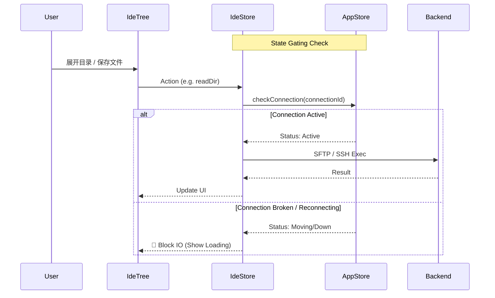

# OxideTerm IDE 模式

> 轻量级远程开发环境，在终端与代码编辑之间无缝切换

## 📖 概述

IDE 模式是 OxideTerm 的核心特性之一，让你无需安装 VS Code Remote 或配置远程开发服务器，即可直接在 SSH 连接上进行代码编辑、文件浏览和终端操作。

### 核心优势

| 特性 | 说明 |
|------|------|
| **零配置** | 无需在远程服务器安装任何 Agent 或插件 |
| **轻量快速** | 基于 SFTP 协议，复用现有 SSH 连接 |
| **原生体验** | CodeMirror 6 编辑器，支持语法高亮、自动补全 |
| **Git 集成** | 实时显示文件修改状态和分支信息 |
| **自愈连接** | v1.4.0 引入的强一致性连接架构，断网重连不丢失上下文 |

## 🚀 快速开始

### 进入 IDE 模式

1. 在连接列表中右键点击一个 SSH 连接
2. 选择 **「以 IDE 模式打开」**
3. 在弹出的对话框中选择远程项目目录
4. 点击确认，即可进入 IDE 工作区

或者在已连接的终端会话中，点击工具栏的 **「IDE」** 按钮切换。

## 🖼️ 界面布局

```
┌─────────────────────────────────────────────────────────────────┐
│  项目名称                                        ⌘ main ↑1      │
├───────────┬─────────────────────────────────────────────────────┤
│           │  [file1.ts] [file2.rs] [config.json ●]              │
│  📁 src   ├─────────────────────────────────────────────────────┤
│   📄 main │                                                     │
│   📄 lib  │              CodeMirror 编辑器                       │
│  📁 docs  │                                                     │
│  📄 README│                                                     │
│           │                                                     │
├───────────┴─────────────────────────────────────────────────────┤
│  $ ~/project  ▌                                                 │
│  终端面板（可折叠）                                               │
├─────────────────────────────────────────────────────────────────┤
│  Ln 42, Col 15  │  UTF-8  │  TypeScript  │  main ↑1 ↓0         │
└─────────────────────────────────────────────────────────────────┘
```

### 区域说明

| 区域 | 功能 |
|------|------|
| **文件树（左侧）** | 浏览项目文件，支持展开/折叠目录，显示 Git 状态颜色 |
| **标签栏** | 已打开的文件标签，`●` 表示有未保存的修改 |
| **编辑器** | CodeMirror 6 编辑器，支持多种编程语言语法高亮 |
| **终端面板** | 集成 SSH 终端，可执行命令、运行程序 |
| **状态栏** | 显示光标位置、文件编码、语言、Git 分支信息 |

## ⚙️ 核心流程与架构 (v1.4.0)

OxideTerm v1.4.0 彻底重构了 IDE 模式的连接管理，采用了 **"强一致性同步"** 和 **"Key-Driven 重置"** 架构，确保在极其不稳定的网络环境下也能保证数据一致性。

### 1. 强一致性同步架构

IDE 模式的所有 IO 操作（文件读取、Git 刷新、保存）都必须经过严格的状态门禁：



### 2. Key-Driven 自动重置与自愈

为了解决 SSH 重连后旧状态残留的问题，我们引入了基于 React Key 的物理级重置机制：

```tsx
// AppLayout.tsx
// 当重连发生 (connectionId 改变)，整个 IDE 树被销毁并重建
<IdeWorkspace
  key={`ide-${sessionId}-${connectionId}`}
  connectionId={sessionId}
  sftpSessionId={sessionId}
  rootPath="~"
/>
```

**生命周期��转**：
1. **断网**：Backend 重连，前一个 `connectionId` 失效。
2. **销毁**：React 卸载旧组件，自动清理所有 Pending 的 SFTP 请求、Watcher 和各种内存状态。
3. **重建**：重连成功，生成新 `connectionId`，组件重新挂载。
4. **恢复**：
    - 从 `ideStore` 的 `cachedProjectPath` 和 `cachedTabPaths` 恢复上次的状态。
    - 重新订阅 Git 状态变更。
    - 重新加载文件树根目录。

### 3. 多 Store 协同

IDE 模式不仅仅依赖单一 Store，而是三个 Store 的协奏曲：


## 🌳 文件树功能

### Git 状态指示

文件树中的文件会根据 Git 状态显示不同颜色：

| 颜色 | 状态 | 说明 |
|------|------|------|
| 🟡 黄色 | Modified | 已修改 |
| 🟢 绿色 | Added | 新增（已暂存） |
| 🔴 红色 | Deleted | 已删除 |
| 🔵 蓝色 | Renamed | 重命名 |
| ⚫ 灰色 | Untracked | 未跟踪 |
| 🔴 深红 | Conflict | 冲突 |

### 行为驱动刷新 (Behavior-Driven Refresh)

为了减少 SSH 流量，Git 状态不再使用轮询，而是由用户行为触发：

- **文件保存**: `ideStore.saveFile()` -> 触发刷新
- **文件操作**: 新建/删除/重命名 -> 触发刷新
- **终端回车**: 在集成终端按 Enter 键 -> 延迟 500ms 触发刷新 (智能捕获 CLI git 命令)
- **窗口聚焦**: 窗口重新获得焦点 -> 触发刷新

## 📝 编辑器功能

### 文件冲突处理 (Data Consistency)

当保存文件时，IDE 会执行 "乐观锁" 检查：

1. **保存前**: 获取远程文件 `mtime`。
2. **比较**: 与文件打开时的 `mtime` 对比。
3. **冲突**: 如果远程更新，弹出冲突解决对话框。
    - **覆盖保存**：用本地内容覆盖远程文件
    - **重新加载**：放弃本地修改，加载远程最新内容

## 🔧 技术实现细节

### 搜索缓存策略

为了在远程 SFTP 环境下提供流畅的全局搜索：

- **缓存键**: `Query + Options + ConnectionId`
- **TTL**: 60 秒 (文件变动自动失效)
- **失效机制**: 任何文件写入操作都会清空当前连接的搜索缓存

### 路径记忆 (Path Memory)

组件重装不应丢失上下文。`ideStore` 使用持久化状态存储会话信息：

```typescript
// ideStore.ts - 使用 Zustand persist 中间件
interface IdeState {
  cachedProjectPath: string | null;   // 上次打开的项目路径
  cachedTabPaths: string[];           // 上次打开的文件路径列表
  cachedNodeId: string | null;        // 上次关联的节点 ID
  lastClosedAt: number | null;        // 上次关闭时间
}

// 打开项目时自动缓存
set({
  cachedProjectPath: projectInfo.rootPath,
  cachedTabPaths: [...new Set([...state.cachedTabPaths, path])],
});
```

## 📋 已知限制

| 限制 | 说明 |
|------|------|
| 文件大小 | 建议 < 1MB，大文件会切换到只读模式 |
| 二进制文件 | 不支持编辑，会提示打开 Hex 查看器 |
| 实时协作 | 不支持多人同时编辑 |
| LSP | 暂不支持语言服务器协议（自动补全基于本地 CodeMirror） |

## 🗺️ 路线图

### 计划中的功能

- [ ] 多光标编辑
- [ ] 代码折叠
- [ ] 小地图 (Minimap)
- [ ] 文件比较 (Diff View)
- [ ] 书签系统
- [ ] 片段管理 (Snippets)

---

*文档版本: v1.4.0 | 适配架构: Strong Sync + Key-Driven Reset*
