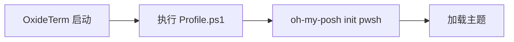
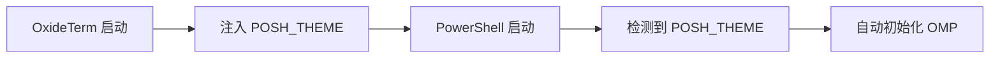

# Oh My Posh (OMP) 支持

> OxideTerm v1.2.2+
> 完美支持 Windows PowerShell 的 Oh My Posh 提示符主题引擎

## 🎨 功能简介

OxideTerm 现已原生支持 [Oh My Posh](https://ohmyposh.dev/)，让您在 Windows 上享受美观、强大的终端提示符体验。

**核心特性：**
- ✅ **Unicode 11 支持** - 正确渲染 Nerd Font 图标和宽字符
- ✅ **灵活配置** - 可选择加载 PowerShell Profile 或直接注入 OMP 环境变量
- ✅ **多语言 UI** - 设置界面支持 9 种语言（中文、英语、日语、韩语等）
- ✅ **跨 Shell 兼容** - 支持 PowerShell、pwsh、bash、zsh 等

---

## 🚀 快速开始

### 1️⃣ 安装 Oh My Posh

```powershell
# Windows (PowerShell)
winget install JanDeDobbeleer.OhMyPosh -s winget

# 验证安装
oh-my-posh --version
```

### 2️⃣ 配置 OxideTerm

1. 打开 **设置 → 本地终端**
2. 找到 **Oh My Posh** 部分
3. 启用 **"Enable Oh My Posh"**
4. （可选）设置 **"Theme Path"**，例如：
   ```
   C:\Users\你的用户名\AppData\Local\Programs\oh-my-posh\themes\agnoster.omp.json
   ```

### 3️⃣ 创建新终端

按 `Cmd+T`（macOS）或 `Ctrl+T`（Windows）新建本地终端，即可看到 Oh My Posh 主题效果！

---

## ⚙️ 配置选项

### Shell Profile 加载

**位置：** 设置 → 本地终端 → Shell Profile

| 选项 | 说明 |
|------|------|
| **Load Shell Profile** | 是否执行 Shell 启动文件（`.bashrc`, `.zshrc`, `Profile.ps1`）<br>默认：✅ 启用 |

**使用场景：**
- ✅ 启用：依赖 PowerShell `$PROFILE` 中的 `oh-my-posh init` 命令
- ⬜ 禁用：通过 OxideTerm 直接注入环境变量（推荐干净安装）

### Oh My Posh 设置

**位置：** 设置 → 本地终端 → Oh My Posh

| 选项 | 说明 |
|------|------|
| **Enable Oh My Posh** | 启用 OMP 环境变量注入<br>默认：⬜ 禁用 |
| **Theme Path** | OMP 主题文件路径（`.omp.json`）<br>留空使用默认主题 |

**环境变量注入（Windows）：**
```env
TERM_PROGRAM=OxideTerm
TERM_PROGRAM_VERSION=1.2.2
POSH_THEME=你设置的主题路径
```

---

## 🔄 工作原理

### 方案 A：依赖 PowerShell Profile


**配置：**
- ✅ Load Shell Profile = 启用
- ⬜ Enable Oh My Posh = 禁用

**优点：** 与其他终端行为一致  
**缺点：** 需要手动配置 `$PROFILE`

### 方案 B：环境变量注入（推荐）


**配置：**
- ⬜ Load Shell Profile = 禁用（可选）
- ✅ Enable Oh My Posh = 启用
- 📝 Theme Path = 主题路径

**优点：** 无需修改 `$PROFILE`，配置集中管理  
**缺点：** 需要 PowerShell 7.2+ 或配合 Profile

---

## 📋 支持的 Shell

| Shell | Profile 文件 | OMP 支持 |
|-------|-------------|----------|
| **PowerShell** | `$PROFILE` | ✅ 完整支持 |
| **pwsh** (PS Core) | `$PROFILE` | ✅ 完整支持 |
| **bash** | `.bashrc`, `.bash_profile` | ✅ 支持（需安装 OMP） |
| **zsh** | `.zshrc` | ✅ 支持（需安装 OMP） |
| **fish** | `config.fish` | ✅ 支持（需安装 OMP） |

---

## 🎨 推荐主题

Oh My Posh 内置主题位置：
```
Windows: C:\Users\<用户名>\AppData\Local\Programs\oh-my-posh\themes\
macOS:   ~/.oh-my-posh/themes/
Linux:   ~/.oh-my-posh/themes/
```

**热门主题：**
- `agnoster.omp.json` - 简洁经典
- `jandedobbeleer.omp.json` - 作者日常使用
- `paradox.omp.json` - 信息丰富
- `powerlevel10k_rainbow.omp.json` - 色彩丰富

**在线预览：** https://ohmyposh.dev/docs/themes

---

## 🐛 故障排查

### 问题 1：主题不显示

**检查清单：**
- [ ] 已安装 Oh My Posh？运行 `oh-my-posh --version`
- [ ] 主题路径正确？检查文件是否存在
- [ ] 已安装 Nerd Font？（必需，用于图标显示）
- [ ] 在设置中启用了 **Enable Oh My Posh**？

### 问题 2：字符显示错乱

**解决方案：**
1. 安装 Nerd Font（推荐：`MesloLGS NF`）
2. 在 OxideTerm 设置中应用该字体
3. Unicode11Addon 已自动加载，无需额外配置

### 问题 3：启动缓慢

**原因：** Oh My Posh 需要时间初始化和渲染提示符

**优化建议：**
- 禁用不需要的 OMP 模块
- 使用更简洁的主题
- 考虑禁用 `Load Shell Profile` 减少加载内容

---

## 🔧 技术细节

### 架构实现

**前端（TypeScript）：**
- `settingsStore.ts` - 设置存储和管理
- `SettingsView.tsx` - 用户界面组件
- `LocalTerminalView.tsx` - Unicode11Addon 加载

**后端（Rust）：**
- `shell.rs` - 动态 Shell 参数生成 `get_shell_args()`
- `pty.rs` - PTY 配置和环境变量注入
- `session.rs` - 会话管理 `start_with_options()`

### 数据流

```
用户设置 (UI)
    ↓
settingsStore.localTerminal
    ↓
localTerminalStore.createTerminal()
    ↓
Tauri Command: local_create_terminal
    ↓
registry.create_session_with_options()
    ↓
PtyConfig { load_profile, oh_my_posh_enabled, oh_my_posh_theme }
    ↓
PTY 启动 + 环境变量注入
```

---

## 📚 相关资源

- [Oh My Posh 官方文档](https://ohmyposh.dev/)
- [Nerd Fonts 下载](https://www.nerdfonts.com/)
- [PowerShell 文档](https://docs.microsoft.com/powershell/)
- [OxideTerm 本地终端文档](./LOCAL_TERMINAL.md)

---

## 📝 更新日志

### v1.2.2 (2026-01-21)

**新增功能：**
- ✅ Oh My Posh 原生支持
- ✅ Unicode 11 宽字符渲染
- ✅ Shell Profile 加载开关
- ✅ 动态 Shell 参数生成
- ✅ 9 语言本地化支持

**技术改进：**
- 移除硬编码的 PowerShell `-NoProfile` 参数
- 新增 `get_shell_args()` 函数支持灵活配置
- PTY 环境变量注入机制
- 143 个单元测试全部通过

---

**Enjoy your beautiful terminal! 🎉**

