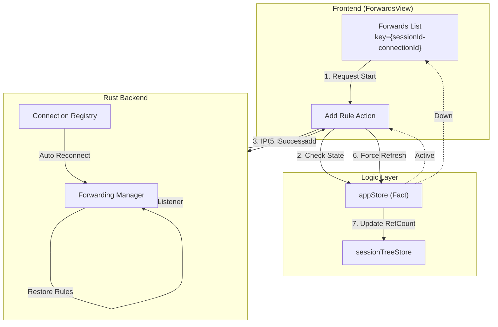
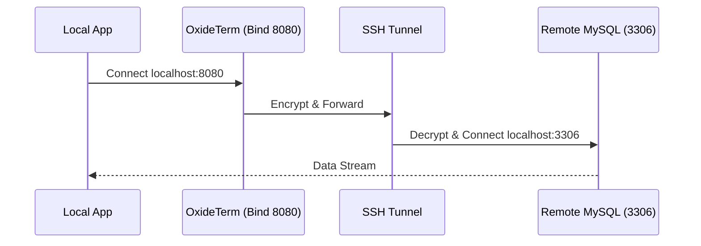
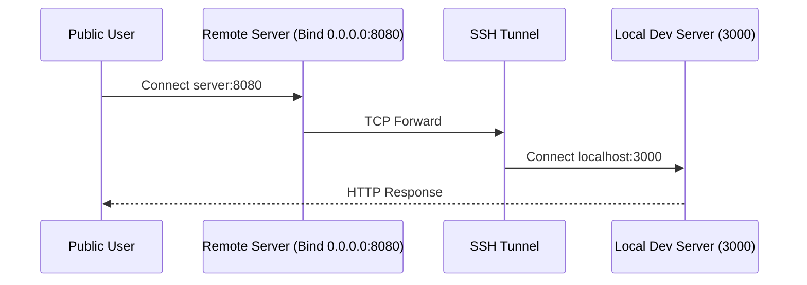

# OxideTerm 端口转发功能文档

> 依托于 v1.4.x 核心架构的智能端口转发系统，支持自愈、状态同步与精确的生命周期管理。

## 📖 概述

OxideTerm 提供企业级的 SSH 端口转发功能，不仅支持标准的本地、远程和动态转发，还集成了 **自动重连自愈**、**强一致性同步** 和 **死亡报告** 机制，确保隧道在网络波动时依然稳定可靠。

### 核心特性

| 特性 | 版本 | 说明 |
|------|------|------|
| **Link Resilience** | v1.4.0 | SSH 连接断开重连后，自动恢复所有转发规则 |
| **强一致性同步** | v1.4.0 | 规则变更强制触发 `AppStore` 刷新，确保连接引用计数准确 |
| **实时流量监控** | v1.4.0 | 基于 Tauri Event 的实时流量统计 (Bytes In/Out) |
| **状态门禁** | v1.4.0 | UI 操作严格受连接状态 (`Active`) 保护 |
| **死亡报告 (Death Reporting)** | v1.4.1 | 转发任务异常退出时主动上报，保持状态一致性 |
| **SSH 断连广播** | v1.4.1 | HandleController 提供 `subscribe_disconnect()` 广播通道 |
| **Suspended 状态** | v1.4.1 | 新增 `ForwardStatus::Suspended` 表示 SSH 断连导致的挂起 |
| **无锁 Channel I/O** | v1.4.2 | 移除 `Arc<Mutex<Channel>>`，采用消息传递模式消除锁竞争 |
| **子任务信号传播** | v1.4.2 | 子连接任务接收 shutdown 广播信号，SSH 断开时主动退出 |
| **全链路超时保护** | v1.4.2 | 所有 I/O 路径都有 `IDLE_TIMEOUT` (300s) 保护，防止僵尸连接 |

---

## 🏗️ 架构与数据流 (v1.4.0)

端口转发模块深度集成了双 Store 架构：



### Key-Driven 重置机制

`ForwardsView` 组件被包裹在 `IdeWorkspace` 或作为独立 Tab 存在，其生命周期与物理连接绑定：

```tsx
// ForwardsView.tsx
// 当重连发生 (connectionId 改变)，组件自动重置
// 触发 useEffect 重新拉取当前活跃的转发规则
useEffect(() => {
  if (connectionId && status === 'active') {
    refreshRules();
  }
}, [connectionId, status]);
```

---

## 转发类型

### 1. 本地转发 (Local Forwarding)

**场景**: 访问远程数据库或内部 Web 服务。



**配置**:
- **Source**: `localhost:8080`
- **Destination**: `localhost:3306`

### 2. 远程转发 (Remote Forwarding)

**场景**: 将本地开发服务器暴露给公网/队友访问。



**配置**:
- **Source**: `0.0.0.0:8080` (注意服务器需开启 `GatewayPorts yes`)
- **Destination**: `localhost:3000`

### 3. 动态转发 (SOCKS5 Proxy)

**场景**: 全局代理或特定网络环境访问。

**配置**:
- **Bind**: `localhost:1080`

---

## 界面交互

### 流量监控与状态同步

v1.4.0 引入了精确的流量统计和状态反馈：

```
┌─────────────────────────────────────────────────────────────┐
│ Port Forwards - prod-db (Active)               [+ New Rule] │
├─────────────────────────────────────────────────────────────┤
│                                                             │
│ ┌─────────────────────────────────────────────────────────┐ │
│ │ 🟢 Local: 8080 -> 3306                                  │ │
│ │ 3 active connections                                    │ │
│ │ Traffic: ↑ 1.2 MB  ↓ 45.8 MB                            │ │
│ │ [Stop] [Edit] [Delete]                                  │ │
│ └─────────────────────────────────────────────────────────┘ │
│                                                             │
│ ┌─────────────────────────────────────────────────────────┐ │
│ │ 🔴 Remote: 9000 -> 3000                                 │ │
│ │ Error: Address already in use                           │ │
│ │ [Retry] [Delete]                                        │ │
│ └─────────────────────────────────────────────────────────┘ │
│                                                             │
└─────────────────────────────────────────────────────────────┘
```

> **注意**: 流量统计每 2 秒聚合一次推送前端，避免 IPC 拥塞。

---

## API 参考

### 创建转发 (Strong Sync)

```typescript
// src/lib/api.ts

// 创建端口转发
const response = await api.createPortForward({
  session_id: sessionId,
  forward_type: 'Local',
  bind_address: '127.0.0.1',
  bind_port: 8080,
  target_host: 'localhost',
  target_port: 3000,
});

// 刷新转发规则列表
const rules = await api.listPortForwards(sessionId);
```

### 规则实体定义

```typescript
interface ForwardRule {
  id: string;               // UUID
  forward_type: 'Local' | 'Remote' | 'Dynamic';
  bind_address: string;
  bind_port: number;
  target_host: string;      // Dynamic 类型为空字符串
  target_port: number;      // Dynamic 类型为 0
  status: 'starting' | 'active' | 'stopped' | 'error' | 'suspended';
  description?: string;
  error_msg?: string;
  stats?: {
    connections: number;
    bytes_sent: number;
    bytes_received: number;
  }
}
```

---

## 故障排除与自愈

### 1. 自动重连行为

当 SSH 连接断开时：
1. **LinkDown**: 所有转发规则状态变更为 `Suspended` (橙色)。
2. **Death Reporting**: 转发任务检测到 SSH 断连，通过 `ForwardEventEmitter` 上报状态。
3. **Reconnecting**: 后端尝试重建 SSH 通道。
4. **Restored**:
    - 连接恢复 `Active`。
    - 后端自动遍历 `SavedRules` 并重新申请端口绑定。
    - 前端收到 `refreshConnections` 信号，更新列表颜色为绿色。

### 2. 死亡报告机制 (v1.4.1)

转发任务（local.rs / dynamic.rs / remote.rs）现在具备主动上报能力：

```rust
// 任务内部维护退出原因
enum ExitReason {
    SshDisconnected,  // SSH 连接断开
    StopRequested,    // 用户主动停止
    Error,            // 其他错误
}

// 任务退出时，根据原因发送事件
match exit_reason {
    ExitReason::SshDisconnected => {
        emitter.emit_status_changed(
            forward_id,
            ForwardStatus::Suspended,
            Some("SSH connection lost".into()),
        );
    }
    // ...
}
```

这确保了：
- **状态一致性**: `ForwardingManager` 的内存状态与实际任务状态同步
- **UI 响应性**: 前端立即收到状态变更事件，更新显示
- **可恢复性**: `Suspended` 状态的转发规则可在重连后自动恢复

### 3. 无锁 Channel I/O 架构 (v1.4.2)

v1.4.2 重构了转发连接的数据桥接逻辑，从 `Arc<Mutex<Channel>>` 模式升级为消息传递模式：

**问题背景：**
- 旧架构中，读写任务竞争同一个 Mutex 锁
- 持锁调用 `.await` 可能导致其他任务长时间等待
- 某些边缘情况下存在死锁风险

**新架构：**
```
┌─────────────────────────────────────────────────────────────┐
│  handle_forward_connection                                  │
│                                                             │
│  ┌─────────────┐   mpsc    ┌─────────────────────────────┐  │
│  │ local_reader├──────────►│                             │  │
│  │ (无锁读)    │           │   ssh_io                    │  │
│  └─────────────┘           │   (单独持有 Channel,        │  │
│                            │    无需 Mutex)              │  │
│  ┌─────────────┐   mpsc    │                             │  │
│  │ local_writer│◄──────────┤                             │  │
│  │ (无锁写)    │           └─────────────────────────────┘  │
│  └─────────────┘                                            │
│                                                             │
│  shutdown_rx ← 来自主任务的 broadcast 信号                  │
└─────────────────────────────────────────────────────────────┘
```

**关键改进：**
- **Channel 单所有权**: SSH Channel 由 `ssh_io` 任务独占持有，无需 Mutex
- **mpsc 解耦**: 读写任务通过 `mpsc::channel` 与 SSH I/O 任务通信
- **信号传播**: 子连接任务订阅 `shutdown_rx`，SSH 断开时主动退出
- **全链路超时**: 所有 I/O 操作都有 `IDLE_TIMEOUT` (300s) 保护

### 4. 常见错误处理

| 错误信息 | 原因 | 解决方案 |
|---------|------|----------|
| `EADDRINUSE` | 端口已被占用 | 检查本地其他进程或僵尸 SSH 进程 |
| `EACCES` | 权限不足 | 绑定 <1024 端口需要管理员权限 (sudo) |
| `Remote Port Forward Failed` | 服务器拒绝 | 检查服务器 `AllowTcpForwarding` 和 `GatewayPorts` 设置 |
| `SSH connection lost` | SSH 连接意外断开 | 检查网络稳定性，转发将在重连后自动恢复 |

---

## 安全最佳实践

1. **最小权限绑定**
   - 默认绑定 `127.0.0.1`，仅当需要外部访问时才使用 `0.0.0.0`。
2. **连接池复用**
   - 多个转发规则会复用同一个 SSH 连接（引用计数增加）。
   - 关闭最后一个转发且无终端会话时，物理连接将在 30分钟 (idle_timeout) 后断开。

---

*文档版本: v1.4.2 | 适配架构: Strong Sync + Auto Recovery + Death Reporting + Lock-Free I/O*
