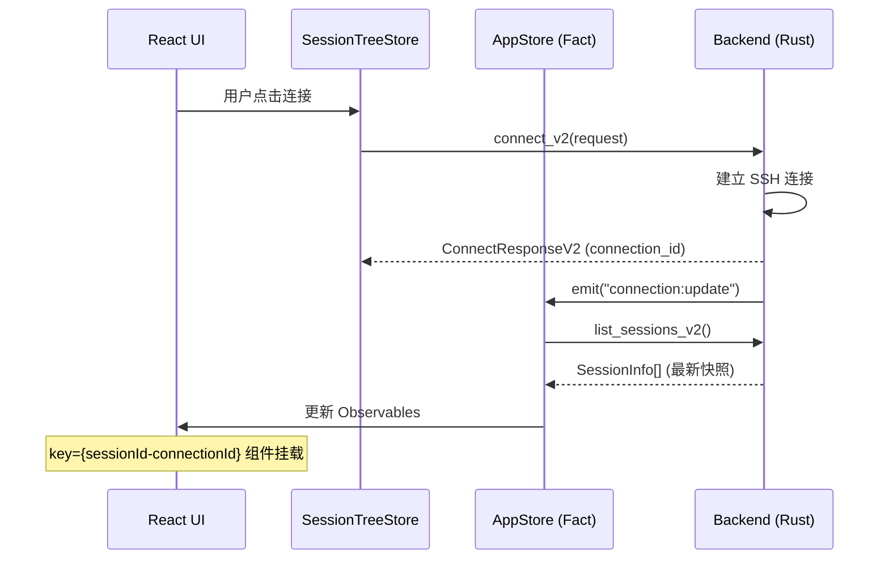
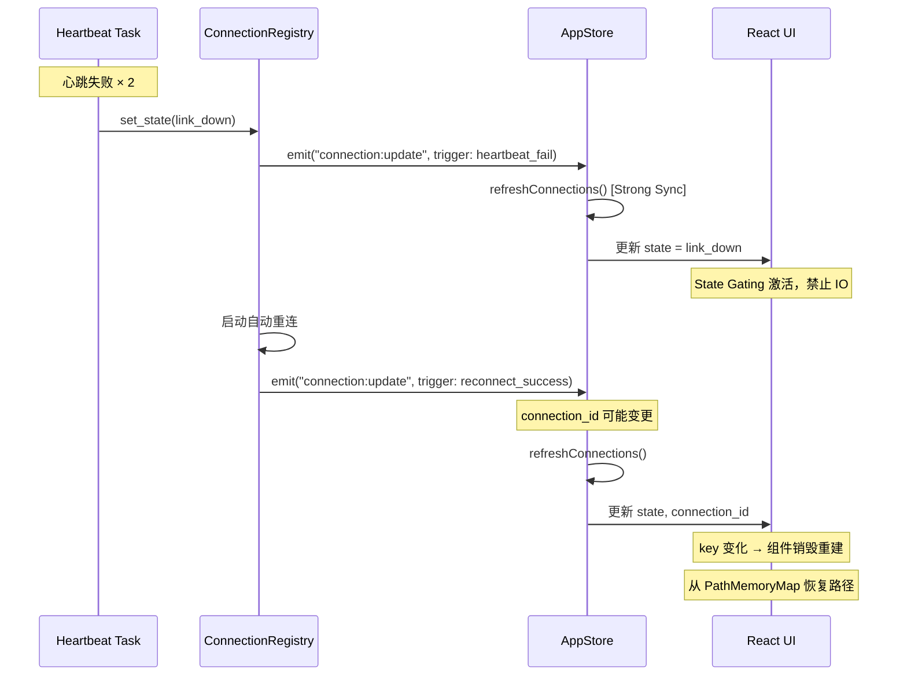
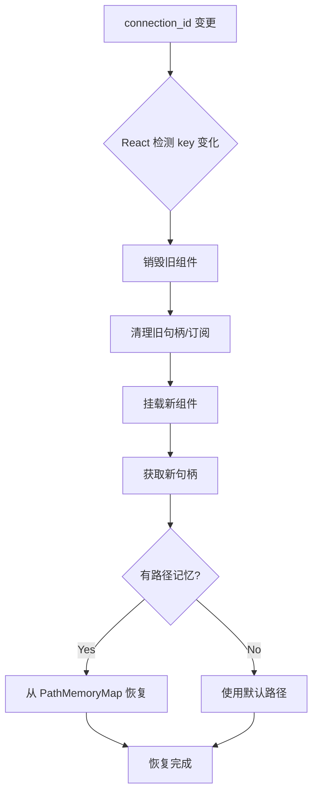

# OxideTerm Protocol Documentation (v1.4.0)

> **v1.4.0 核心架构**: 本协议文档已与 **Strong Consistency Sync** 和 **Key-Driven Reset** 架构完全对齐。所有连接状态变更均通过事件系统触发前端强制同步。

## 目录

1. [Wire Protocol (WebSocket)](#wire-protocol-websocket)
2. [Tauri Commands](#tauri-commands)
   - [Session Commands](#session-commands-v2)
   - [Config Commands](#config-commands-连接管理)
   - [SFTP Commands](#sftp-commands)
   - [Port Forwarding Commands](#port-forwarding-commands)
   - [Health Commands](#health-commands)
3. [Events (事件系统)](#events-事件系统)
4. [Strong Sync 协议流程](#strong-sync-协议流程)
5. [数据类型映射](#数据类型映射)

---

## Wire Protocol (WebSocket)

### 帧格式

```
+--------+--------+--------+--------+--------+-- ... --+
| Type   | Length (4 bytes, big-endian)      | Payload |
| (1B)   |                                   |         |
+--------+--------+--------+--------+--------+-- ... --+
```

### 消息类型

| Type | 名称 | Payload 格式 | 方向 |
|------|------|--------------|------|
| 0x00 | Data | 原始字节 (终端 I/O) | 双向 |
| 0x01 | Resize | cols: u16 BE, rows: u16 BE | Client→Server |
| 0x02 | Heartbeat | seq: u32 BE | 双向 |
| 0x03 | Error | UTF-8 错误消息 | Server→Client |

### 帧限制

- **最大 Payload 大小**: 16 MB (`MAX_PAYLOAD_SIZE = 16 * 1024 * 1024`)
- **协议版本**: `PROTOCOL_VERSION = 1`

### 心跳机制

- 服务端每 30s 发送心跳 (seq 递增)
- 客户端收到后立即回显相同 seq
- 90s 无响应则断开连接
- **v1.4.0**: 心跳失败触发 `connection:update` 事件，前端进入 State Gating 模式

---

## Tauri Commands

### Session Commands (v2)

#### `connect_v2`

**请求:**
```typescript
interface ConnectRequest {
  host: string;
  port: number;
  username: string;
  // Auth 使用 serde flatten + tag
  auth_type: 'password' | 'key' | 'default_key';
  password?: string;      // auth_type='password' 时必填
  key_path?: string;      // auth_type='key' 时必填
  passphrase?: string;    // 可选，用于加密密钥
  cols?: number;          // 默认 80
  rows?: number;          // 默认 24
  name?: string;          // 自定义会话名称
}
```

**Rust 端定义:**
```rust
#[derive(Deserialize)]
pub struct ConnectRequest {
    pub host: String,
    pub port: u16,
    pub username: String,
    #[serde(flatten)]
    pub auth: AuthRequest,  // 使用 flatten 展开
    #[serde(default = "default_cols")]
    pub cols: u32,
    #[serde(default = "default_rows")]
    pub rows: u32,
    pub name: Option<String>,
}

#[derive(Deserialize)]
#[serde(tag = "auth_type", rename_all = "snake_case")]
pub enum AuthRequest {
    Password { password: String },
    Key { key_path: String, passphrase: Option<String> },
    DefaultKey { passphrase: Option<String> },
}
```

**响应:**
```typescript
interface ConnectResponseV2 {
  session_id: string;
  connection_id: string;   // v1.4.0: 用于 Key-Driven Reset
  ws_url: string;          // e.g., "ws://localhost:55880"
  port: number;
  session: SessionInfo;
}

interface SessionInfo {
  id: string;
  connection_id: string;   // v1.4.0: 连接标识符
  name: string;
  host: string;
  port: number;
  username: string;
  state: ConnectionState;
  error?: string;
  ws_url?: string;
  color: string;           // 自动生成的 hex 颜色
  uptime_secs: number;
  order: number;           // Tab 排序
}

type ConnectionState = 
  | 'disconnected' 
  | 'connecting' 
  | 'connected' 
  | 'link_down'      // 心跳失败
  | 'reconnecting'   // 自动重连中
  | 'idle'           // 空闲 (ref_count = 0)
  | 'disconnecting' 
  | 'error';
```

**v1.4.0 Strong Sync**: 连接成功后，后端 emit `connection:update` 事件。

#### `disconnect_v2`

```typescript
// 请求
{ sessionId: string }

// 响应
void (成功) 或 Error string
```

**v1.4.0**: 断开后 emit `connection:update`，触发前端 `refreshConnections()`。

#### `list_sessions_v2`

```typescript
// 请求
(无参数)

// 响应
SessionInfo[]
```

**v1.4.0**: 这是 **Strong Sync** 的核心拉取接口。前端收到 `connection:update` 事件后必须调用此命令获取最新状态快照。

#### `resize_session_v2`

```typescript
// 请求
{ sessionId: string, cols: number, rows: number }

// 响应
void
```

**v1.4.0 State Gating**: 前端调用前必须检查 `connectionState === 'connected'`。

#### `reorder_sessions`

```typescript
// 请求
{ orderedIds: string[] }  // 按顺序排列的 session ID

// 响应
void
```

#### `check_ssh_keys`

```typescript
// 请求
(无参数)

// 响应
string[]  // 可用 SSH 密钥路径列表，如 ["~/.ssh/id_rsa", "~/.ssh/id_ed25519"]
```

#### `get_session_stats`

```typescript
// 请求
(无参数)

// 响应
interface SessionStats {
  total: number;
  connected: number;
  connecting: number;
  disconnected: number;
  link_down: number;      // v1.4.0 新增
  reconnecting: number;   // v1.4.0 新增
  error: number;
}
```

#### `get_session`

```typescript
// 请求
{ sessionId: string }

// 响应
SessionInfo  // 单个会话信息，未找到时抛出错误
```

---

### Config Commands (连接管理)

#### `get_connections`

获取所有保存的连接。

```typescript
// 请求
(无参数)

// 响应
ConnectionInfo[]
```

#### `get_recent_connections`

获取最近使用的连接。

```typescript
// 请求
{ limit?: number }  // 默认 5

// 响应
ConnectionInfo[]
```

#### `get_connections_by_group`

按分组获取连接。

```typescript
// 请求
{ group?: string }  // null 表示未分组

// 响应
ConnectionInfo[]
```

#### `search_connections`

搜索连接（匹配名称、主机、用户名）。

```typescript
// 请求
{ query: string }

// 响应
ConnectionInfo[]
```

#### `get_groups`

获取所有分组名称。

```typescript
// 请求
(无参数)

// 响应
string[]
```

#### `save_connection`

创建或更新连接。

```typescript
// 请求
interface SaveConnectionRequest {
  id?: string;           // 有值 = 更新，无值 = 创建
  name: string;
  group?: string;
  host: string;
  port: number;
  username: string;
  auth_type: 'password' | 'key' | 'agent';
  password?: string;     // auth_type='password' 时必填
  key_path?: string;     // auth_type='key' 时必填
  color?: string;
  tags: string[];
}

// 响应
ConnectionInfo
```

**v1.4.0**: 保存成功后 emit `connection:update`。

#### `delete_connection`

删除连接（同时删除 keychain 中的密码）。

```typescript
// 请求
{ id: string }

// 响应
void
```

**v1.4.0**: 删除后 emit `connection:update`。

#### `mark_connection_used`

标记连接为已使用（更新 `last_used_at`）。

```typescript
// 请求
{ id: string }

// 响应
void
```

#### `get_connection_password`

从 keychain 获取连接密码。

```typescript
// 请求
{ id: string }

// 响应
string  // 明文密码
```

#### `list_ssh_config_hosts`

列出 `~/.ssh/config` 中的主机配置。

```typescript
// 请求
(无参数)

// 响应
interface SshHostInfo {
  alias: string;
  hostname: string;
  user?: string;
  port: number;
  identity_file?: string;
}[]
```

#### `import_ssh_host`

导入 SSH config 主机为保存的连接。

```typescript
// 请求
{ alias: string }  // SSH config 中的 Host 别名

// 响应
ConnectionInfo
```

**v1.4.0**: 导入后 emit `connection:update`。

#### `get_ssh_config_path`

获取 SSH config 文件路径。

```typescript
// 请求
(无参数)

// 响应
string  // 如 "/Users/xxx/.ssh/config"
```

#### `create_group`

创建连接分组。

```typescript
// 请求
{ name: string }

// 响应
void
```

#### `delete_group`

删除分组（连接移至未分组）。

```typescript
// 请求
{ name: string }

// 响应
void
```

#### 共享类型定义

```typescript
interface ConnectionInfo {
  id: string;
  name: string;
  group?: string;
  host: string;
  port: number;
  username: string;
  auth_type: 'password' | 'key' | 'agent';
  key_path?: string;       // 仅 key auth
  created_at: string;      // ISO 8601
  last_used_at?: string;   // ISO 8601
  color?: string;          // hex 颜色
  tags: string[];
}
```

---

### SFTP Commands

> **Oxide-Next**: 所有 SFTP 命令已迁移至 `node_sftp_*` 前缀，使用 `nodeId` 路由，不再需要 `sessionId`。
> 后端通过 `NodeRouter` 自动查找对应的 `ConnectionEntry` 并获取 SFTP session。

**State Gating**: 所有 SFTP 命令执行前，前端检查节点状态 `status === 'connected'`。

#### `node_sftp_init`

初始化 SFTP 子系统（通过 NodeRouter 自动获取 SSH 连接）。

```typescript
// 请求
{ nodeId: string }

// 响应
string  // 当前工作目录路径
```

#### `node_sftp_list_dir`

列出目录内容。

```typescript
// 请求
{
  nodeId: string;
  path: string;
  filter?: ListFilter;
}

interface ListFilter {
  show_hidden?: boolean;
  pattern?: string | null;
  sort?: SortOrder;
}

// 响应
FileInfo[]
```

#### `node_sftp_stat`

获取文件/目录信息。

```typescript
// 请求
{ nodeId: string; path: string }

// 响应
FileInfo
```

#### `node_sftp_preview`

预览文件内容（文本/图片/视频/音频/PDF等）。

```typescript
// 请求
{ nodeId: string; path: string }

// 响应
PreviewContent
```

#### `node_sftp_preview_hex`

增量加载 Hex 数据。

```typescript
// 请求
{ nodeId: string; path: string; offset: number }

// 响应
PreviewContent
```

#### `node_sftp_download`

下载文件（支持进度事件）。

```typescript
// 请求
{
  nodeId: string;
  remotePath: string;
  localPath: string;
}

// 响应
void  // 通过事件推送进度
```

#### `node_sftp_upload`

上传文件（支持进度事件）。

```typescript
// 请求
{
  nodeId: string;
  localPath: string;
  remotePath: string;
}

// 响应
void  // 通过事件推送进度
```

#### `node_sftp_delete`

删除文件。

```typescript
// 请求
{ nodeId: string; path: string }

// 响应
void
```

#### `node_sftp_delete_recursive`

递归删除目录。

```typescript
// 请求
{ nodeId: string; path: string }

// 响应
number  // 已删除的文件/目录数量
```

#### `node_sftp_mkdir`

创建目录。

```typescript
// 请求
{ nodeId: string; path: string }

// 响应
void
```

#### `node_sftp_rename`

重命名/移动文件或目录。

```typescript
// 请求
{ nodeId: string; oldPath: string; newPath: string }

// 响应
void
```

#### `node_sftp_download_dir`

下载目录。

```typescript
// 请求
{ nodeId: string; remotePath: string; localPath: string }

// 响应
number  // 已下载的文件数量
```

#### `node_sftp_upload_dir`

上传目录。

```typescript
// 请求
{ nodeId: string; localPath: string; remotePath: string }

// 响应
number  // 已上传的文件数量
```

#### `node_sftp_write`

写入文件内容。

```typescript
// 请求
{ nodeId: string; path: string; content: string; createNew: boolean }

// 响应
{ bytesWritten: number }
```

#### Transfer Control Commands

以下命令基于 `transferId`，不依赖 nodeId：

```typescript
// 取消传输
sftp_cancel_transfer({ transferId: string })

// 暂停传输
sftp_pause_transfer({ transferId: string })

// 恢复传输
sftp_resume_transfer({ transferId: string })

// 查询传输统计
sftp_transfer_stats({ transferId: string }) → TransferStats

// 更新传输设置
sftp_update_settings({ transferId: string, settings: TransferSettings })
```

#### SFTP 共享类型

```typescript
interface FileInfo {
  name: string;
  path: string;
  file_type: FileType;
  size: number;
  modified: string;      // ISO 8601
  permissions: string;   // 如 "rwxr-xr-x"
  owner?: string;
  group?: string;
}

type FileType = 'file' | 'directory' | 'symlink' | 'unknown';
```

---

### Port Forwarding Commands

#### `create_port_forward`

创建端口转发。

```typescript
// 请求
interface CreateForwardRequest {
  session_id: string;
  forward_type: 'local' | 'remote';
  bind_address: string;   // 本地转发: 本地地址; 远程转发: 远程绑定地址
  bind_port: number;
  target_host: string;
  target_port: number;
  description?: string;
}

// 响应
interface ForwardResponse {
  success: boolean;
  forward?: ForwardRuleDto;
  error?: string;
}
```

**v1.4.0 Link Resilience**: 创建的规则会被持久化到 redb，重连后自动恢复。

#### `stop_port_forward`

停止端口转发。

```typescript
// 请求
{ sessionId: string; forwardId: string }

// 响应
ForwardResponse
```

#### `list_port_forwards`

列出会话的所有端口转发。

```typescript
// 请求
{ sessionId: string }

// 响应
ForwardRuleDto[]
```

#### `stop_all_forwards`

停止会话的所有端口转发。

```typescript
// 请求
{ sessionId: string }

// 响应
void
```

#### `forward_jupyter`

快捷创建 Jupyter 端口转发。

```typescript
// 请求
{ sessionId: string; localPort: number; remotePort: number }

// 响应
ForwardResponse
```

#### `forward_tensorboard`

快捷创建 TensorBoard 端口转发。

```typescript
// 请求
{ sessionId: string; localPort: number; remotePort: number }

// 响应
ForwardResponse
```

#### Port Forwarding 共享类型

```typescript
interface ForwardRuleDto {
  id: string;
  forward_type: 'local' | 'remote' | 'dynamic';
  bind_address: string;
  bind_port: number;
  target_host: string;
  target_port: number;
  status: 'starting' | 'active' | 'stopped' | 'error';
  description?: string;
  traffic_stats?: TrafficStats;  // v1.4.0 新增
}

interface TrafficStats {
  bytes_sent: number;
  bytes_received: number;
  connections_total: number;
  connections_active: number;
}
```

---

### Health Commands

#### `get_connection_health`

获取会话的详细健康指标。

```typescript
// 请求
{ sessionId: string }

// 响应
interface HealthMetrics {
  session_id: string;
  status: HealthStatus;
  latency: LatencyStats;
  packets: PacketStats;
  last_activity: string;  // ISO 8601
  uptime_secs: number;
}

interface LatencyStats {
  current_ms?: number;
  avg_ms: number;
  min_ms?: number;
  max_ms?: number;
  jitter_ms: number;
}

interface PacketStats {
  sent: number;
  received: number;
  lost: number;
  loss_rate: number;  // 0.0 - 1.0
}

type HealthStatus = 'excellent' | 'good' | 'fair' | 'poor' | 'critical' | 'unknown';
```

#### `get_quick_health`

获取会话的快速健康检查（适合状态指示器）。

```typescript
// 请求
{ sessionId: string }

// 响应
interface QuickHealthCheck {
  session_id: string;
  status: HealthStatus;
  status_color: string;    // "green" | "yellow" | "orange" | "red" | "gray"
  latency_ms?: number;
  message: string;         // 如 "Excellent (12ms)"
}
```

#### `get_all_health_status`

获取所有活跃会话的健康状态。

```typescript
// 请求
(无参数)

// 响应
{ [sessionId: string]: QuickHealthCheck }
```

#### `simulate_health_response`

模拟健康响应（测试用）。

```typescript
// 请求
{ sessionId: string; latencyMs: number }

// 响应
void
```

---

## Events (事件系统)

### 1. 连接状态变更 (Strong Sync 核心)

**事件名:** `connection:update`

> **重要**: 这是 v1.4.0 Strong Sync 架构的核心事件。任何连接状态变更都会触发此事件，前端必须监听并调用 `list_sessions_v2` 完成同步。

```typescript
interface ConnectionUpdateEvent {
    session_id: string;
    connection_id: string;
    old_state: ConnectionState;
    new_state: ConnectionState;
    trigger: ConnectionTrigger;
    timestamp: number;        // Unix timestamp (ms)
}

type ConnectionState = 
  | 'connecting' 
  | 'connected' 
  | 'link_down'       // 心跳失败，链路中断
  | 'reconnecting'    // 自动重连中
  | 'idle'            // 空闲 (ref_count = 0)
  | 'disconnected'
  | 'error';

type ConnectionTrigger = 
  | 'user_action'        // 用户主动操作
  | 'heartbeat_fail'     // 心跳检测失败
  | 'reconnect_success'  // 自动重连成功
  | 'reconnect_fail'     // 自动重连失败
  | 'idle_timeout'       // 空闲超时
  | 'cascade_fail';      // 级联故障 (跳板机断开)
```

### 2. SFTP 传输进度

**事件名:** `sftp:progress:{sessionId}`

```typescript
interface TransferProgress {
  operation: 'download' | 'upload';
  file_name: string;
  bytes_transferred: number;
  total_bytes: number;
  percentage: number;       // 0-100
  speed_bps: number;        // bytes per second
  eta_secs?: number;        // 预计剩余秒数
}
```

### 3. 端口转发状态变更

**事件名:** `forward:update:{sessionId}`

```typescript
interface ForwardUpdateEvent {
  forward_id: string;
  old_status: ForwardStatus;
  new_status: ForwardStatus;
  trigger: 'user_action' | 'link_restored' | 'error';
}

type ForwardStatus = 'starting' | 'active' | 'stopped' | 'error';
```

---

## Strong Sync 协议流程

### 连接建立流程



### 心跳失败与自愈流程



### Key-Driven Reset 流程



---

## 数据类型映射

| TypeScript | Rust | 说明 |
|------------|------|------|
| `string` | `String` | UTF-8 编码 |
| `number` | `u16` / `u32` / `i64` | 根据范围选择 |
| `boolean` | `bool` | |
| `string \| null` | `Option<String>` | |
| `{ [key: string]: T }` | `HashMap<String, T>` | |
| Union types | `#[serde(tag = "...")]` enum | 使用 tag 区分 |

### Serde 注意事项

1. **`#[serde(flatten)]`**: 将嵌套结构展开到父级
   ```rust
   struct Parent {
     #[serde(flatten)]
     child: Child,  // Child 的字段会出现在 Parent 同级
   }
   ```

2. **`#[serde(tag = "type")]`**: 用于 TypeScript union types
   ```rust
   #[serde(tag = "auth_type")]
   enum Auth {
     Password { password: String },
     Key { key_path: String },
   }
   ```
   对应 JSON: `{ "auth_type": "password", "password": "xxx" }`

3. **`#[serde(rename_all = "snake_case")]`**: 字段命名风格
   - Rust: `DefaultKey`
   - JSON: `"default_key"`

---

*文档版本: v1.4.0 (Strong Sync + Key-Driven Reset) | 最后更新: 2026-02-04*
