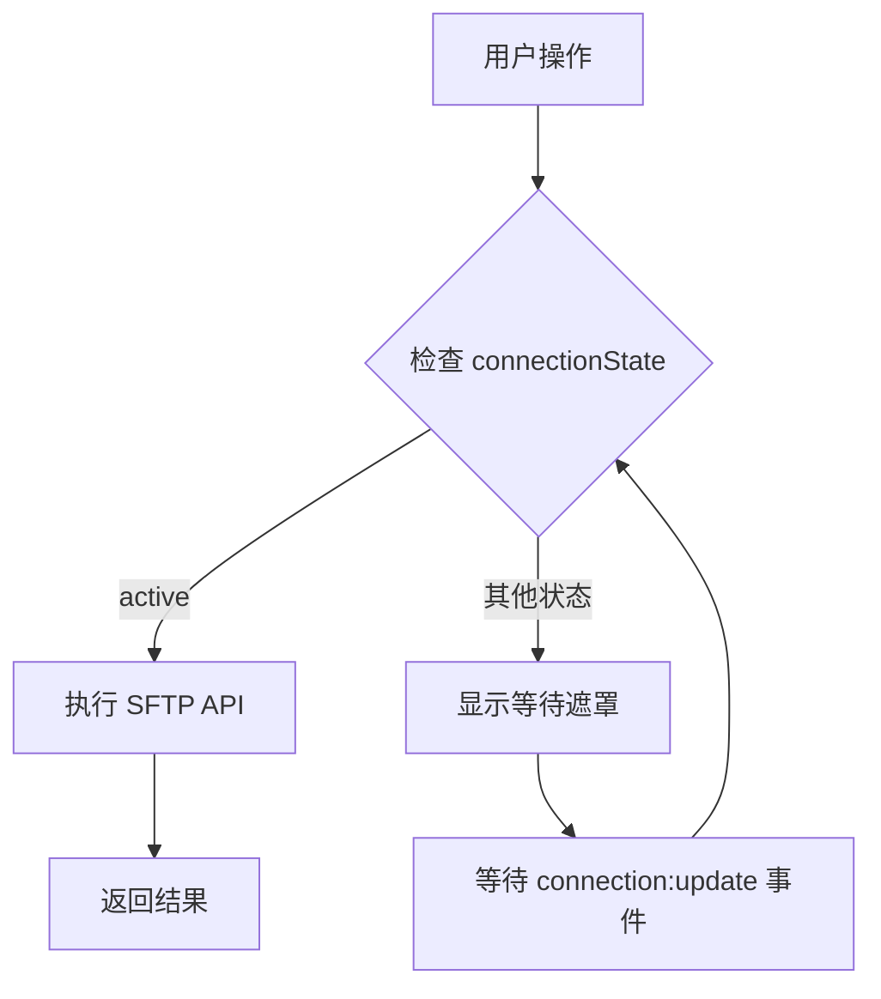
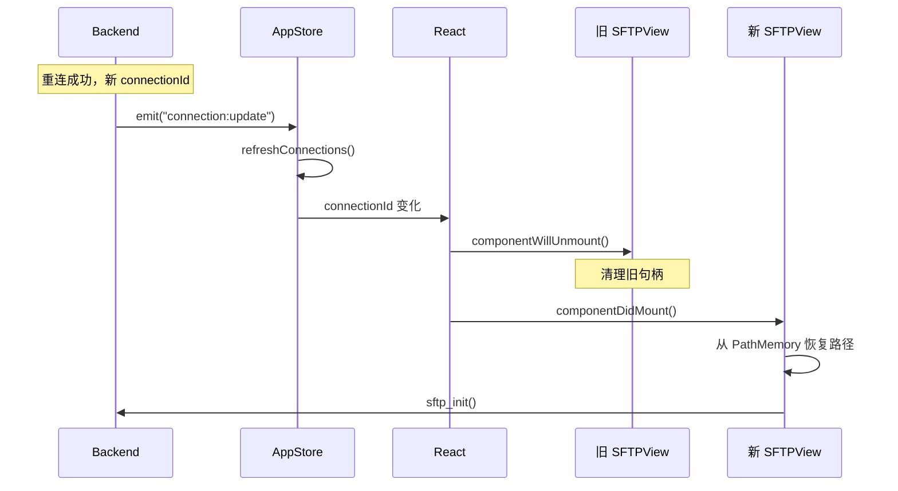
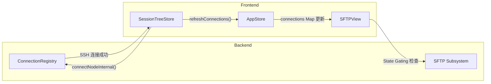

# OxideTerm SFTP 功能文档 (v1.4.0)

> **v1.4.0 核心架构**: SFTP 模块完全遵循 **Strong Consistency Sync** 和 **Key-Driven Reset** 模式，确保连接状态与 UI 组件的绝对一致性。

## 目录

1. [功能概述](#功能概述)
2. [界面说明](#界面说明)
3. [文件操作](#文件操作)
4. [文件预览](#文件预览)
5. [传输管理](#传输管理)
6. [连接鲁棒性架构 (v1.4.0)](#连接鲁棒性架构-v140)
7. [API 参考](#api-参考)

---

## 功能概述

OxideTerm 内置 SFTP 文件浏览器，提供：

- 📁 **双窗格视图** - 本地和远程文件并排显示
- 🔄 **拖拽传输** - 直接拖拽上传/下载
- 👁️ **智能预览** - 支持多种文件格式预览
- 📊 **传输队列** - 批量传输管理和进度显示
- ⌨️ **键盘操作** - 全键盘支持
- 🔒 **State Gating** - 连接状态门禁，防止无效 IO

---

## 界面说明

### 双窗格布局

```
┌─────────────────────────────────────────────────────────────┐
│ SFTP - user@server                                          │
├────────────────────────────┬────────────────────────────────┤
│ Local                      │ Remote (server)                │
│ /Users/name/Documents      │ /home/user                     │
├────────────────────────────┼────────────────────────────────┤
│ 📁 ..                      │ 📁 ..                          │
│ 📁 projects/               │ 📁 .config/                    │
│ 📄 readme.md               │ 📁 data/                       │
│ 📄 config.json             │ 📄 .bashrc                     │
│                            │ 📄 app.py                      │
├────────────────────────────┴────────────────────────────────┤
│ Transfer Queue: 0 active, 0 pending                         │
└─────────────────────────────────────────────────────────────┘
```

### 工具栏

| 图标 | 功能 | 快捷键 |
|------|------|--------|
| 🏠 | 返回主目录 | `~` |
| ⬆️ | 上级目录 | `Backspace` |
| 🔄 | 刷新 | `F5` |
| 📁+ | 新建文件夹 | `Ctrl+N` |
| 🔍 | 搜索过滤 | `/` |

### 排序选项

点击列标题可切换排序：
- **名称** - 字母顺序
- **大小** - 文件大小
- **修改时间** - 最后修改日期

---

## 文件操作

### 基本操作

| 操作 | 方式 |
|------|------|
| 打开目录 | 双击 / Enter |
| 选择单个 | 单击 |
| 多选 | Ctrl+Click |
| 范围选择 | Shift+Click |
| 全选 | Ctrl+A |
| 预览 | 右键 → 预览 |
| 重命名 | 右键 → 重命名 / F2 |
| 删除 | 右键 → 删除 / Delete |

### 传输操作

| 方式 | 说明 |
|------|------|
| 拖拽 | 选中文件拖拽到对面窗格 |
| 右键 | 选中 → 右键 → 上传/下载 |
| 双击 | 双击远程文件自动下载到当前本地目录 |

### 批量操作

1. 使用 Ctrl+Click 或 Shift+Click 多选
2. 右键选择操作 (删除/传输)
3. 确认对话框

---

## 文件预览

### 支持的格式

#### 文本/代码文件

| 扩展名 | 语言高亮 |
|--------|----------|
| `.sh`, `.bash`, `.zsh` | Bash |
| `.py`, `.pyw` | Python |
| `.js`, `.mjs`, `.cjs` | JavaScript |
| `.ts`, `.tsx` | TypeScript |
| `.rs` | Rust |
| `.go` | Go |
| `.c`, `.h`, `.cpp`, `.hpp` | C/C++ |
| `.java` | Java |
| `.json`, `.jsonc` | JSON |
| `.yaml`, `.yml` | YAML |
| `.toml` | TOML |
| `.xml`, `.html` | XML/HTML |
| `.md`, `.markdown` | Markdown |
| `.sql` | SQL |
| `.conf`, `.ini`, `.cfg` | INI |
| `.env`, `.envrc` | 环境变量 |
| `.dockerfile` | Docker |
| `.makefile` | Makefile |

**限制**: 文本文件最大 1MB

#### 图片

| 格式 | 支持 |
|------|------|
| PNG, JPG, JPEG, GIF, WebP | ✅ |
| SVG | ✅ |
| BMP, ICO | ✅ |

**限制**: 图片最大 10MB

#### 视频

| 格式 | 支持 |
|------|------|
| MP4 | ✅ (最佳兼容) |
| WebM | ✅ |
| OGG | ✅ |
| MOV | ⚠️ 部分浏览器 |
| MKV, AVI | ⚠️ 需转码 |

**限制**: 视频最大 50MB

#### 音频

| 格式 | 支持 |
|------|------|
| MP3, WAV, OGG | ✅ |
| FLAC, AAC, M4A | ✅ |

**限制**: 音频最大 50MB

#### PDF

| 格式 | 支持 |
|------|------|
| PDF | ✅ 内嵌查看器 |

**限制**: PDF 最大 10MB

#### Office 文档 (可选)

| 格式 | 支持 | 要求 |
|------|------|------|
| DOCX, DOC | ✅ 转 PDF 预览 | 需安装 LibreOffice |
| XLSX, XLS | ✅ 转 PDF 预览 | 需安装 LibreOffice |
| PPTX, PPT | ✅ 转 PDF 预览 | 需安装 LibreOffice |
| ODT, ODS, ODP | ✅ 转 PDF 预览 | 需安装 LibreOffice |

**限制**: 
- 文档最大 10MB
- 需要系统安装 LibreOffice
- 未安装时显示友好提示

#### 二进制文件 (Hex 视图)

对于无法识别的文件，自动显示十六进制视图：

```
Hex View • 显示前 16KB • 共 1.2MB

00000000  7F 45 4C 46 02 01 01 00  00 00 00 00 00 00 00 00 |.ELF............|
00000010  03 00 3E 00 01 00 00 00  40 10 40 00 00 00 00 00 |..>.....@.@.....|
00000020  40 00 00 00 00 00 00 00  98 19 00 00 00 00 00 00 |@...............|

                    [加载更多 (+16KB)]
```

**特性**:
- 默认只加载前 16KB
- 点击"加载更多"每次加载 16KB
- 显示 ASCII 可打印字符

---

## 传输管理

### 传输队列

位于 SFTP 视图底部，显示：

- **进行中** - 当前正在传输的文件
- **等待中** - 队列中等待的文件
- **已完成** - 最近完成的传输 (保留 50 条)
- **失败** - 传输失败的文件

### 进度显示

```
┌─────────────────────────────────────────────────────────────┐
│ Transfer Queue                                              │
├─────────────────────────────────────────────────────────────┤
│ ⬆️ Uploading: large-file.zip                                │
│ ████████████████████░░░░░░░░░░  67% │ 45.2 MB/s │ ETA: 12s │
├─────────────────────────────────────────────────────────────┤
│ Pending: 3 files (128 MB total)                             │
│ ⏳ file1.txt, file2.pdf, archive.tar.gz                     │
└─────────────────────────────────────────────────────────────┘
```

### 传输控制

| 操作 | 说明 |
|------|------|
| ⏸️ 暂停 | 暂停当前传输 |
| ▶️ 继续 | 恢复暂停的传输 |
| ❌ 取消 | 取消传输并删除不完整文件 |
| 🔄 重试 | 重试失败的传输 |

### 并发传输

默认最多 3 个并发传输，可在设置中调整。

---

## 连接鲁棒性架构 (v1.4.0)

### 核心设计原则

v1.4.0 引入了 **Strong Consistency Sync** 架构，彻底解决了 SSH 重连后 SFTP 组件卡死的问题。

### 三大核心机制

| 机制 | 描述 | 实现 |
|------|------|------|
| **State Gating** | IO 操作前强制检查连接状态 | `connectionState === 'active'` |
| **Key-Driven Reset** | 连接 ID 变化时销毁重建组件 | `key={sessionId-connectionId}` |
| **Path Memory** | 跨重连保持目录位置 | `sftpPathMemory Map` |

### State Gating (状态门禁)

所有 SFTP 操作执行前，必须通过状态检查：



**前端实现**：

```typescript
// SFTPView.tsx
const connectionState = appStore.connections.get(connectionId)?.state;
const isConnectionReady = connectionState === 'active' || connectionState === 'idle';

useEffect(() => {
  if (!isConnectionReady) {
    console.debug('[SFTPView] Waiting for connection:', connectionState);
    return;  // 阻止所有 IO
  }
  // 初始化 SFTP 会话
}, [connectionState, connectionId]);
```

### Key-Driven Reset (键驱动重置)

当连接重建生成新的 `connectionId` 时，React 自动销毁旧组件：



**组件 Key 绑定**：

```tsx
// AppLayout.tsx
<SFTPView 
  key={`sftp-${sessionId}-${connectionId}`}  // 关键！
  sessionId={sessionId} 
/>
```

### Path Memory (路径记忆)

跨重连保持用户的工作目录：

```typescript
// 全局路径记忆 Map
const sftpPathMemory = new Map<string, string>();

// 保存路径
useEffect(() => {
  if (remotePath) {
    sftpPathMemory.set(nodeId, remotePath);
  }
}, [remotePath, nodeId]);

// 恢复路径
const initializeSftp = async () => {
  const savedPath = sftpPathMemory.get(nodeId);
  if (savedPath) {
    // 路径通过 node_sftp_list_dir 自动切换
    await nodeSftpListDir(nodeId, savedPath);
  }
};
```

### Strong Sync 数据流



### TransferQueue 状态门禁

传输队列同样遵循 State Gating：

```typescript
// TransferQueue.tsx
const connectionState = connections.get(connectionId)?.state;
const isConnectionReady = connectionState === 'active' || connectionState === 'idle';

useEffect(() => {
  if (!isConnectionReady) {
    console.debug('[TransferQueue] Connection not ready');
    return;  // 暂停所有传输
  }
  // 恢复传输
}, [connectionState]);
```

---

## API 参考

> **Oxide-Next**: 所有 SFTP API 已迁移至 `nodeId` 路由，通过 NodeRouter 自动获取连接和 SFTP session。

### 初始化 SFTP

```typescript
// 为节点初始化 SFTP
const cwd = await nodeSftpInit(nodeId);
// 返回当前工作目录，如 "/home/user"
```

**注意**: 调用前确保节点状态为 `connected`。

### 目录操作

```typescript
// 列出目录内容
const files: FileInfo[] = await nodeSftpListDir(nodeId, "/path/to/dir");

// 获取文件/目录信息
const info: FileInfo = await nodeSftpStat(nodeId, "/path/to/file");

// 创建目录
await nodeSftpMkdir(nodeId, "/path/to/new/dir");

// 删除文件
await nodeSftpDelete(nodeId, "/path/to/file");

// 递归删除目录
const deletedCount = await nodeSftpDeleteRecursive(nodeId, "/path/to/dir");

// 重命名/移动
await nodeSftpRename(nodeId, "/old/path", "/new/path");
```

### 文件传输

```typescript
// 下载文件
await nodeSftpDownload(nodeId, "/remote/path", "/local/path");

// 上传文件
await nodeSftpUpload(nodeId, "/local/path", "/remote/path");

// 下载目录
const fileCount = await nodeSftpDownloadDir(nodeId, "/remote/dir", "/local/dir");

// 上传目录
const fileCount = await nodeSftpUploadDir(nodeId, "/local/dir", "/remote/dir");
```

### 文件预览

```typescript
// 预览文件内容
const content: PreviewContent = await nodeSftpPreview(nodeId, "/path/to/file");

// 增量加载 Hex 数据
const hexContent: PreviewContent = await nodeSftpPreviewHex(nodeId, "/path/to/file", offset);
```

### 文件写入

```typescript
// 写入文件
const result = await nodeSftpWrite(nodeId, "/path/to/file", content, createNew);
// result: { bytesWritten: number }
```

### Transfer Control Commands (transferId-based)

```typescript
// 取消传输
await sftpCancelTransfer(transferId);

// 暂停传输
await sftpPauseTransfer(transferId);

// 恢复传输
await sftpResumeTransfer(transferId);

// 查询传输统计
const stats = await sftpTransferStats(transferId);

// 更新传输设置
await sftpUpdateSettings(transferId, settings);
```

### PreviewContent 类型

```typescript
type PreviewContent =
  | { Text: { data: string; mime_type: string | null; language: string | null } }
  | { Image: { data: string; mime_type: string } }
  | { Video: { data: string; mime_type: string } }
  | { Audio: { data: string; mime_type: string } }
  | { Pdf: { data: string; original_mime: string | null } }
  | { Hex: { data: string; total_size: number; offset: number; chunk_size: number; has_more: boolean } }
  | { TooLarge: { size: number; max_size: number; recommend_download: boolean } }
  | { Unsupported: { mime_type: string; reason: string } };
```

### 传输进度事件

```typescript
import { listen } from '@tauri-apps/api/event';

// 监听传输进度
const unlisten = await listen(`sftp:progress:${sessionId}`, (event) => {
  const progress: TransferProgress = event.payload;
  console.log(`${progress.id}: ${progress.transferred_bytes}/${progress.total_bytes}`);
});

// 清理监听器
unlisten();
```

### TransferProgress 类型

```typescript
interface TransferProgress {
  id: string;
  remote_path: string;
  local_path: string;
  direction: 'download' | 'upload';
  state: 'pending' | 'in_progress' | 'completed' | 'failed' | 'cancelled';
  total_bytes: number;
  transferred_bytes: number;
  speed: number;  // bytes/second
  eta_seconds: number | null;
  error: string | null;
}
```

---

## 快捷键

| 快捷键 | 功能 |
|--------|------|
| `Enter` | 打开目录 / 预览文件 |
| `Backspace` | 上级目录 |
| `~` | 返回主目录 |
| `F2` | 重命名 |
| `F5` | 刷新 |
| `Delete` | 删除 |
| `Ctrl+A` | 全选 |
| `Ctrl+N` | 新建文件夹 |
| `/` | 搜索过滤 |
| `Tab` | 切换窗格焦点 |
| `↑↓` | 导航 |

---

## 常见问题

### Q: 为什么 SFTP 显示 "Waiting for connection"？

**A:** 这是 v1.4.0 的 **State Gating** 机制。可能原因：
1. SSH 连接尚未完成 - 等待连接建立
2. 连接正在重连 - 等待 `connection:update` 事件
3. `appStore.connections` 未同步 - 检查是否调用了 `refreshConnections()`

### Q: 重连后为什么路径没有恢复？

**A:** 确保：
1. 路径已存入 `sftpPathMemory` Map
2. 组件使用了 `key={sessionId-connectionId}`
3. 初始化时读取了 `sftpPathMemory`

### Q: 传输速度很慢？

**A:** 检查：
1. 网络连接质量
2. 服务器负载
3. 尝试减少并发传输数

### Q: Office 文档无法预览？

**A:** 需要安装 LibreOffice:
- macOS: `brew install --cask libreoffice`
- Ubuntu: `sudo apt install libreoffice`
- Windows: 从官网下载安装

---

## 相关文档

- [ARCHITECTURE.md](./ARCHITECTURE.md) - 系统架构 (v1.4.0 Strong Sync)
- [PROTOCOL.md](./PROTOCOL.md) - 前后端协议
- [CONNECTION_POOL.md](./CONNECTION_POOL.md) - 连接池与自动重连

---

*文档版本: v1.4.0 (Strong Sync + Key-Driven Reset) | 最后更新: 2026-02-04*
