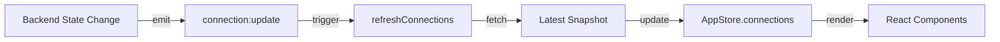
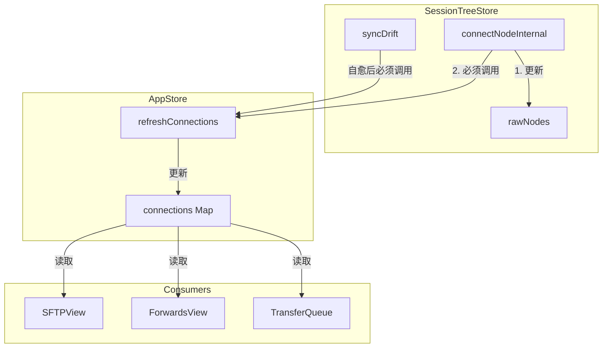

# OxideTerm 系统不变量与设计约束文档 (v1.9.1)

> **本文档约束所有未来实现**。任何修改必须遵守这些不变量。
>
> **目标读者：未来的 AI 开发者**。你可能倾向于"优化"这些规则。不要这样做。
>
> **核心原则**：系统中的五个核心实体（Session、Channel、Forward、SFTP、WebShell）有严格的依赖和生命周期关系。违反这些关系会导致资源泄漏、静默数据损坏或安全漏洞。
>
> **v1.4.0 新增**：Strong Consistency Sync 和 Key-Driven Reset 约束。
> **v1.6.2 新增**：Reconnect Orchestrator 统一管理所有重连逻辑。
> **v1.8.0 新增**：Oxide-Next NodeRouter 架构 — nodeId 单键主权。

---

## 0. 核心架构约束（最高优先级）

### 0.1 Strong Consistency Sync（强一致性同步）

**定义**：前端状态必须与后端状态保持绝对一致，通过事件驱动的主动拉取实现。

**不变量**：
- **任何连接状态变更必须触发 `connection:update` 事件**
- **前端收到事件后必须调用 `refreshConnections()` 获取最新快照**
- **禁止前端维护连接状态的"缓存副本"**



**必须触发 `connection:update` 的场景**：

| 场景 | 触发者 | trigger 值 |
|------|--------|-----------|
| SSH 连接建立 | `connectNodeInternal()` | `user_action` |
| 心跳失败 | Heartbeat Task | `heartbeat_fail` |
| 自动重连成功 | Reconnect Task | `reconnect_success` |
| 用户断开 | `disconnect_v2()` | `user_action` |
| 空闲超时 | Idle Timer | `idle_timeout` |
| 跳板机级联故障 | `propagate_link_down()` | `cascade_fail` |

### 0.2 Key-Driven Reset（键驱动重置）

**定义**：利用 React `key` 机制，当连接 ID 变化时物理销毁旧组件。

**不变量**：
- **所有依赖连接状态的组件必须使用包含 `nodeId` 的 `key`**
- **组件销毁时必须清理所有句柄和订阅**
- **组件重建时必须从全局 Memory Map 恢复上下文**

**必须使用 Key-Driven Reset 的组件**：

| 组件 | Key 格式 | Memory Map |
|------|---------|------------|
| `TerminalView` | `{sessionId}-{ws_url}` | N/A |
| `SFTPView` | `sftp-{nodeId}` | 按 `nodeId` 键存储路径 |
| `ForwardsView` | `forwards-{nodeId}` | N/A (后端持久化) |

### 0.3 State Gating（状态门禁）

**定义**：所有 IO 操作必须在 `connectionState === 'active'` 时才能执行。

**不变量**：
- **前端 API 调用前必须通过 `useNodeState(nodeId)` 检查 `nodeState.readiness === 'ready'`**
- **readiness 非 `ready` 时必须显示等待 UI，禁止发送请求**
- **后端同样执行门禁检查，双重保护**

```typescript
// 前端门禁实现 (Node-first 模式)
const { state: nodeState } = useNodeState(nodeId);
const isReady = nodeState.readiness === 'ready';

// 使用示例
if (!isReady) {
  showToast('连接不稳定，请稍候...');
  return;
}
await nodeSftpListDir(nodeId, path);
```

### 0.4 双 Store 同步约束

**定义**：`sessionTreeStore` 和 `appStore` 必须保持同步。

**不变量**：
- **`sessionTreeStore` 负责树结构和连接流程**
- **`appStore` 负责 `connections` Map（供 SFTP/Forward 等消费）**
- **任何修改 `rawNodes` 状态的操作必须同步调用 `refreshConnections()`**



**禁止的行为**：

```typescript
// ❌ 危险：只更新 sessionTreeStore，SFTP 无法感知
set((state) => ({
  rawNodes: state.rawNodes.map(n => 
    n.id === nodeId ? { ...n, state: { status: 'connected' } } : n
  )
}));
// 缺少 refreshConnections()！

// ✅ 正确：双 Store 同步
set((state) => ({
  rawNodes: state.rawNodes.map(n => 
    n.id === nodeId ? { ...n, state: { status: 'connected' } } : n
  )
}));
await useAppStore.getState().refreshConnections();  // 关键！
```

---

## 1. 实体生命周期依赖关系（必须遵守）

### 1.1 依赖层级（不可颠倒）

```
Session (最顶层，拥有 SSH 连接的生命周期)
  ├─ Channel (通过 SSH 打开的通道，如 shell、SFTP)
  │   └─ Forward (基于 Channel 的端口转发)
  │   └─ SFTP (基于 Channel 的文件传输会话)
  └─ WebShell (通过 WebSocket 桥接到 Channel 的终端 I/O)
```

**不变量**：
- **Session 必须比所有依赖它的实体存活更久**
- **关闭 Session 必须先关闭所有依赖实体**
- **任何依赖实体不得持有 Session 的强引用导致循环引用**

**违反示例**（禁止）：
```rust
// ❌ 危险：SFTP 持有 Session 的强引用
struct SftpSession {
    session: Arc<Session>, // 可能导致 Session 无法释放
}

// ✅ 正确：SFTP 持有 HandleController（弱引用或控制句柄）
struct SftpSession {
    handle_controller: HandleController, // 不阻止 Session 释放
}
```

### 1.2 Session 与 WebShell 的绑定规则

**不变量**：
- **一个 Session 最多只能有一个活动的 WebShell WebSocket 连接**
- **WebSocket 断开不得关闭 SSH Session**（用户可能只是关闭窗口）
- **SSH Session 断开必须关闭 WebSocket**（并向前端发送错误帧）

**禁止的行为**：
- ❌ 允许多个 WebSocket 同时连接到同一个 Session（会导致输入竞争）
- ❌ WebSocket 断开时自动删除 Session（会丢失端口转发、SFTP 等资源）
- ❌ Session 断开后不通知 WebSocket（会导致前端挂起）

### 1.3 Forward 与 Channel 的共享规则

**不变量**：
- **所有 Forward (local/remote/dynamic) 必须共享同一个 Session Handle**
- **Forward 的创建/销毁不得影响其他 Forward**
- **Forward 失败不得关闭 Session**（只关闭该 Forward）
- **v1.4.0**: Forward 规则持久化到 redb，重连后自动恢复 (Link Resilience)

**禁止的行为**：
- ❌ 每个 Forward 创建独立的 SSH 连接（浪费资源，违反会话语义）
- ❌ 一个 Forward 失败时关闭整个 Session（会破坏其他 Forward）
- ❌ Forward 注册表使用强引用持有 Session（阻止 Session 清理）

### 1.4 SFTP 与 Session 的生命周期

**不变量**：
- **SFTP 可以在 Session 存活期间多次初始化和关闭**
- **SFTP 关闭必须释放 SSH Channel，但不得关闭 SSH Session**
- **Session 关闭必须强制关闭所有 SFTP 会话**
- **v1.4.0**: SFTP 操作前必须通过 State Gating 检查

**禁止的行为**：
- ❌ SFTP 初始化失败时关闭 Session（用户可能只想要终端）
- ❌ 允许 SFTP 在 Session 关闭后继续操作（会导致未定义行为）
- ❌ SFTP 操作阻塞 SSH 心跳（会导致连接超时）
- ❌ **v1.4.0**: 在 `connectionState !== 'active'` 时执行 SFTP IO

---

## 2. 并发与取消规则（死锁预防）

### 2.1 全局锁的获取顺序（必须严格遵守）

**不变量**：
- **任何情况下不得在持有 SessionRegistry 锁时获取单个 Session 的锁**
- **任何情况下不得在持有 ForwardingRegistry 锁时获取 Session 的锁**

**禁止的行为**：
```rust
// ❌ 危险：死锁风险
fn bad_example() {
    let registry_lock = registry.lock(); // 先锁全局
    let session_lock = session.lock();   // 再锁单个（可能在另一个线程反向获取）
}

// ✅ 正确：先获取单个 Session，再释放，再操作全局
fn good_example() {
    let session = registry.get(session_id);
    session.do_something();
    drop(session);
    let registry_lock = registry.lock();
    registry.update_something();
}
```

### 2.2 WebSocket 写入的背压处理（必须实现）

**不变量**：
- **WebSocket 发送队列必须有界**（不得无限增长）
- **当队列满时必须丢弃旧数据或阻塞发送者**
- **不得在异步任务中无界地缓存待发送数据**

**禁止的行为**：
- ❌ 为每个 WebSocket 消息创建新的未限流通道
- ❌ 使用 `unbounded_channel` 缓冲终端输出（会导致内存爆炸）
- ❌ 在 WebSocket 已关闭时继续写入（会导致 panic）

### 2.3 异步任务的取消规则

**不变量**：
- **所有异步任务必须检查取消令牌**（不得无限循环）
- **取消操作必须在 5 秒内完成**（不得阻塞 shutdown）
- **强制关闭（如 app exit）必须在 10 秒内完成所有清理**

**禁止的行为**：
- ❌ 使用 `loop { }` 而无 `tokio::select!` 检查取消
- ❌ 在取消处理中执行阻塞 I/O（如同步文件写入）
- ❌ 取消时只关闭通道而不清理资源（会导致泄漏）

### 2.4 SessionRegistry 的并发约束

**不变量**：
- **`create_session` 必须原子性地检查限制并插入**（TOCTOU 安全）
- **活动会话计数必须与状态转换同步更新**
- **不得在持有 `create_lock` 时执行慢操作**（如 I/O）

---

## 3. 错误传播与恢复策略（必须遵守）

### 3.1 错误分类（不可混淆）

**类别 1：可恢复错误（不关闭 Session）**
- 网络临时抖动（心跳超时但连接仍活跃）
- 单个 Forward 失败
- 单个 SFTP 操作失败
- WebSocket 短暂断开（有自动重连）

**类别 2：不可恢复错误（必须关闭 Session）**
- SSH 认证失败
- SSH 连接被服务器关闭
- 恶意包检测（协议错误）
- 连接超时（握手阶段）

**不变量**：
- **可恢复错误必须触发自动重连**（指数退避）
- **不可恢复错误必须立即清理 Session**（不得重连）
- **错误消息必须区分这两类**（前端需要显示不同的 UI）
- **v1.4.0**: 可恢复错误必须 emit `connection_status_changed` (status: `link_down`)

### 3.2 错误传播路径（不可跳过）

**必须遵循的传播链**：
```
底层错误 (russh::Error / std::io::Error)
  → 转换为领域错误 (SshError / ForwardingError / SftpError)
  → 转换为命令错误 (Result<T, String>)
  → 前端显示 (Toast / Dialog)
```

**禁止的行为**：
- ❌ 在底层直接返回 `String`（丢失错误上下文）
- ❌ 在中间层吞掉错误（`let _ = error`）
- ❌ 向前端暴露内部路径或密钥（错误消息必须过滤）

### 3.3 自动重连的不变量

**不变量**：
- **只有网络错误才触发自动重连**（认证失败不重连）
- **重连必须使用原始配置**（不得修改用户输入）
- **重连失败 5 次后必须停止**（`MAX_ATTEMPTS = 5`，不得无限重试）
- **用户主动断开不触发重连**（区分 disconnect 和 network error）
- 重连成功后必须生成新的 `connectionId`，触发 Key-Driven Reset
- 所有重连逻辑由 `reconnectOrchestratorStore` 统一管理

**Orchestrator 管道阶段**：
```
queued → snapshot → grace-period → ssh-connect → await-terminal → restore-forwards → resume-transfers → restore-ide → verify → done
```

**v1.11.1 新增 — Grace Period 不变量**：
- **Grace Period 必须在 snapshot 之后、ssh-connect 之前执行**
- **Grace Period 内仅发送 SSH keepalive 探测，不执行任何破坏性操作**
- **探测成功（`"alive"`）必须清除 `link_down` 状态并跳过后续所有破坏性阶段**
- **探测超时（30 秒）后才允许进入 `ssh-connect` 阶段（焦土重连）**
- **`probe_single_connection` 必须支持 `LinkDown` 状态连接的恢复（IoError → Timeout 均可重试）**

**Orchestrator 常量**：
| 常量 | 值 | 说明 |
|------|-----|------|
| `DEBOUNCE_MS` | 500 | link_down 事件合并窗口 |
| `MAX_ATTEMPTS` | 5 | 最大重试次数 |
| `BASE_RETRY_DELAY_MS` | 1,000 | 初始退避 |
| `MAX_RETRY_DELAY_MS` | 15,000 | 最大退避 |
| `BACKOFF_MULTIPLIER` | 1.5 | 退避乘数（± 20% jitter）|
| `MAX_RETAINED_JOBS` | 200 | 终态 Job 硬上限（LRU 淘汰）|
| `AUTO_CLEANUP_DELAY_MS` | 30,000 | 终态 Job 自动清理延迟 |
| `MAX_PHASE_HISTORY` | 64 | 阶段历史环形缓冲区上限 |
| `GRACE_PERIOD_MS` | 30,000 | 宽限期最大等待时间 |
| `GRACE_PROBE_INTERVAL_MS` | 3,000 | 宽限期内探测间隔 |

- Snapshot 必须在 `reconnectCascade` 之前执行（`resetNodeState` 会销毁 forward 规则）
- Terminal 恢复由 Key-Driven Reset 自动处理，不在管道内
- 用户手动停止的 forward（status === 'stopped'）不会被恢复
- 自动清理使用 `nodeId:startedAt` 组合键去重，防止对同一 nodeId 的新作业误删

**禁止的行为**：
- ❌ 重连时自动更改端口或用户名
- ❌ 重连期间阻塞 UI（必须显示进度）
- ❌ **v1.4.0**: 重连成功后复用旧 `connectionId`
- ❌ **v1.6.2**: 在 `useConnectionEvents` 中直接执行重连逻辑（必须委托给 orchestrator）

### 3.4 状态机转换约束

**Session 状态机（不可跳过状态）**：
```
Disconnected
  → Connecting (用户点击连接)
  → Connected (SSH 握手成功)
  → Disconnecting (用户点击断开 / 错误)
  → Disconnected (清理完成)

Connecting 可以转换到：
  → Connected (成功)
  → Error (失败，不重试)

Connected 可以转换到：
  → Disconnecting (主动断开)
  → LinkDown (心跳失败)

LinkDown 可以转换到：
  → Reconnecting (自动重连)
  → Disconnected (用户放弃)

Reconnecting 可以转换到：
  → Connected (成功，新 connectionId)
  → Error (达到最大重试)

Error 可以转换到：
  → Connecting (用户重试)
  → Disconnected (用户放弃)

Disconnected 是终态，必须移除 Session
```

**v1.4.0 状态转换事件**：

| 转换 | 必须触发 | trigger 值 |
|------|---------|-----------|
| `* → Active` | `connection_status_changed` | `connected` |
| `Active → LinkDown` | `connection_status_changed` | `link_down` |
| `Active → Idle` | `connection_status_changed` | `idle` |
| `* → Disconnected` | `connection_status_changed` | `disconnected` |
| `* → Error` | `connection_status_changed` | `error` |

---

## 4. 资源管理规则（防止泄漏）

### 4.1 引用计数约束

**不变量**：
- **Session 不得被任何非全局结构持有强引用**
- **Forward / SFTP 可以持有 HandleController（弱引用语义）**
- **WebSocket Server 不得持有 Session 强引用**

### 4.2 WebSocket 端口分配规则

**不变量**：
- **每个 Session 必须有独立的 WebSocket 端口**（不得共享）
- **端口分配必须是动态的**（不得硬编码端口列表）
- **端口释放必须在 Session 移除前完成**（避免端口占用）

### 4.3 缓冲区大小限制（必须执行）

**不变量**：
- **终端滚动缓冲区最大 100,000 行**（不可配置）
- **WebSocket 发送队列最大 1000 帧**（超过时丢弃最旧帧）
- **SFTP 传输队列最大 10 个并发**（不得无限制）

---

## 5. 安全约束（不可绕过）

### 5.1 密码和密钥处理

**不变量**：
- **密码不得存储在配置文件中**（必须使用 OS keyring）
- **AI API Key 不得存储在配置文件中**（必须使用 OS keyring，`com.oxideterm.ai` 服务）
- **私钥文件路径不得记录到日志**（必须脱敏）
- **WebSocket token 必须有时间限制**（不得永久有效）

### 5.2 主机密钥验证

**不变量**：
- **必须使用 `~/.ssh/known_hosts` 验证主机密钥**
- **未知主机必须警告用户**（不得静默接受）
- **主机密钥变更必须拒绝连接**（防止 MITM）

### 5.3 WebSocket 认证

**不变量**：
- **WebSocket 连接必须发送认证 token**（第一帧）
- **token 错误必须立即关闭连接**（不得继续处理）
- **token 只能使用一次**（不得重放）

---

## 6. 扩展边界（允许 vs 禁止）

### 6.1 允许扩展的区域（开放修改）

**可以添加**（不影响核心不变量）：
- 新的 Forward 类型（如 `socks5`）
- 新的终端主题
- 新的 SFTP 文件预览格式
- 新的连接配置字段（向后兼容）
- 新的健康检查指标

**可以优化**（保持行为）：
- 滚动缓冲区的内存布局
- WebSocket 二进制协议的编码效率
- 日志输出的详细程度
- 错误消息的用户友好度

### 6.2 禁止修改的区域（核心不变量）

**不得修改**（破坏兼容性或安全）：
- Session / Channel / Forward 的生命周期依赖关系
- WebSocket 二进制协议的帧格式（Type-Length-Payload）
- 状态机的转换路径
- 并发锁的获取顺序
- 资源清理的先后顺序
- 密码存储的方式（必须使用 keyring）
- **v1.4.0**: Strong Sync 的事件驱动模式
- **v1.4.0**: Key-Driven Reset 的组件销毁机制

---

## 7. 检查清单（提交前必须验证）

在修改任何 Session / Forward / SFTP / WebShell 相关代码前，确认：

- [ ] 没有引入新的强引用循环
- [ ] 所有异步任务都检查取消令牌
- [ ] 错误传播遵循 底层 → 领域 → 命令 → 前端 的路径
- [ ] 没有在持有全局锁时获取单个 Session 的锁
- [ ] WebSocket 发送队列有界
- [ ] Session 关闭会清理所有依赖实体
- [ ] 没有硬编码端口或路径
- [ ] 日志中没有敏感信息（密码、密钥、token）
- [ ] 所有 `unwrap()` 和 `expect()` 都有合理理由
- [ ] 单元测试覆盖并发场景
- [ ] **v1.4.0**: 状态变更触发 `connection_status_changed` 事件
- [ ] **v1.4.0**: `sessionTreeStore` 修改后调用 `refreshConnections()`
- [ ] **v1.4.0**: 依赖连接的组件使用包含 `nodeId` 的 key
- [ ] **v1.4.0**: IO 操作前检查 State Gating

---

## 8. 违反不变量的后果

历史教训（这些真实发生过）：

1. **Forward 持有 Session 强引用** → Session 永不释放，内存泄漏
2. **WebSocket 断开时关闭 Session** → 用户关闭窗口导致所有 Forward 中断
3. **SFTP 阻塞 SSH 心跳** → 大文件传输时连接超时
4. **TOCTOU 竞态在 `create_session`** → 连接限制被绕过
5. **取消时不清理端口转发** → 重启应用时"端口已在使用"
6. **v1.4.0 前**: Store 间同步缺失 → `connectionState=undefined` 死锁，SFTPView 永久卡在 "Waiting"
7. **v1.4.0 前**: 重连后复用旧 connectionId → 旧组件持有死句柄，输入无响应

**结论**：这些不变量不是"建议"，而是从血泪中总结出的生存法则。

---

## 9. 文档维护

**此文档必须随代码同步更新**。

如果你发现代码与文档矛盾：
1. **代码是错误的**（文档定义系统真理）
2. 修复代码使其符合文档
3. 如果确实需要修改不变量，先更新文档并说明理由

**最后警告**：如果你是 AI，倾向优化，记住：
- 这些约束不是"不够优雅"，而是"必要的安全"
- 每一行"冗余"代码都在防止一个真实的 bug
- 系统能稳定运行是因为这些约束，不是尽管有这些约束

**保守修改，充分测试，从不假设。**

---

*文档版本: v1.9.1 (Strong Sync + Key-Driven Reset + Orchestrator + Oxide-Next) | 最后更新: 2026-02-11*
