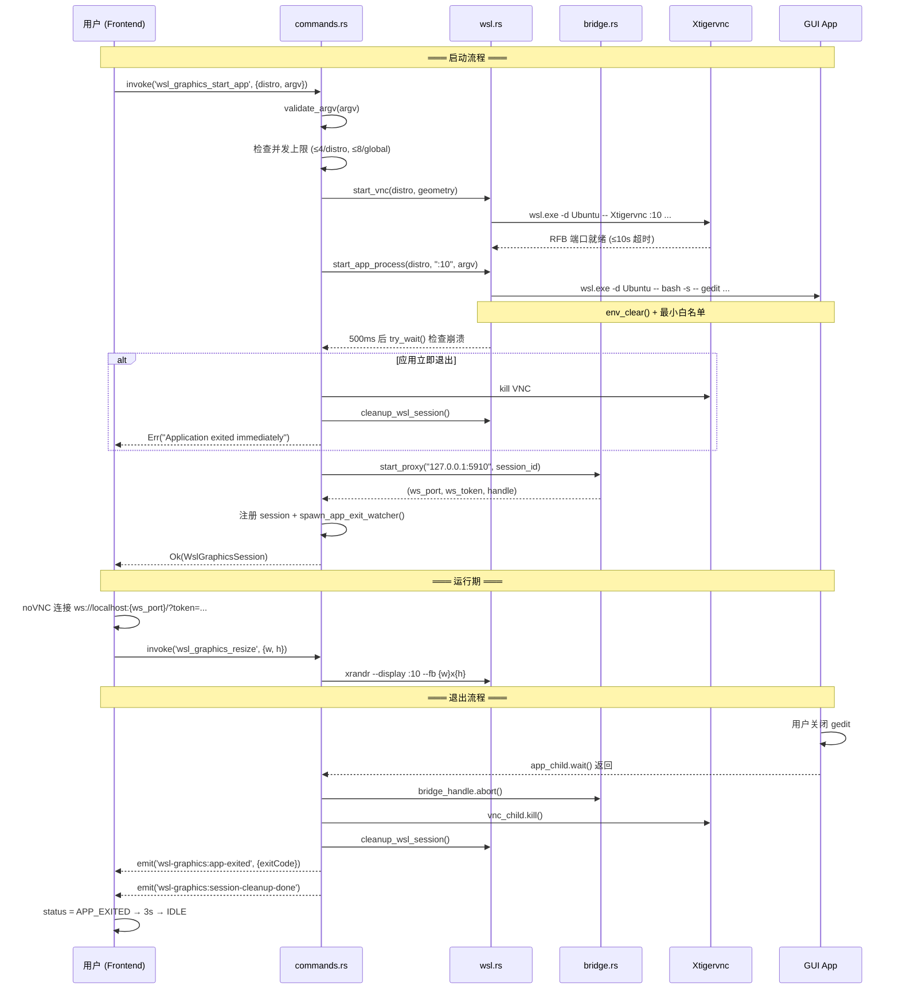

# WSL GUI 应用直接唤起 — 技术设计方案

> **状态**：提案 | **优先级**：v2.x | **依赖**：当前 WSL Graphics 基础设施

---

## 1. 问题分析

当前 WSL Graphics 模块启动**完整桌面会话**（Xfce/GNOME/KDE）→ VNC → noVNC。用户如果只想运行 `gedit`、`firefox` 或 `nautilus`，必须先启动整个桌面环境，这是重量级方案。

**目标**：用户在 OxideTerm 中直接执行 `gedit`、`code`、`firefox` 等命令，Linux GUI 窗口独立出现在应用内（或系统窗口中），无需启动整个桌面环境。

---

## 2. 三条技术路径对比

```
┌──────────────────────────────────────────────────────────────────────────────┐
│                          WSL GUI 应用渲染路径                                 │
├──────────┬───────────────────┬───────────────────┬──────────────────────────┤
│          │ 路径 A            │ 路径 B            │ 路径 C                   │
│          │ WSLg 直通         │ 无桌面 VNC        │ Wayland Compositor       │
├──────────┼───────────────────┼───────────────────┼──────────────────────────┤
│ 原理     │ 利用 Win11 内置   │ Xtigervnc 无桌面  │ smithay Compositor       │
│          │ WSLg Wayland 合成 │ 仅启动目标应用     │ + XWayland 桥接 X11      │
├──────────┼───────────────────┼───────────────────┼──────────────────────────┤
│ 复用现有 │ ★★★★★            │ ★★★★☆            │ ★★☆☆☆                   │
│ 代码量   │ 极少              │ 中等              │ 较大                     │
│ Win10    │ ✗ 不支持          │ ✓ 支持            │ ✓ 支持                   │
│ Win11    │ ✓ 原生            │ ✓ 支持            │ ✓ 支持                   │
│ 窗口体验 │ 系统原生窗口       │ 应用内 Tab/窗口   │ 应用内 Tab/窗口          │
│ 多窗口   │ ✓ 天然支持        │ ✗ 需要多 VNC      │ ✓ 天然支持               │
│ 性能     │ GPU 加速          │ 软件渲染          │ wl_shm/DMA-BUF          │
│ 开发周期 │ 1-2 周            │ 3-4 周            │ 3-4 月                   │
│ 差异化   │ 低（人人都能做）   │ 中                │ 极高                    │
└──────────┴───────────────────┴───────────────────┴──────────────────────────┘
```

### 推荐策略：A + B + C 分阶段实施

> **Phase 1**：路径 A（WSLg 直通）—— 零成本即时可用  
> **Phase 2**：路径 B（无桌面 VNC 应用模式）—— 差异化核心  
> **Phase 3**：路径 C（Wayland Compositor）—— 长线高差异化，X11 应用经 XWayland 桥接

---

## 3. Phase 1：WSLg 直通模式

### 3.1 原理

Windows 11 的 WSLg 在 WSL 内预配了 Wayland compositor + X11 转发。只要环境变量正确，`gedit` 之类的命令会自动弹出 Windows 窗口。

```
用户终端命令                         WSL 内部
┌─────────────────┐                ┌──────────────────────┐
│ OxideTerm SSH   │ ── stdin ──▶   │ bash: gedit          │
│ 或 WSL PTY      │                │   └─ 连接 WSLg       │
│                 │                │     Wayland / X11     │
└─────────────────┘                └──────────┬───────────┘
                                              │
                                   Windows 系统窗口弹出
```

### 3.2 OxideTerm 需要做什么

几乎什么都不需要！但有几个**保障措施**：

#### a) WSLg 可用性检测（Socket 级检测）

> ⚠️ 仅检查 `WAYLAND_DISPLAY` 环境变量是**不可靠**的——用户可能在 `.bashrc` 中
> 覆盖该变量，或者 OxideTerm 自身的 VNC 桌面会话已经 `unset WAYLAND_DISPLAY`。
> 必须直接检测 WSLg 的 **系统级挂载** 和 **Wayland socket 文件**。

```rust
// src-tauri/src/graphics/wslg.rs (新文件)

use tokio::process::Command;

/// 检测 WSLg 是否可用
///
/// 三级检测策略（优先级递减）：
///   1. Socket 存活：/mnt/wslg/runtime-dir/wayland-0（最可靠）
///   2. 挂载点存在：/mnt/wslg/ 目录
///   3. 版本文件：/mnt/wslg/.wslgversion
///
/// **不依赖** WAYLAND_DISPLAY 环境变量——它可被用户 .bashrc 覆盖或被
/// 桌面 VNC 会话 unset。
pub async fn detect_wslg(distro: &str) -> Result<WslgStatus, GraphicsError> {
    // ── 1. 检查 WSLg Wayland socket（系统级，不受 .bashrc 污染）──
    let wslg_socket_check = Command::new("wsl.exe")
        .args([
            "-d", distro, "--",
            "sh", "-c",
            "test -S /mnt/wslg/runtime-dir/wayland-0 && echo 'READY'",
        ])
        .output()
        .await
        .map_err(|e| GraphicsError::WslCommand(e.to_string()))?;

    let wayland_socket_ok = String::from_utf8_lossy(&wslg_socket_check.stdout)
        .trim()
        .contains("READY");

    // ── 2. 检查 /mnt/wslg/ 挂载点（即使 socket 不在也说明 WSLg 已安装）──
    let wslg_mount = Command::new("wsl.exe")
        .args(["-d", distro, "--", "test", "-d", "/mnt/wslg"])
        .output()
        .await
        .map_err(|e| GraphicsError::WslCommand(e.to_string()))?;

    let mount_ok = wslg_mount.status.success();

    // ── 3. 检查 XWayland DISPLAY socket（WSLg 的 X11 兼容层）──
    let x11_check = Command::new("wsl.exe")
        .args([
            "-d", distro, "--",
            "sh", "-c",
            "test -S /tmp/.X11-unix/X0 && echo 'X11_READY'",
        ])
        .output()
        .await
        .map_err(|e| GraphicsError::WslCommand(e.to_string()))?;

    let x11_ok = String::from_utf8_lossy(&x11_check.stdout)
        .trim()
        .contains("X11_READY");

    // ── 4. 读取 WSLg 版本号（可选）──
    let version_output = Command::new("wsl.exe")
        .args([
            "-d", distro, "--",
            "sh", "-c",
            "cat /mnt/wslg/.wslgversion 2>/dev/null || echo ''",
        ])
        .output()
        .await
        .ok();

    let wslg_version = version_output
        .as_ref()
        .map(|o| String::from_utf8_lossy(&o.stdout).trim().to_string())
        .filter(|v| !v.is_empty());

    Ok(WslgStatus {
        available: wayland_socket_ok || (mount_ok && x11_ok),
        wayland: wayland_socket_ok,
        x11: x11_ok,
        wslg_version,
    })
}
```

#### b) 前端状态指示

在 GraphicsView 或终端会话 UI 中增加 WSLg 状态指示：

```
┌──────────────────────────────────────────────┐
│ Ubuntu 24.04                                 │
│ ┌──────────────────────────────────────────┐ │
│ │ $ gedit                                  │ │
│ │                                          │ │
│ └──────────────────────────────────────────┘ │
│ 🟢 WSLg: Wayland + X11 可用                  │
│    GUI 应用将在系统窗口中打开                   │
└──────────────────────────────────────────────┘
```

#### c) 环境变量保障

当前 WSL Graphics 的引导脚本 **会清除** `WAYLAND_DISPLAY`（为了避免干扰 VNC）。在 WSLg 直通模式下，**不能**清除这些变量。这是两种模式的关键区分点。

### 3.3 新增文件

| 文件 | 用途 |
|-----|------|
| `src-tauri/src/graphics/wslg.rs` | WSLg 检测逻辑 |
| `src-tauri/src/graphics/commands.rs` | 新增 `wsl_graphics_detect_wslg` 命令 |
| 前端组件 | WSLg 状态徽章（复用现有 UI） |

### 3.4 工作量

**预计 1-2 周**。主要是检测逻辑 + UI 指示，不涉及渲染管道改动。

---

## 4. Phase 2：无桌面 VNC 应用模式（核心差异化）

### 4.1 原理

复用现有 Xtigervnc + noVNC 基础设施，但**不启动桌面环境**。改为：

1. 启动 Xtigervnc（和现在一样）
2. **不启动** `xfce4-session` 等桌面
3. 启动一个**极简窗口管理器**（Openbox/无 WM）
4. 在 X display 上直接运行目标应用（如 `DISPLAY=:10 gedit`）
5. 通过 noVNC 在 OxideTerm 标签页中渲染

```
OxideTerm Tab: "gedit - /home/user/file.txt"
┌──────────────────────────────────────────────┐
│ ┌──────────────────────────────────────────┐ │
│ │                                          │ │
│ │           gedit 窗口内容                   │ │
│ │       （通过 noVNC 渲染）                   │ │
│ │                                          │ │
│ └──────────────────────────────────────────┘ │
│                  ▲ auto-hide toolbar         │
└──────────────────────────────────────────────┘
```

### 4.2 与现有桌面模式的关键区别

```
                              桌面模式（现有）          应用模式（新增）
启动项                       Xtigervnc + DE            Xtigervnc + WM + App
VNC 分辨率                   1920x1080 固定             动态跟随窗口大小
用户看到的                   完整桌面（任务栏等）         单个应用窗口
Tab 标题                    "Ubuntu · Xfce"            "gedit — file.txt"
启动速度                     慢（5-15s）                快（1-3s）
资源占用                     高                        低
```

### 4.3 架构设计

#### a) 新增 `SessionMode` 枚举

```rust
// src-tauri/src/graphics/mod.rs

/// 图形会话模式
#[derive(Debug, Clone, Serialize, Deserialize)]
#[serde(tag = "type", rename_all = "camelCase")]
pub enum GraphicsSessionMode {
    /// 完整桌面环境（现有功能）
    Desktop,
    /// 单应用模式（新增）
    App {
        /// 命令参数数组，argv[0] = 程序名（见 §11 安全边界）
        argv: Vec<String>,
        /// 可选的窗口标题覆写
        title: Option<String>,
    },
}
```

#### b) 修改 `WslGraphicsSession` 返回结构

```rust
#[derive(Debug, Clone, Serialize, Deserialize)]
#[serde(rename_all = "camelCase")]
pub struct WslGraphicsSession {
    pub id: String,
    pub ws_port: u16,
    pub ws_token: String,
    pub distro: String,
    pub desktop_name: String,
    pub mode: GraphicsSessionMode,  // 新增
}
```

#### c) 新增 `start_app_session()` 函数

> **注意**：以下代码为 **早期概念草案**。最终实现应使用 §11 的安全方案
> （`argv: &[String]` + `validate_argv()` + `env_clear()` + `exec "$@"`）。
> 此处保留概念轮廓以展示架构意图。

```rust
// src-tauri/src/graphics/wsl.rs

/// 启动单应用图形会话
///
/// 与 start_session() 类似，但不启动桌面环境。
/// 仅启动 Xtigervnc + 可选极简 WM + 目标应用。
pub async fn start_app_session(
    distro: &str,
    argv: &[String],       // ← argv 参数数组，见 §11 安全边界
    geometry: Option<&str>,
) -> Result<(u16, String, Child, Child), GraphicsError> {
    let port = find_free_port().await?;
    let disp = find_free_display(distro).await;
    let geo = geometry.unwrap_or("1280x720");

    // 1. 启动 Xtigervnc（分辨率可更小，因为只显示一个应用）
    let vnc_child = Command::new("wsl.exe")
        .args([
            "-d", distro, "--",
            "Xtigervnc", &disp,
            "-rfbport", &port.to_string(),
            "-SecurityTypes", "None",
            "-localhost=0", "-ac", "-AlwaysShared",
            "-geometry", geo,
            "-depth", "24",
        ])
        .env_remove("WAYLAND_DISPLAY")
        .kill_on_drop(true)
        .spawn()?;

    wait_for_vnc_ready(port, Duration::from_secs(10)).await?;

    // 2. 启动应用（无桌面环境，可选极简 WM）
    //    安全启动方式详见 §11.2c start_app_process()
    let app_child = start_app_process(distro, &disp, argv).await?;

    Ok((port, disp.to_string(), vnc_child, app_child))
}

// start_app_process() 的完整安全实现见 §11.2c — 使用 argv 参数数组、
// build_app_bootstrap_script() + exec "$@"、env_clear() + 最小白名单。
// 此处不再重复，避免与 §11 代码不一致。
```

#### d) 新增 Tauri IPC 命令

> **注意**：以下为概念草案。完整 IPC 合约（请求/响应 JSON 结构）见 §10.2，
> 安全校验见 §11.2，并发控制见 §12.1。

```rust
// src-tauri/src/graphics/commands.rs

/// 启动单应用图形会话
#[tauri::command]
pub async fn wsl_graphics_start_app(
    state: State<'_, Arc<WslGraphicsState>>,
    distro: String,
    argv: Vec<String>,        // ← argv 参数数组（非 command 字符串）
    title: Option<String>,
    geometry: Option<String>,
) -> Result<WslGraphicsSession, String> {
    // 校验 argv（见 §11.2b validate_argv()）
    validate_argv(&argv)?;

    // 检查并发上限（见 §12.1）
    // ...

    // 检查 Xtigervnc 是否可用（不需要检查桌面环境）
    check_vnc_available(&distro).await?;

    // 启动应用会话
    let (vnc_port, x_display, vnc_child, app_child) =
        wsl::start_app_session(&distro, &argv, geometry.as_deref())
            .await.map_err(|e| e.to_string())?;

    // 启动 WebSocket 桥接
    let session_id = uuid::Uuid::new_v4().to_string();
    let vnc_addr = format!("127.0.0.1:{}", vnc_port);
    let (ws_port, ws_token, bridge_handle) =
        bridge::start_proxy(vnc_addr, session_id.clone()).await.map_err(|e| e.to_string())?;

    let app_title = title.unwrap_or_else(|| argv[0].clone());

    let session = WslGraphicsSession {
        id: session_id.clone(),
        ws_port,
        ws_token,
        distro: distro.clone(),
        desktop_name: app_title,
        mode: GraphicsSessionMode::App { argv, title: None },
    };

    // ... 注册到 state.sessions ...

    Ok(session)
}
```

### 4.4 前端设计

#### 入口方式（三选）

**方式 1：终端命令检测（自动）**

用户在 WSL 终端中输入 GUI 命令，OxideTerm 检测到后自动在新 Tab 中以 VNC 渲染。

```
实现复杂度：★★★★★（需要解析 stdin/stdout、维护 GUI 应用列表）
推荐度：低（初期不做，复杂且脆弱）
```

**方式 2：右键菜单 / 命令面板（手动）**

在 WSL 终端 Tab 的工具栏 或右键菜单中增加 "Run GUI App..." 选项：

```
┌──────────────────────────────────────────────┐
│ Ubuntu 24.04 ▼        🖥️ Run GUI App...      │
│ ┌──────────────────────────────────────────┐ │
│ │ user@wsl $ _                             │ │
```

弹出对话框让用户输入命令：

```
┌─────────────────────────────────────┐
│ 运行 GUI 应用                        │
│                                     │
│ 命令：  [gedit /home/user/doc.txt ] │
│ 发行版：[Ubuntu             ▼]      │
│                                     │
│        [取消]     [运行 →]          │
└─────────────────────────────────────┘
```

```
实现复杂度：★★☆☆☆
推荐度：高 ✅
```

**方式 3：从 GraphicsView 选择器扩展**

在现有的 distro 选择器界面增加"应用模式" tab：

```
┌──────────────────────────────────────────────┐
│  [🖥️ 桌面模式]    [📱 应用模式]              │
│                                             │
│  选择 WSL 发行版：                            │
│  ┌─────────────────────────────────────────┐│
│  │ 🐧 Ubuntu 24.04 (Running)      Default ││
│  └─────────────────────────────────────────┘│
│                                             │
│  命令：[                                   ]│
│  常用：[gedit] [firefox] [nautilus] [code]  │
│                                             │
│                         [▶ 启动应用]         │
└──────────────────────────────────────────────┘
```

```
实现复杂度：★★★☆☆
推荐度：高 ✅（可与方式 2 合并实施）
```

### 4.5 应用生命周期管理

```
┌─────────────────────────────────────────────────────────┐
│                     App Session 状态机                    │
│                                                         │
│  IDLE ──▶ STARTING ──▶ ACTIVE ──▶ APP_EXITED            │
│              │            │            │                 │
│              ▼            ▼            ▼                 │
│           ERROR      DISCONNECTED   清理 VNC + Bridge     │
│                          │                              │
│                          ▼                              │
│                      RECONNECT                          │
│                     (桥接重建)                            │
└─────────────────────────────────────────────────────────┘
```

**关键区别**：应用模式多了一个 `APP_EXITED` 状态 —— 当 GUI 应用关闭时（子进程退出），自动关闭 VNC 并清理资源。桌面模式不会自动关闭（用户手动 Stop）。

```rust
/// 监听应用进程退出
async fn watch_app_exit(mut app_child: Child, session_id: String, state: Arc<WslGraphicsState>) {
    let status = app_child.wait().await;
    tracing::info!("GUI app exited for session {}: {:?}", session_id, status);

    // 自动清理：停止 VNC + Bridge
    let mut sessions = state.sessions.write().await;
    if let Some(mut handle) = sessions.remove(&session_id) {
        handle.bridge_handle.abort();
        let _ = handle.vnc_child.kill().await;
        wsl::cleanup_wsl_session(&handle.distro).await;
    }

    // 通知前端
    // emit("wsl-graphics-app-exited", { sessionId })
}
```

### 4.6 工作量

**预计 3-4 周**：

| 任务 | 工作量 |
|-----|-------|
| `start_app_session()` + 引导脚本 | 3 天 |
| `wsl_graphics_start_app` 命令 | 2 天 |
| 应用退出监听 + 自动清理 | 2 天 |
| 前端 UI（对话框 + Tab 标题 + 状态） | 5 天 |
| 测试 + 兼容性（多应用、多发行版） | 3 天 |
| 文档 + i18n (11 语言) | 2 天 |

---

## 5. Phase 3：Wayland Compositor（长线高差异化）

### 5.1 为什么要超越 VNC

路径 B（VNC）的根本限制：

- **每个应用一个 VNC 实例** —— 资源浪费（每个应用独占 Xtigervnc 进程）
- **软件渲染** —— VNC 本质是位图传输，无法硬件加速
- **延迟** —— RFB 协议多一层编解码
- **分辨率固定** —— VNC 窗口大小 ≠ 应用窗口大小

真正的解决方案是**OxideTerm 自己成为 Wayland Compositor**：通过 smithay 框架直接接收应用的 `wl_surface` 帧，X11 应用经 XWayland 桥接透明接入。

### 5.2 ~~X11 直连路径~~（已降级为 Phase 4 备选）

> 早期设计考虑过直接实现 X11 Server，但 X11 协议包含 **120+ 个核心请求** +
> **数十个扩展**（RENDER、COMPOSITE、SHM、GLX、XInput2…），工作量 6+ 月。
> 相比之下，Wayland Compositor + XWayland 路径更现实（见 §5.6），
> 因此 X11 直连**降级为 Phase 4 备选**，不在近期计划中。
>
> <details><summary>点击展开 X11 直连的架构蓝图（仅存档）</summary>
>
> ```
> WSL GUI App → libX11.so → X11 Wire Protocol (Unix Socket) → OxideTerm X11 Proxy (Rust)
>   → Window mgmt / Pixmap rendering / Input forwarding → Canvas/WebGL → Tauri Webview
> ```
>
> 简化策略：核心子集（~30 请求）、`x11rb` 协议解析、MIT-SHM pixmap 直传、
> 代理而非实现、借鉴 xpra 的协议子集选择。
> </details>

### 5.3 可参考的开源项目

| 项目 | 语言 | 许可证 | 用法 | 参考价值 |
|-----|------|--------|------|--------|
| **[smithay](https://github.com/Smithay/smithay)** | Rust | MIT | ✅ 直接依赖 | Wayland compositor 框架，v0.7.0，2.7k⭐，内建 XWayland |
| **[wprs](https://github.com/wayland-transpositor/wprs)** | Rust | Apache-2.0 | ✅ 架构参考 | 基于 smithay 的 rootless 远程 Wayland，SIMD 压缩 |
| [x11rb](https://github.com/psychon/x11rb) | Rust | Apache-2.0 / MIT | ✅ Phase 4 备用 | X11 协议 Rust 绑定 |
| [x11docker](https://github.com/mviereck/x11docker) | Shell | MIT | ✅ 参考 | X11 容器隔离方案 |
| [xpra](https://github.com/Xpra-org/xpra) | Python | **GPL-2.0** | ⚠️ **仅参考** | 无桌面 X11/Wayland 转发，HTML5 客户端 |
| [Xephyr](https://freedesktop.org/wiki/Software/Xephyr/) | C | MIT | ✅ 参考 | 嵌套 X Server（参考意义） |

> **⚠️ xpra 许可证警告**：xpra 使用 **GPL-2.0**（copyleft）。OxideTerm 仅将其作为
> **协议设计参考**（借鉴其 rootless 转发的协议子集选择策略），
> **绝对不引入其代码、不 fork、不 linking**。如果未来需要从 xpra 移植任何算法，
> 必须基于协议规范重新实现（clean-room），不得参考其源码。

### 5.4 工作量对比

| 路径 | 预计工时 | 多窗口 | GPU 路径 | 推荐 |
|-----|---------|--------|---------|------|
| X11 直连（Phase 4 备选） | 6+ 月 | ✓ | 无 | ✗ |
| **Wayland + XWayland**（Phase 3） | **3-4 月** | ✓ | wl_shm → DMA-BUF | **✓** |

### 5.5 Wayland Compositor 方案（推荐）

在 2026 年，比起从零实现 X11 Server，一条**更现实的路径**是：写一个极简 Wayland Compositor，复用 XWayland 处理 X11 应用。

#### 为什么 Wayland 比 X11 更可行？

| 维度 | X11 Server | Wayland Compositor |
|-----|-----------|--------------------|
| 协议复杂度 | 120+ 核心请求 + 数十个扩展 | ~40 个核心接口，模块化扩展 |
| Rust 生态 | `x11rb`（协议绑定，非 Server 框架） | **smithay**（完整 Compositor 框架，v0.7.0，2.7k⭐） |
| X11 应用支持 | 原生 | 通过 XWayland 桥接（smithay 内建支持） |
| 缓冲区交换 | 位图拷贝（`PutImage`） | `wl_buffer` 共享内存 / DMA-BUF（零拷贝） |
| 输入协议 | 复杂（XInput2 等） | 统一且简洁（`wl_seat`） |
| 安全模型 | 全局 X 共享（任意窗口可截屏） | 隔离（compositor 全权控制） |

#### 核心参考：wprs

[wprs](https://github.com/wayland-transpositor/wprs)（553⭐，Rust，Apache-2.0）**正是我们所需的原型**：

- **wprsd**：基于 smithay 的 Wayland Compositor，不做渲染，而是序列化窗口状态
- **wprsc**：Wayland 客户端，在本地 compositor 上重建远端窗口
- **xwayland-xdg-shell**：独立的 XWayland 支持二进制，复用 smithay 共享代码
- 自研 SIMD 加速无损压缩（AoS→SoA + 差分 PCM + YUV 色彩空间 + zstd）
- 支持会话恢复（wprsc 断连重连，wprsd 保持状态）

#### 适配 OxideTerm 的架构

```
WSL 中的 GUI 应用
┌──────────────────┐
│ gedit            │
│   └─ libwayland  │──── Wayland Proto ───┐
│                  │     (Unix Socket)    │
├──────────────────┤                      │
│ firefox          │                      │
│   └─ XWayland    │──── Wayland Proto ───┤
│                  │                      │
└──────────────────┘                      │
                                          ▼
                             ┌──────────────────────┐
                             │ OxideTerm Wayland     │
                             │ Compositor (smithay)  │
                             │                      │
                             │ wl_surface → texture  │
                             │ wl_seat ← input       │
                             │ xdg_shell → 窗口管理   │
                             │                      │
                             │ 输出：per-surface      │
                             │ 像素帧 → 压缩传输      │
                             └──────────┬───────────┘
                                        │
                             WebSocket + SharedArrayBuffer
                                        │
                                        ▼
                             ┌──────────────────────┐
                             │ Tauri Webview         │
                             │                      │
                             │ Tab 1: gedit (native)│
                             │ Tab 2: firefox       │
                             └──────────────────────┘
```

**关键优势**：
- 每个应用一个 `wl_surface` → 天然支持多窗口、独立标签页
- `wl_buffer` 共享内存直读 → 比 VNC RFB 少一层编解码
- smithay 已处理 XWayland 管理 → 不需要自己实现 X11
- wprs 的压缩算法可直接借鉴 → 单帧个位数毫秒

#### 实现路径

| 阶段 | 任务 | 预计时间 |
|-----|------|--------|
| C.1 | 引入 smithay，实现最小 compositor（wl_shm + xdg_toplevel） | 4 周 |
| C.2 | 添加 XWayland 支持（via `smithay::xwayland`） | 2 周 |
| C.3 | 帧压缩 + WebSocket 传输 → Tauri webview Canvas 渲染 | 3 周 |
| C.4 | 输入反向代理（键盘/鼠标事件 → wl_seat 注入） | 2 周 |
| C.5 | 多窗口管理、标签页集成、剪贴板同步 | 3 周 |
| **总计** | | **~3-4 个月** |

**vs X11 路径的 6+ 月，节省约 40% 开发时间。**

#### 开放风险

| 风险 | 缓解 |
|-----|------|
| smithay 仅 Linux（非 cross-compile） | Compositor 运行在 WSL 内，通过 socket/WebSocket 向 Windows 宿主传输 |
| 不支持 GPU 加速（wl_drm / DMA-BUF） | 初期仅 wl_shm（CPU 渲染），与 VNC 持平；后续可探索 DMA-BUF passthrough |
| wprs 主线专注远程桌面，非嵌入式集成 | 作为参考而非直接依赖；smithay API 足够灵活 |

---

## 6. 推荐实施路线图

```
v1.10 (2-3 周)                v2.0 (3-4 周)                v3.x (3-4 月)
┌──────────────┐             ┌──────────────────┐          ┌────────────────────┐
│ Phase 1      │             │ Phase 2          │          │ Phase 3            │
│ WSLg 直通    │────────────▶│ 无桌面 VNC       │────────▶ │ Wayland Compositor │
│              │             │ 应用模式          │          │                    │
│ • WSLg 检测  │             │ • start_app_     │          │ • smithay 极简     │
│   (socket级) │             │   session(argv)  │          │   compositor       │
│ • 状态指示   │             │ • 应用退出监听    │          │ • XWayland 桥接    │
│ • 环境变量   │             │ • Tab 标题       │          │ • 帧压缩 → Canvas  │
│   保障       │             │ • 动态 Resize    │          │ • 输入反向代理     │
│              │             │ • 启动对话框 UI   │          │                    │
└──────────────┘             └──────────────────┘          └────────────────────┘
       ▲                            ▲                            ▲
       │                            │                            │
  现有代码改动极少              复用 90% 现有基础设施          参考 wprs 架构
  （仅新增检测命令）            （Xtigervnc / bridge / noVNC）  彻底替换 VNC 管道
```

---

## 7. 与现有功能的关系

**不废弃任何现有功能**。桌面模式和应用模式共存：

```
WSL Graphics
├── 桌面模式（Desktop Mode）—— 现有功能，保持不变
│   └── 启动完整桌面环境（Xfce/GNOME/KDE/...）
│
├── 应用模式（App Mode）—— Phase 2 新增
│   └── 直接运行单个 GUI 应用，无桌面
│
└── WSLg 直通（WSLg Passthrough）—— Phase 1 新增
    └── Win11 用户：GUI 窗口直接弹出系统窗口
```

三种模式的**底层基础设施高度共享**：

| 组件 | 桌面模式 | 应用模式 | WSLg 直通 |
|-----|---------|---------|----------|
| `wsl.rs` — 发行版检测 | ✓ | ✓ | ✓ |
| `wsl.rs` — Xtigervnc 启动 | ✓ | ✓ | ✗ |
| `wsl.rs` — 桌面引导脚本 | ✓ | ✗（新脚本） | ✗ |
| `bridge.rs` — WS↔TCP 代理 | ✓ | ✓ | ✗ |
| `commands.rs` — IPC 命令 | ✓ | ✓（新增） | ✓（新增） |
| `GraphicsView.tsx` — noVNC | ✓ | ✓ | ✗ |
| Feature gate `wsl-graphics` | ✓ | ✓ | ✓ |

### 改动范围预估

| 阶段 | 新增文件 | 修改文件 | 新增代码行 |
|-----|---------|---------|-----------|
| Phase 1 | 1（`wslg.rs`） | 3（`mod.rs`, `commands.rs`, frontend） | ~200 |
| Phase 2 | 0 | 4（`wsl.rs`, `mod.rs`, `commands.rs`, `GraphicsView.tsx`） | ~500 |
| Phase 3 | 3+（`wayland/` 模块） | 多 | ~3000+ |

---

## 8. 技术风险

| 风险 | 影响 | 缓解 |
|-----|------|------|
| Win10 无 WSLg → Phase 1 不可用 | 中 | Phase 1 仅作为快捷通道，Phase 2 覆盖 Win10 |
| 某些 GUI 应用需要 D-Bus | 中 | 应用模式引导脚本可选启动 `dbus-daemon --session` |
| 应用窗口大小 ≠ VNC 分辨率 | 低 | noVNC `resizeSession` + Xtigervnc RANDR 动态调整 |
| 多窗口应用（如 GIMP） | 中 | VNC 天然支持多窗口渲染在同一 display 上 |
| 非 X11 应用（纯 Wayland） | 低 | WSL 中绝大多数应用仍走 XWayland 层 |
| 应用崩溃后 VNC 残留 | 低 | `watch_app_exit()` 自动清理 |

---

## 9. 开放问题

1. **Phase 2 是否需要窗口管理器？**
   - 有 WM（如 Openbox）：应用有标题栏、可拖动、可调整大小
   - 无 WM：应用填满整个 VNC 画布，更干净但缺少窗口装饰
   - **建议**：默认启动 Openbox（如果可用），否则无 WM

2. **多应用共享 X display？**
   - 方案 A：每个应用一个 Xtigervnc（隔离性好，资源浪费）
   - 方案 B：多个应用共享同一个 Xtigervnc display（节省资源，但 VNC 画布包含所有窗口）
   - **建议**：初期用方案 A（简单），后续可优化为方案 B

3. **音频转发？**
   - WSLg 已内置 PulseAudio 转发
   - 无 WSLg 时，可通过 `pulseaudio --start` + TCP 转发（PulseAudio over TCP）
   - **建议**：v2.0 不做音频，标注为已知限制

---

## 10. IPC 合约（固化）

所有命令遵循 Tauri IPC 约定：`invoke<ResponseType>('command_name', { ...params })`。  
错误统一返回 `string`（Tauri 将 `Err(String)` 序列化为 rejected Promise）。

### 10.1 `wsl_graphics_detect_wslg`

检测指定 WSL 发行版中 WSLg 的可用性。

**请求**

```jsonc
// invoke('wsl_graphics_detect_wslg', payload)
{
  "distro": "Ubuntu"       // string — 必填，WSL 发行版名称
}
```

**响应**

```jsonc
// Result<WslgStatus, String>
{
  "available": true,        // bool — WSLg 是否整体可用
  "wayland": true,          // bool — /mnt/wslg/runtime-dir/wayland-0 socket 是否存在
  "x11": true,              // bool — /tmp/.X11-unix/X0 socket 是否存在（XWayland 层）
  "wslgVersion": "1.0.59"   // string | null — /mnt/wslg/.wslgversion 内容（如果存在）
}
```

**错误情况**

| 场景 | 错误消息 |
|-----|---------|
| 发行版不存在 | `"WSL distribution 'xxx' not found"` |
| wsl.exe 不可用 | `"WSL not available or no distributions found"` |
| 非 Windows 平台 | `"WSL Graphics is only available on Windows..."` |

**TypeScript 类型**

```typescript
interface WslgStatus {
  available: boolean;
  wayland: boolean;
  x11: boolean;
  wslgVersion: string | null;
}
```

---

### 10.2 `wsl_graphics_start_app`

启动单应用图形会话（无桌面环境）。

**请求**

```jsonc
// invoke('wsl_graphics_start_app', payload)
{
  "distro": "Ubuntu",                   // string — 必填
  "argv": ["gedit", "/home/user/a.txt"],// string[] — 必填，命令参数数组（argv[0] = 程序名）
  "title": "gedit",                     // string | null — 可选，Tab 标题覆写
  "geometry": "1280x720"                // string | null — 可选，VNC 分辨率（默认 "1280x720"）
}
```

> ⚠️ 使用 `argv: string[]` 而非 `command: string`，见 §11（安全边界）。

**响应**

```jsonc
// Result<WslGraphicsSession, String>
{
  "id": "a1b2c3d4-...",          // string — 会话 UUID
  "wsPort": 49152,               // number — WebSocket 桥接端口
  "wsToken": "base64-token...",  // string — CSPRNG 一次性 Token
  "distro": "Ubuntu",           // string — 发行版名称
  "desktopName": "gedit",       // string — 显示名称（取 argv[0] 或 title）
  "mode": {                      // GraphicsSessionMode
    "type": "app",
    "argv": ["gedit", "/home/user/a.txt"],
    "title": "gedit"
  }
}
```

**错误情况**

| 场景 | 错误消息 |
|-----|---------|
| Xtigervnc 未安装 | `"No VNC server found in WSL distro 'Ubuntu'. Install..."` |
| 超过并发上限 | `"App session limit reached for 'Ubuntu' (max 4). Stop an existing session first."` |
| argv 为空 | `"argv must contain at least one element (the program name)"` |
| argv[0] 不在白名单且包含路径穿越 | `"Invalid program name: must be a simple command or absolute path without shell metacharacters"` |
| VNC 启动超时 | `"VNC server failed to start within timeout"` |
| 桥接绑定失败 | `"IO error: ..."` |

---

### 10.3 `wsl_graphics_stop`（现有，无变更）

停止指定的图形会话（桌面模式或应用模式通用）。

**请求**

```jsonc
{
  "sessionId": "a1b2c3d4-..."   // string — 必填，会话 UUID
}
```

**响应**

```jsonc
// Result<(), String>
null   // 成功时无返回值
```

**错误情况**

| 场景 | 错误消息 |
|-----|---------|
| 会话不存在 | `"Session not found: a1b2c3d4-..."` |

---

### 10.4 `wsl_graphics_reconnect`（现有，无变更）

重建 WebSocket 桥接（VNC + 应用/桌面保持运行）。

**请求**

```jsonc
{
  "sessionId": "a1b2c3d4-..."   // string — 必填
}
```

**响应**

```jsonc
// Result<WslGraphicsSession, String>
{
  "id": "a1b2c3d4-...",          // string — 同一会话 ID（不变）
  "wsPort": 49200,               // number — 新端口
  "wsToken": "new-base64-...",   // string — 新 Token
  "distro": "Ubuntu",
  "desktopName": "gedit",
  "mode": { "type": "app", "argv": ["gedit", "/home/user/a.txt"], "title": "gedit" }
}
```

---

### 10.5 `GraphicsSessionMode` 枚举（JSON 序列化）

```jsonc
// 桌面模式
{ "type": "desktop" }

// 应用模式
{
  "type": "app",
  "argv": ["firefox", "--no-remote"],
  "title": "Firefox"             // string | null
}
```

**Rust 定义**

```rust
#[derive(Debug, Clone, Serialize, Deserialize)]
#[serde(tag = "type", rename_all = "camelCase")]
pub enum GraphicsSessionMode {
    Desktop,
    App {
        argv: Vec<String>,
        title: Option<String>,
    },
}
```

---

## 11. 安全边界

### 11.1 问题：命令注入

Phase 2 原设计中 `start_app_session(command: &str)` 直接拼入引导脚本：

```bash
exec {command}   # ← 如果 command = "gedit; rm -rf /" → 灾难
```

**这是一个 shell injection 漏洞。**

### 11.2 解决方案：argv 参数数组 + 严格校验

#### a) API 层：接受 `argv: Vec<String>` 而非 `command: String`

```rust
#[tauri::command]
pub async fn wsl_graphics_start_app(
    state: State<'_, Arc<WslGraphicsState>>,
    distro: String,
    argv: Vec<String>,        // ← 参数数组，不是单一字符串
    title: Option<String>,
    geometry: Option<String>,
) -> Result<WslGraphicsSession, String> {
    // 校验 argv
    validate_argv(&argv)?;
    // ...
}
```

#### b) 校验规则：`validate_argv()`

```rust
/// 校验 argv 参数数组，拒绝危险输入
fn validate_argv(argv: &[String]) -> Result<(), String> {
    if argv.is_empty() {
        return Err("argv must contain at least one element (the program name)".into());
    }

    let program = &argv[0];

    // 规则 1：程序名不能为空
    if program.is_empty() {
        return Err("Program name cannot be empty".into());
    }

    // 规则 2：禁止 shell 元字符（防止注入）
    const FORBIDDEN: &[char] = &[';', '|', '&', '`', '$', '(', ')', '{', '}', '<', '>', '\n', '\r', '\\', '\'', '"', '!', '#'];
    for (i, arg) in argv.iter().enumerate() {
        for ch in FORBIDDEN {
            if arg.contains(*ch) {
                return Err(format!(
                    "argv[{}] contains forbidden shell metacharacter '{}'", i, ch
                ));
            }
        }
    }

    // 规则 3：程序名只能是简单命令名或绝对路径
    //   ✓ "gedit"                 → which 查找
    //   ✓ "/usr/bin/gedit"        → 绝对路径
    //   ✗ "../../../bin/sh"       → 路径穿越
    //   ✗ "./exploit"             → 相对路径
    if program.contains("..") {
        return Err("Program name must not contain '..' (path traversal)".into());
    }
    if program.starts_with("./") || program.starts_with("../") {
        return Err("Program name must be a bare command or absolute path, not relative".into());
    }

    // 规则 4：参数总长度限制（防止巨大 payload）
    let total_len: usize = argv.iter().map(|a| a.len()).sum();
    if total_len > 4096 {
        return Err(format!("Total argv length ({}) exceeds limit (4096 bytes)", total_len));
    }

    Ok(())
}
```

#### c) 引导脚本：使用 `exec "$@"` 而非字符串拼接

```rust
/// 生成应用引导脚本 — argv 通过 wsl.exe 的 args 传递，不拼入脚本
fn build_app_bootstrap_script(x_display: &str) -> String {
    format!(
        r#"#!/bin/bash
set -e
unset WAYLAND_DISPLAY
export DISPLAY={display}
export XDG_RUNTIME_DIR="/tmp/oxideterm-app-xdg-$$"
mkdir -p "$XDG_RUNTIME_DIR"
chmod 700 "$XDG_RUNTIME_DIR"

# 可选：极简窗口管理器
if command -v openbox &>/dev/null; then
    openbox --config-file /dev/null &
    sleep 0.3
fi

echo $$ > /tmp/oxideterm-app-$$.pid

cleanup() {{
    rm -f /tmp/oxideterm-app-$$.pid
    rm -rf "$XDG_RUNTIME_DIR"
}}
trap cleanup EXIT

# 应用命令通过 positional parameters 传入，不经过 shell 解析
exec "$@"
"#,
        display = x_display,
    )
}

/// 启动应用进程 — argv 作为独立参数传递
async fn start_app_process(
    distro: &str,
    x_display: &str,
    argv: &[String],
) -> Result<Child, GraphicsError> {
    let script = build_app_bootstrap_script(x_display);

    // 构造 wsl.exe 参数：
    // wsl.exe -d Ubuntu -- bash -s -- gedit /home/user/file.txt
    //                                ^^^^^^^^^^^^^^^^^^^^^^^^^^^^^
    //                                这些变成脚本的 $1 $2 ...，由 exec "$@" 执行
    let mut args = vec![
        "-d".to_string(),
        distro.to_string(),
        "--".to_string(),
        "bash".to_string(),
        "-s".to_string(),
        "--".to_string(),
    ];
    args.extend_from_slice(argv);

    let mut child = Command::new("wsl.exe")
        .args(&args)
        .env_remove("WAYLAND_DISPLAY")
        .kill_on_drop(true)
        .stdin(std::process::Stdio::piped())
        .stdout(std::process::Stdio::null())
        .stderr(std::process::Stdio::null())
        .spawn()?;

    // 将引导脚本写入 stdin
    if let Some(mut stdin) = child.stdin.take() {
        use tokio::io::AsyncWriteExt;
        stdin.write_all(script.as_bytes()).await?;
        drop(stdin);
    }

    Ok(child)
}
```

### 11.3 防御深度总结

```
┌──────────────────────────────────────────────────────────────────┐
│                   命令注入防御层                                   │
├────────┬─────────────────────────────────────────────────────────┤
│ 第 1 层 │ 前端：argv 数组（不接受自由文本拼接的 command 字符串）     │
│ 第 2 层 │ IPC 合约：argv: Vec<String>，类型安全                   │
│ 第 3 层 │ validate_argv()：禁止 shell 元字符、路径穿越、长度限制    │
│ 第 4 层 │ 引导脚本：exec "$@"，argv 通过 positional params 传入   │
│ 第 5 层 │ wsl.exe args：每个 argv 元素是独立进程参数，不经 shell    │
│ 第 6 层 │ env_clear()：清除继承环境，仅注入最小白名单变量            │
└────────┴─────────────────────────────────────────────────────────┘
```

### 11.4 环境变量注入防御

#### 问题

即使 `argv` 本身安全，攻击者仍可能通过**环境变量**影响应用行为：

| 攻击向量 | 影响 |
|---------|------|
| `LD_PRELOAD=/tmp/evil.so` | 在应用启动时注入恶意共享库 |
| `LD_LIBRARY_PATH=/tmp/evil/` | 劫持动态链接搜索路径 |
| `PYTHONPATH=/tmp/evil/` | Python 应用加载恶意模块 |
| `PATH=/tmp/evil:$PATH` | 命令查找被劫持 |
| `http_proxy=http://evil.com/` | 网络流量被中间人截获 |

> `argv` 校验堵住了 **shell 注入**，但宿主进程的环境变量会被 `wsl.exe` 继承传递。
> 如果宿主 Windows 上已被恶意软件设置了上述变量，WSL 内的应用将受到影响。

#### 解决方案：`env_clear()` + 最小白名单

在 `start_app_process()` 中，**清除所有继承环境**，仅显式注入必要变量：

```rust
/// 启动应用进程 — 使用最小环境变量白名单
async fn start_app_process(
    distro: &str,
    x_display: &str,
    argv: &[String],
) -> Result<Child, GraphicsError> {
    let script = build_app_bootstrap_script(x_display);

    let mut args = vec![
        "-d".to_string(),
        distro.to_string(),
        "--".to_string(),
        "bash".to_string(),
        "-s".to_string(),
        "--".to_string(),
    ];
    args.extend_from_slice(argv);

    let mut child = Command::new("wsl.exe")
        .args(&args)
        // ── 关键：清除所有继承环境 ──
        .env_clear()
        // ── 仅注入安全的最小变量集 ──
        .env("SYSTEMROOT", std::env::var("SYSTEMROOT").unwrap_or_default())  // wsl.exe 需要
        .env("SYSTEMDRIVE", std::env::var("SYSTEMDRIVE").unwrap_or_default())
        .env("PATH", std::env::var("PATH").unwrap_or_default())              // 定位 wsl.exe
        .env("USERPROFILE", std::env::var("USERPROFILE").unwrap_or_default())
        // 不传递：LD_PRELOAD, LD_LIBRARY_PATH, PYTHONPATH, http_proxy, ...
        .kill_on_drop(true)
        .stdin(std::process::Stdio::piped())
        .stdout(std::process::Stdio::null())
        .stderr(std::process::Stdio::null())
        .spawn()?;

    if let Some(mut stdin) = child.stdin.take() {
        use tokio::io::AsyncWriteExt;
        stdin.write_all(script.as_bytes()).await?;
        drop(stdin);
    }

    Ok(child)
}
```

引导脚本内部同样需要**重置** WSL 内的敏感变量：

```bash
# 在 build_app_bootstrap_script() 生成的脚本中追加：
unset LD_PRELOAD LD_LIBRARY_PATH PYTHONPATH PYTHONSTARTUP NODE_OPTIONS
export PATH="/usr/local/sbin:/usr/local/bin:/usr/sbin:/usr/bin:/sbin:/bin"
```

#### 白名单策略表

| 从宿主继承 | 变量 | 原因 |
|-----------|------|------|
| ✓ 必须 | `SYSTEMROOT`, `SYSTEMDRIVE` | `wsl.exe` 运行依赖 |
| ✓ 必须 | `PATH` | 定位 `wsl.exe` 自身 |
| ✓ 可选 | `USERPROFILE` | WSL 互操作路径映射 |
| ✗ 禁止 | `LD_PRELOAD`, `LD_LIBRARY_PATH` | 共享库注入攻击 |
| ✗ 禁止 | `PYTHONPATH`, `NODE_OPTIONS` | 解释器劫持 |
| ✗ 禁止 | `http_proxy`, `HTTPS_PROXY` | 中间人攻击 |
| ✗ 禁止 | `WAYLAND_DISPLAY` | 防止干扰 VNC 会话（已有 unset） |

---

## 12. 资源治理

### 12.1 并发上限

```rust
/// 资源限制常量
mod limits {
    /// 每个 WSL 发行版的最大 App 会话数
    pub const MAX_APP_SESSIONS_PER_DISTRO: usize = 4;

    /// 全局最大 App 会话总数（跨所有发行版）
    pub const MAX_APP_SESSIONS_GLOBAL: usize = 8;

    /// 全局最大 Desktop 会话数（现有逻辑：每 distro 1 个，无需额外限制）
    pub const MAX_DESKTOP_SESSIONS_PER_DISTRO: usize = 1;
}
```

**执行点**：在 `wsl_graphics_start_app` 命令入口处检查：

```rust
pub async fn wsl_graphics_start_app(/* ... */) -> Result<WslGraphicsSession, String> {
    // ── 并发检查 ──
    {
        let sessions = state.sessions.read().await;

        // 全局上限
        let app_count = sessions.values()
            .filter(|h| matches!(h.info.mode, GraphicsSessionMode::App { .. }))
            .count();
        if app_count >= limits::MAX_APP_SESSIONS_GLOBAL {
            return Err(format!(
                "Global app session limit reached (max {}). Stop an existing session first.",
                limits::MAX_APP_SESSIONS_GLOBAL
            ));
        }

        // 每 distro 上限
        let distro_count = sessions.values()
            .filter(|h| h.distro == distro && matches!(h.info.mode, GraphicsSessionMode::App { .. }))
            .count();
        if distro_count >= limits::MAX_APP_SESSIONS_PER_DISTRO {
            return Err(format!(
                "App session limit reached for '{}' (max {}). Stop an existing session first.",
                distro, limits::MAX_APP_SESSIONS_PER_DISTRO
            ));
        }
    }

    // ... 继续启动 ...
}
```

### 12.2 超时策略

| 阶段 | 超时 | 行为 |
|-----|------|------|
| Xtigervnc 启动（RFB 握手） | 10s | 杀 VNC 子进程，返回 `VncStartTimeout` |
| 应用进程启动 | 5s | 检查子进程是否立即退出（exit code ≠ 0），如果是则回滚 |
| WebSocket 桥接绑定 | 3s | 杀 VNC + 应用，返回 IO 错误 |
| 应用无响应（可选） | 可配置，默认禁用 | 不主动杀 —— 用户可能在等应用加载 |

```rust
/// 超时常量（毫秒）
mod timeouts {
    pub const VNC_STARTUP_MS: u64 = 10_000;
    pub const APP_STARTUP_CHECK_MS: u64 = 5_000;
    pub const BRIDGE_BIND_MS: u64 = 3_000;
}
```

### 12.3 失败回滚顺序

启动过程分 3 步，任何一步失败都必须回滚已成功的步骤。回滚顺序：**bridge → app → vnc**（后启动的先清理）。

```
启动流程                              失败回滚
                                     (后进先出)
Step 1: Xtigervnc 启动               │
    ↓ 成功                           │
Step 2: 应用进程启动                   │
    ↓ 成功                           │
Step 3: WebSocket 桥接启动             │
    ↓ 成功                           │
Step 4: 注册到 state.sessions         │
                                     │
如果 Step 3 失败:                     │
    ├─ kill app_child                │ ← 第一个回滚
    ├─ kill vnc_child                │ ← 第二个回滚
    └─ cleanup_wsl_session()         │ ← 最终清理
                                     │
如果 Step 2 失败:                     │
    ├─ kill vnc_child                │
    └─ cleanup_wsl_session()         │
```

**实现**：

```rust
pub async fn wsl_graphics_start_app(/* ... */) -> Result<WslGraphicsSession, String> {
    // ... 校验 + 并发检查 ...

    // Step 1: Xtigervnc
    let (vnc_port, mut vnc_child) = start_vnc(distro, geometry).await
        .map_err(|e| e.to_string())?;

    // Step 2: 应用进程
    let app_child = match start_app_process(distro, &disp, &argv).await {
        Ok(child) => child,
        Err(e) => {
            // 回滚 Step 1
            let _ = vnc_child.kill().await;
            wsl::cleanup_wsl_session(distro).await;
            return Err(e.to_string());
        }
    };

    // Step 2.5: 检查应用是否立即崩溃
    tokio::time::sleep(Duration::from_millis(500)).await;
    if let Ok(Some(exit_status)) = app_child.try_wait() {
        // 应用已退出 → 回滚
        let _ = vnc_child.kill().await;
        wsl::cleanup_wsl_session(distro).await;
        return Err(format!(
            "Application '{}' exited immediately with status: {}",
            argv[0], exit_status
        ));
    }

    // Step 3: WebSocket 桥接
    let (ws_port, ws_token, bridge_handle) = match bridge::start_proxy(
        format!("127.0.0.1:{}", vnc_port),
        session_id.clone(),
    ).await {
        Ok(result) => result,
        Err(e) => {
            // 回滚 Step 2 + Step 1
            let _ = app_child.kill().await;
            let _ = vnc_child.kill().await;
            wsl::cleanup_wsl_session(distro).await;
            return Err(e.to_string());
        }
    };

    // Step 4: 注册会话（不可能失败）
    // ...

    Ok(session)
}
```

### 12.4 资源治理总览

```
┌───────────────────────────────────────────────────────────────────┐
│                      资源治理策略                                   │
├───────────────┬───────────────────────────────────────────────────┤
│ 维度          │ 策略                                              │
├───────────────┼───────────────────────────────────────────────────┤
│ 并发 (App)    │ 每 distro ≤ 4, 全局 ≤ 8                          │
│ 并发 (Desktop)│ 每 distro ≤ 1（现有逻辑）                          │
│ VNC 启动超时   │ 10s → kill + VncStartTimeout                     │
│ App 崩溃检测   │ 500ms 后 try_wait()，立即退出则回滚                │
│ Bridge 超时    │ 3s → 回滚 app + vnc                              │
│ 回滚顺序      │ bridge → app → vnc → cleanup_wsl_session()        │
│ App 退出       │ watch_app_exit() 自动清理全部资源                  │
│ 应用关闭       │ shutdown() 遍历所有会话执行完整清理                 │
│ 孤儿进程      │ PID 文件 + recursive kill_tree()                   │
└───────────────┴───────────────────────────────────────────────────┘
```

---

## 13. 状态机与事件

### 13.1 统一状态图

应用模式的状态机是桌面模式的**超集**（多了 `APP_EXITED` 状态）。

```
                          桌面模式                  应用模式
                         ─────────                ──────────

                          ┌──────┐                 ┌──────┐
                          │ IDLE │                 │ IDLE │
                          └──┬───┘                 └──┬───┘
                             │                        │
                       select distro            invoke start_app
                             │                        │
                          ┌──▼──────┐              ┌──▼──────┐
                     ┌────│STARTING │         ┌────│STARTING │
                     │    └──┬──────┘         │    └──┬──────┘
                  timeout    │             timeout    │
                  / error    │ VNC+Desktop  / error   │ VNC+App
                     │       │ + Bridge OK     │      │ + Bridge OK
                  ┌──▼───┐ ┌─▼─────┐       ┌──▼───┐ ┌▼──────┐
                  │ERROR │ │ACTIVE │       │ERROR │ │ACTIVE │
                  └──────┘ └──┬────┘       └──────┘ └──┬────┘
                              │                        │
                    ┌─────────┼──────────┐   ┌─────────┼──────────┬─────────────┐
                    │         │          │   │         │          │             │
               WS 断连    用户 Stop   App退出不适用  WS 断连    用户 Stop    App 进程退出
                    │         │               │         │          │             │
             ┌──────▼──┐  ┌───▼──┐     ┌──────▼──┐  ┌───▼──┐  ┌───▼──────────┐
             │DISCONN- │  │ IDLE │     │DISCONN- │  │ IDLE │  │ APP_EXITED   │
             │ECTED    │  │      │     │ECTED    │  │      │  │              │
             └────┬────┘  └──────┘     └────┬────┘  └──────┘  │ 自动清理     │
                  │                         │                  │ VNC+Bridge   │
              reconnect                 reconnect              │              │
                  │                         │                  │ → 3s 后 IDLE │
             ┌────▼────┐              ┌─────▼───┐             └──────────────┘
             │STARTING │              │STARTING │
             └─────────┘              └─────────┘
```

### 13.2 前端状态枚举（扩展）

```typescript
const STATUS = {
  IDLE: 'idle',               // 初始态 / 会话已停止
  STARTING: 'starting',       // VNC + App/Desktop 启动中
  ACTIVE: 'active',           // noVNC 已连接，正常运行
  DISCONNECTED: 'disconnected', // WS 断连，VNC 仍存活
  ERROR: 'error',             // 启动失败 / 不可恢复错误
  APP_EXITED: 'app_exited',   // ★ 新增：应用进程已退出，自动清理中
} as const;

type Status = typeof STATUS[keyof typeof STATUS];
```

### 13.3 事件表

#### Tauri → 前端事件

| 事件名 | Payload | 触发时机 | 前端处理 |
|-------|---------|---------|---------|
| `wsl-graphics:app-exited` | `{ sessionId: string, exitCode: number \| null, signal: string \| null }` | `watch_app_exit()` 检测到子进程退出 | 设置 `status = APP_EXITED`，显示提示，3 秒后 `status = IDLE` |
| `wsl-graphics:session-error` | `{ sessionId: string, error: string }` | 会话运行期间发生不可恢复错误 | 设置 `status = ERROR`，显示错误信息 |
| `wsl-graphics:session-cleanup-done` | `{ sessionId: string }` | 后端完成资源清理（VNC + Bridge + WSL 进程） | 前端可安全移除会话引用 |

#### 前端 → 后端命令（已在 §10 定义）

| 用户操作 | 调用命令 | 当前状态 | 目标状态 |
|---------|---------|---------|---------|
| 选择发行版 + 输入命令 + 点击运行 | `wsl_graphics_start_app` | `IDLE` | `STARTING → ACTIVE` |
| 点击 Stop | `wsl_graphics_stop` | `ACTIVE / DISCONNECTED / APP_EXITED` | `IDLE` |
| 点击 Reconnect | `wsl_graphics_reconnect` | `DISCONNECTED` | `STARTING → ACTIVE` |
| — | — | `APP_EXITED`（自动） | `IDLE`（3 秒延迟） |

### 13.4 `APP_EXITED` 完整处理路径

```
                         应用进程退出
                              │
                    ┌─────────▼──────────┐
                    │ watch_app_exit()    │ (Rust, tokio::spawn)
                    │                    │
                    │ 1. app_child.wait()│
                    │ 2. 获取 exit code  │
                    └─────────┬──────────┘
                              │
                    ┌─────────▼──────────┐
                    │ 自动清理            │
                    │                    │
                    │ 3. bridge.abort()  │ ← 第一个
                    │ 4. vnc_child.kill()│ ← 第二个
                    │ 5. cleanup_wsl_    │ ← 第三个
                    │    session()       │
                    │ 6. sessions.remove │
                    └─────────┬──────────┘
                              │
                    ┌─────────▼──────────┐
                    │ 发送事件            │
                    │                    │
                    │ emit("wsl-graphics │
                    │  :app-exited", {   │
                    │   sessionId,       │
                    │   exitCode,        │
                    │   signal           │
                    │ })                 │
                    │                    │
                    │ emit("wsl-graphics │
                    │  :session-cleanup- │
                    │  done", {          │
                    │   sessionId        │
                    │ })                 │
                    └─────────┬──────────┘
                              │
                    ┌─────────▼──────────┐
                    │ 前端处理            │
                    │                    │
                    │ 7. status =        │
                    │    APP_EXITED      │
                    │ 8. 显示 Toast:     │
                    │    "gedit 已退出   │
                    │     (code: 0)"     │
                    │ 9. 3s 后:          │
                    │    status = IDLE   │
                    │    session = null  │
                    └────────────────────┘
```

### 13.5 后端 `watch_app_exit()` 实现

```rust
/// 在 tokio 后台任务中监听应用进程退出
fn spawn_app_exit_watcher(
    mut app_child: Child,
    session_id: String,
    state: Arc<WslGraphicsState>,
    app_handle: tauri::AppHandle,
) {
    tokio::spawn(async move {
        // 阻塞等待应用退出
        let exit_result = app_child.wait().await;

        let (exit_code, signal) = match &exit_result {
            Ok(status) => (status.code(), None::<String>),
            Err(e) => (None, Some(e.to_string())),
        };

        tracing::info!(
            "App exited for session {}: code={:?}, signal={:?}",
            session_id, exit_code, signal
        );

        // 自动清理
        let mut sessions = state.sessions.write().await;
        if let Some(mut handle) = sessions.remove(&session_id) {
            handle.bridge_handle.abort();
            let _ = handle.vnc_child.kill().await;
            crate::graphics::wsl::cleanup_wsl_session(&handle.distro).await;
        }
        drop(sessions);

        // 通知前端
        let _ = app_handle.emit("wsl-graphics:app-exited", serde_json::json!({
            "sessionId": session_id,
            "exitCode": exit_code,
            "signal": signal,
        }));

        let _ = app_handle.emit("wsl-graphics:session-cleanup-done", serde_json::json!({
            "sessionId": session_id,
        }));
    });
}
```

### 13.6 前端事件监听

```typescript
// GraphicsView.tsx — 在 session 存活期间监听
useEffect(() => {
  if (!session || session.mode.type !== 'app') return;

  const unlisten = listen<{ sessionId: string; exitCode: number | null; signal: string | null }>(
    'wsl-graphics:app-exited',
    (event) => {
      if (event.payload.sessionId !== session.id) return;

      setStatus(STATUS.APP_EXITED);

      // Toast 提示
      const name = session.desktopName;
      const code = event.payload.exitCode;
      toast({
        title: t('graphics.app_exited_title'),
        description: t('graphics.app_exited_desc', { name, code: code ?? 'unknown' }),
        variant: code === 0 ? 'default' : 'destructive',
      });

      // 3 秒后回到 IDLE
      const timer = setTimeout(() => {
        setSession(null);
        setStatus(STATUS.IDLE);
      }, 3000);

      return () => clearTimeout(timer);
    }
  );

  return () => { unlisten.then(fn => fn()); };
}, [session]);
```

### 13.7 `StatusOverlay` 扩展

```typescript
// APP_EXITED 状态的叠加层
[STATUS.APP_EXITED]: {
  icon: (
    <svg className="w-8 h-8 text-muted-foreground" viewBox="0 0 24 24"
      fill="none" stroke="currentColor" strokeWidth="2">
      <rect x={2} y={3} width={20} height={14} rx={2} />
      <path d="M9 10l2 2 4-4" />
      <line x1={8} y1={21} x2={16} y2={21} />
      <line x1={12} y1={17} x2={12} y2={21} />
    </svg>
  ),
  text: t('graphics.app_exited'),
},
```

---

## 14. 环境变量治理（Phase 1/2 兼容性）

### 14.1 核心冲突：WSLg vs VNC 桌面

Phase 1（WSLg 直通）需要 `WAYLAND_DISPLAY` 和 `DISPLAY` 保持 WSLg 默认值。  
现有桌面模式（Phase 0）的引导脚本会 `unset WAYLAND_DISPLAY` 并将 `DISPLAY` 重设为 VNC 的 `:N`。

如果用户**同时**运行了 VNC 桌面会话和 WSLg 直通应用，环境变量会互相干扰。

### 14.2 隔离策略

```
┌─────────────────────────────────────────────────────────────────┐
│                   环境变量隔离矩阵                                │
├──────────────────┬────────────────┬─────────────────────────────┤
│ 变量             │ WSLg 直通模式   │ VNC 模式（桌面/应用）         │
├──────────────────┼────────────────┼─────────────────────────────┤
│ WAYLAND_DISPLAY  │ ✓ 保持默认     │ ✗ unset（必须）              │
│ DISPLAY          │ ✓ 保持 :0      │ ✓ 重设为 :N（VNC display）   │
│ XDG_RUNTIME_DIR  │ ✓ 保持系统默认  │ ✓ 隔离为 /tmp/oxideterm-...  │
│ DBUS_SESSION_..  │ ✓ 保持         │ ✓ 新 dbus-daemon             │
└──────────────────┴────────────────┴─────────────────────────────┘
```

**关键**：每种模式使用**独立的引导脚本**，不尝试在同一脚本中同时支持两种模式。  
这已是现有设计（`start_desktop_session()` vs `start_app_process()` 分离），只需确保：

1. WSLg 检测 (`detect_wslg()`) 不受活跃 VNC 会话影响 → Socket 级检测（§3.2a 已解决）
2. VNC 引导脚本不污染系统级环境 → 仅在子 shell 中 unset，不写入 profile
3. 前端在 WSLg 检测时标注是否有活跃 VNC 会话 → 提示用户可能的冲突

### 14.3 冲突检测提示

```typescript
// 前端在 detect_wslg 结果返回后检查当前是否有活跃 VNC 桌面会话
const activeSessions = await invoke<WslGraphicsSession[]>('wsl_graphics_list_sessions');
const hasActiveDesktop = activeSessions.some(
  s => s.distro === selectedDistro && s.mode.type === 'desktop'
);

if (wslgStatus.available && hasActiveDesktop) {
  // 显示警告：
  // "当前 {distro} 有活跃的 VNC 桌面会话。
  //  WSLg 直通的 GUI 应用可能不受影响（独立进程），
  //  但部分应用可能与桌面会话共享状态（如 D-Bus、剪贴板）。"
}
```

---

## 15. 动态分辨率（Phase 2 应用模式）

### 15.1 问题

Phase 2 的应用模式使用 VNC 渲染单个应用。如果 OxideTerm 标签页大小改变  
（用户拖拽窗口/分屏），VNC 画布分辨率仍然是启动时的固定值（如 `1280x720`），  
导致黑边或缩放模糊。

### 15.2 解决方案：xrandr 动态调整

Xtigervnc 支持 RANDR 扩展，可在运行时改变 framebuffer 大小：

```bash
xrandr --display :10 --fb 1440x900
```

配合 noVNC 的 `resizeSession=true`，可实现 **OxideTerm 标签页大小 → VNC 分辨率 → 应用窗口** 三级联动。

### 15.3 新增 IPC 命令：`wsl_graphics_resize`

**请求**

```jsonc
// invoke('wsl_graphics_resize', payload)
{
  "sessionId": "a1b2c3d4-...",  // string — 必填
  "width": 1440,                 // number — 必填，像素宽度
  "height": 900                  // number — 必填，像素高度
}
```

**响应**

```jsonc
// Result<(), String>
null
```

**Rust 实现**

```rust
/// 动态调整 VNC 分辨率
#[tauri::command]
pub async fn wsl_graphics_resize(
    state: State<'_, Arc<WslGraphicsState>>,
    session_id: String,
    width: u32,
    height: u32,
) -> Result<(), String> {
    // 安全约束：分辨率范围限制
    if width < 320 || width > 3840 || height < 240 || height > 2160 {
        return Err(format!("Resolution {}x{} out of allowed range (320x240 ~ 3840x2160)", width, height));
    }

    let sessions = state.sessions.read().await;
    let handle = sessions.get(&session_id)
        .ok_or_else(|| format!("Session not found: {}", session_id))?;

    // 通过 wsl.exe 执行 xrandr
    let output = Command::new("wsl.exe")
        .args([
            "-d", &handle.distro, "--",
            "xrandr",
            "--display", &handle.x_display,
            "--fb", &format!("{}x{}", width, height),
        ])
        .output()
        .await
        .map_err(|e| format!("Failed to execute xrandr: {}", e))?;

    if !output.status.success() {
        return Err(format!(
            "xrandr failed: {}",
            String::from_utf8_lossy(&output.stderr)
        ));
    }

    Ok(())
}
```

### 15.4 前端 ResizeObserver 集成

```typescript
// GraphicsView.tsx — 在 ACTIVE 状态时监听容器 resize
const containerRef = useRef<HTMLDivElement>(null);

useEffect(() => {
  if (status !== STATUS.ACTIVE || !session || !containerRef.current) return;

  let resizeTimer: ReturnType<typeof setTimeout>;

  const observer = new ResizeObserver((entries) => {
    const entry = entries[0];
    if (!entry) return;

    const { width, height } = entry.contentRect;

    // 防抖：300ms 内连续 resize 只发送最后一次
    clearTimeout(resizeTimer);
    resizeTimer = setTimeout(async () => {
      // 向下取整到 8 的倍数（VNC 帧缓冲对齐）
      const w = Math.floor(width / 8) * 8;
      const h = Math.floor(height / 8) * 8;

      if (w >= 320 && h >= 240) {
        try {
          await invoke('wsl_graphics_resize', {
            sessionId: session.id,
            width: w,
            height: h,
          });
        } catch (err) {
          console.warn('VNC resize failed:', err);
          // 非致命错误，不改变状态
        }
      }
    }, 300);
  });

  observer.observe(containerRef.current);

  return () => {
    clearTimeout(resizeTimer);
    observer.disconnect();
  };
}, [status, session]);
```

### 15.5 桌面模式 vs 应用模式

| | 桌面模式 | 应用模式 |
|---|---------|--------|
| 默认分辨率 | 1920×1080（固定） | 跟随标签页大小（动态） |
| 动态 resize | 可选开启 | 默认开启 |
| noVNC `resizeSession` | `true` | `true` |
| 用户体验 | 类似远程桌面（滚动/缩放） | 类似原生窗口（自适应） |

---

## 16. Phase 2 资源治理时序图

下图展示 Phase 2 应用会话的完整生命周期，包括启动、运行、退出和失败回滚：



---

## 17. 下一步行动项

### 17.1 v1.10 分支 — 立即可做

| # | 任务 | 优先级 | 预估 |
|---|------|-------|------|
| 1 | **实现 `detect_wslg()` 并注册为 IPC 命令** | P0 | 2 天 |
| | 使用 §3.2a 的 Socket 级检测方案，在 WSL2 精简发行版（Alpine、Arch）上验证 `/mnt/wslg` 可能被卸载的场景 | | |
| 2 | **前端 WSLg 状态徽章** | P0 | 1 天 |
| | 在终端标签/GraphicsView 选择器中显示 WSLg 可用性（🟢/🔴） | | |
| 3 | **Openbox 预检** | P1 | 0.5 天 |
| | 在 `check_prerequisites()` 中添加 Openbox 检测（`which openbox`），前端在 GraphicsView 中显示提示："安装 Openbox 可获得更好的窗口管理体验 (`sudo apt install openbox`)" | | |

### 17.2 v2.0 分支 — Phase 2 核心

| # | 任务 | 优先级 | 预估 |
|---|------|-------|------|
| 4 | **`start_app_session()` + `env_clear()` 安全引导** | P0 | 3 天 |
| 5 | **`wsl_graphics_start_app` IPC 命令** | P0 | 2 天 |
| 6 | **`spawn_app_exit_watcher()` + 事件发送** | P0 | 2 天 |
| 7 | **`wsl_graphics_resize` + ResizeObserver** | P1 | 2 天 |
| 8 | **前端 UI（启动对话框 + Tab 标题 + APP_EXITED 叠加层）** | P0 | 5 天 |
| 9 | **集成测试（多应用、多 distro、并发上限）** | P0 | 3 天 |
| 10 | **文档 + i18n（11 语言 × 新增 locale keys）** | P1 | 2 天 |

### 17.3 验证检查清单

- [ ] 在 Win11 + WSL2 Ubuntu 24.04 上验证 `detect_wslg()` 返回 `available: true`
- [ ] 在 Win10（无 WSLg）上验证 `detect_wslg()` 返回 `available: false` 且无崩溃
- [ ] 在 Alpine WSL 上验证 `/mnt/wslg` 不存在时的优雅降级
- [ ] 在有活跃 VNC 桌面会话时验证 `detect_wslg()` 仍能正确检测 WSLg socket
- [ ] 验证 `env_clear()` 后 `wsl.exe` 仍能正常启动（`SYSTEMROOT` 必须在白名单）
- [ ] 验证 `which openbox` 检测在 Openbox 未安装时返回适当提示
- [ ] 验证 `xrandr --fb` 在 Xtigervnc 上的动态调整效果

---

## 18. 许可证合规

### 18.1 当前状态

`check-license-policy.cjs` 检查通过：

```
License policy check ok (no unreviewed copyleft licenses detected).
```

当前仅为文档/方案引用，未实际引入任何新库，不触发 copyleft 义务。

### 18.2 依赖许可证核对

| 库 | 许可证 | 用途 | 风险 |
|-----|--------|------|------|
| smithay | MIT | Phase 3 直接依赖 | ✅ 无 |
| wprs | Apache-2.0 | Phase 3 架构参考（不引入代码） | ✅ 无 |
| x11rb | Apache-2.0 / MIT | Phase 4 备选 | ✅ 无 |
| x11docker | MIT | 仅文档参考 | ✅ 无 |
| **xpra** | **GPL-2.0** | 仅协议设计参考 | ⚠️ **高** |

### 18.3 xpra GPL-2.0 边界控制

xpra 是本方案中**唯一的 copyleft 项目**。必须严格限制在以下边界内：

| 允许 | 禁止 |
|------|------|
| 阅读 xpra 的**文档、协议规范描述** | 复制 xpra 的任何源代码（包括 “参考后重写”） |
| 借鉴其​​ **协议子集选择的策略**（“哪 30 个 X11 请求足够”） | 复制其压缩算法、协议解析器、渲染逻辑 |
| 在文档中引用 xpra 作为“可参考项目” | 将 xpra 作为 Cargo 依赖、git submodule、或 linking |

> **执行规则**：如果未来 Phase 3/4 需要从 xpra 移植算法，必须使用
> **clean-room 实现**：一人阅读 xpra 汇编功能规范，另一人基于规范重新实现，
> 不得参考 xpra 源码。实际上，由于 smithay + wprs 已提供充分的
> Wayland 路径参考，大概率不需要触碰 xpra 代码。

---

*文档版本：v0.3.2 | 最后更新：2026-02-11*
