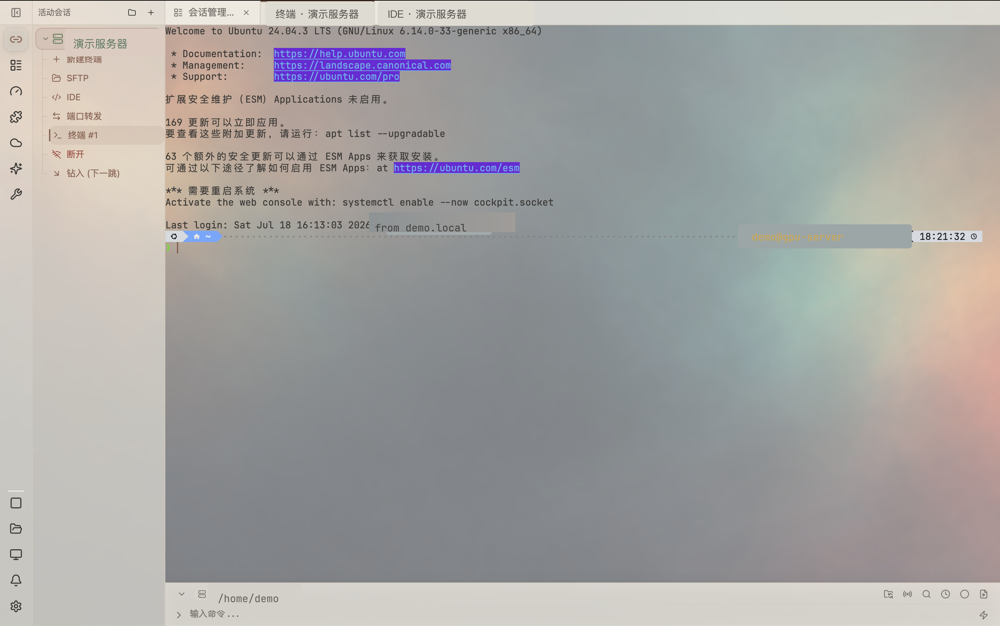
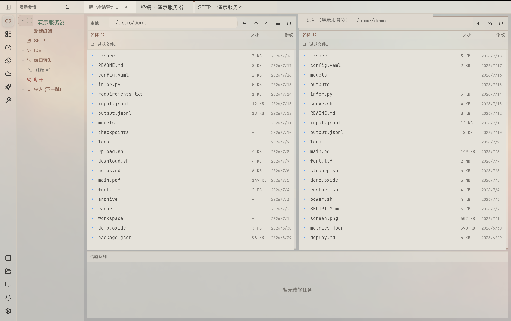
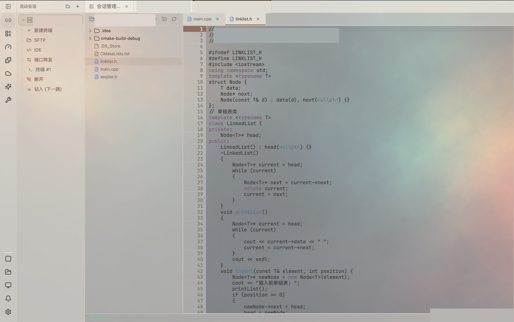
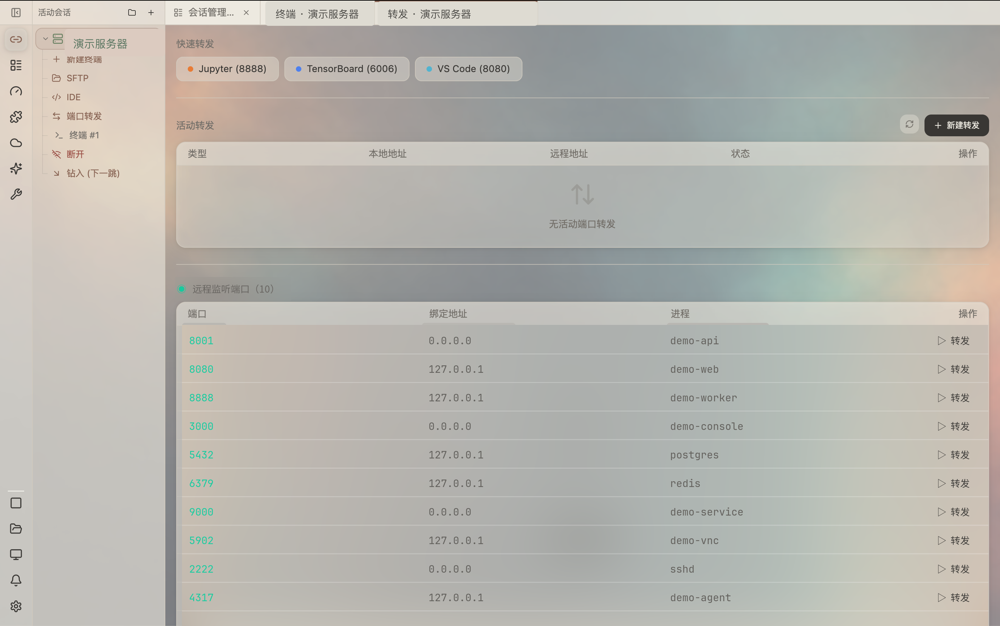
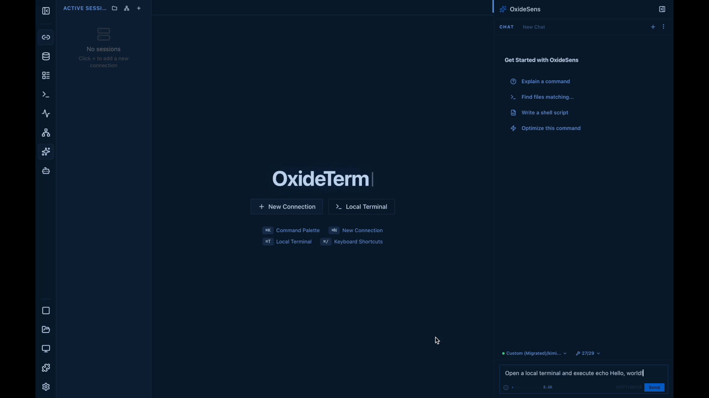

<div align="center">


# ⚡ OxideTerm

**Бесплатный нативный SSH-клиент и рабочее пространство для удалённых операций с AI-ассистентом на вашем собственном ключе.**

SSH · Mosh · Telnet · Serial · RDP/VNC · SFTP · проброс портов · встроенный редактор — всё в одном приложении с рендерингом на GPU.
Без аккаунта. Без подписки. Без телеметрии. Без Electron.

[](https://github.com/AnalyseDeCircuit/oxideterm/releases/latest)
[](#install)
[](../../LICENSE)
[](https://github.com/AnalyseDeCircuit/oxideterm/stargazers)

[**Скачать**](https://github.com/AnalyseDeCircuit/oxideterm/releases/latest) ·
[**Документация**](https://oxideterm.app) ·
[**Список изменений**](../../.github/release-notes/stable-changelog.md) ·
[**Сообщить о проблеме**](https://github.com/AnalyseDeCircuit/oxideterm/issues)

[English](../../README.md) | [简体中文](README.zh-Hans.md) | [繁體中文](README.zh-Hant.md) | [日本語](README.ja.md) | [한국어](README.ko.md) | [Français](README.fr.md) | [Deutsch](README.de.md) | [Español](README.es.md) | [Italiano](README.it.md) | [Português](README.pt-BR.md) | [Tiếng Việt](README.vi.md) | [Русский](README.ru.md)

</div>

---

## Быстрый старт

1. **Установите OxideTerm.** Скачайте пакет из [последнего релиза](https://github.com/AnalyseDeCircuit/oxideterm/releases/latest); особенности платформ описаны ниже в разделе [Установка](#install).
2. **Добавьте сервер.** Откройте менеджер сессий и создайте SSH-подключение или импортируйте хосты из вашего `~/.ssh/config`.
3. **Подключитесь.** Откройте терминал. Ключи хостов проверяются по `~/.ssh/known_hosts`.
4. **Используйте остальное рабочее пространство.** Откройте SFTP, проброс портов или встроенный редактор на том же узле. По умолчанию они используют одно SSH-соединение.
5. **Опционально: включите AI.** В настройках добавьте собственный эндпоинт OpenAI, Anthropic, Gemini, Ollama или любой совместимый с OpenAI, чтобы включить OxideSens.

С обзором возможностей можно ознакомиться в [документации](https://oxideterm.app).

---

## Что вы получаете

| | |
|---|---|
| **Терминалы и протоколы** | Локальные оболочки, SSH, Mosh, Telnet, Serial, разделённые панели, маршруты через несколько узлов, SSH-агент и проброс агента, 2FA и учётные данные TOTP, проброс X11, интеграция с оболочкой, метки команд, настраиваемые журналы сессий, запись, графика Sixel и Kitty, передачи trzsz |
| **tmux и broadcast** | Нативный режим управления `tmux -CC` с раскладками панелей и перетаскиваемыми разделителями, именованные broadcast-группы и расширенная отправка команд сразу нескольким целям для запланированных повторяемых действий |
| **Надёжность** | Переподключение Grace Period сохраняет TUI-приложения при кратковременных обрывах сети, а затем восстанавливает пробросы, передачи и открытые файлы редактора |
| **Файлы и редактирование** | Двухпанельный менеджер SFTP, очереди передач с ограничением скорости и оценкой времени, закладки, встроенный удалённый редактор с безопасной записью, обработкой конфликтов и восстановлением рабочего пространства |
| **Сеть** | Локальный, удалённый и динамический SOCKS5-проброс, сохранённые правила, обнаружение удалённых портов, топология соединений, отладка сокетов на лету |
| **Удалённый рабочий стол** | Встроенные RDP и VNC с поддержкой буфера обмена и ввода |
| **Операции на хосте** | Мониторинг процессов, служб, журналов, портов, задач, дисков, пакетов, контейнеров и tmux |
| **AI и автоматизация** | OxideSens на вашем ключе, MCP, локальный RAG, Agent Skills, одобряемые действия в рабочем пространстве, автономная CLI |
| **Контроль и аудит** | Опциональное рабочее пространство уведомлений и аудита, а также зашифрованные записи сессий (оба отключены по умолчанию) |
| **Синхронизация и переносимость** | Шифрованная облачная синхронизация, портативные пакеты `.oxide` |
| **Персонализация** | Темы, фоновые изображения, настраиваемые сочетания клавиш, быстрые команды, 11 языков интерфейса |

---

## Почему OxideTerm

- **Бесплатно и с приоритетом локальной работы.** Без аккаунта, подписки и телеметрии. Ваши подключения и рабочие данные остаются под вашим контролем.
- **Одно рабочее пространство на сервер.** Терминал, SFTP, проброс портов, RDP/VNC, редактор, мониторинг и AI работают с одним узлом, а не как разрозненные утилиты.
- **Нативное приложение, а не замаскированный браузер.** Интерфейс отрисовывается напрямую на GPU с помощью [GPUI](https://github.com/zed-industries/zed/tree/main/crates/gpui). Никакого Electron и встроенной WebView.
- **AI на ваших условиях.** OxideSens использует вашего провайдера и ваш ключ и выполняет только те действия, которые вы одобряете.
- **Устойчивые соединения.** Переподключение Grace Period в течение 30 секунд проверяет старое соединение перед его заменой, поэтому TUI-приложения переживают кратковременные обрывы сети.
- **SSH на чистом Rust.** Стек SSH использует `russh` с `ring`, без OpenSSL и libssh2.

---

## Потребление памяти

**Нативная версия сократила потребление памяти в простое примерно до четверти прежнего уровня на macOS и примерно до одной восьмой на Windows.** Это зафиксированные мейнтейнером наблюдения при переходе с Tauri 1.x на нативный GPUI 2.0:

| Платформа | Tauri 1.x (простой) | Нативная 2.0 (простой) | Снижение |
|---|---:|---:|---:|
| macOS | 318.7 MB | 81.3 MB | Около 74% |
| Windows | 182.4 MB | 23.5 MB | Около 87% |

Суммарный показатель старой версии включает OxideTerm и связанные с ним процессы WebView. Нативной версии эти браузерные процессы больше не нужны.


---

## Скриншоты

| SSH-терминал с OxideSens | Менеджер файлов SFTP |
|---|---|
|  |  |

| Встроенная IDE | Умный проброс портов |
|---|---|
|  |  |

<details>
<summary><b>Смотрите, как OxideSens открывает терминал по запросу на естественном языке</b></summary>

<a href="../../docs/media/ai-terminal-demo.mp4">
  
</a>

</details>

---

## OxideSens AI

OxideSens — опциональный ассистент, который может просматривать ваши активные сессии и выполнять действия в рабочем пространстве **только после вашего одобрения**.

- **Собственный ключ.** Работает с OpenAI, Anthropic (Claude), Google Gemini, Ollama и любым эндпоинтом, совместимым с OpenAI, с настройками режима рассуждений под конкретного провайдера. Никаких платформенных кредитов.
- **MCP и Agent Skills.** Подключайте MCP-серверы (stdio и SSE) и загружайте Agent Skills с ограниченной областью действия.
- **Локальная база знаний (RAG).** Полнотекстовый поиск BM25 плюс векторный индекс.
- **Вы управляете контекстом.** Вы сами решаете, какой контекст рабочего пространства и какие действия одобрены; при этом действуют правила политики команд.
- **Маскирование учётных данных.** Сообщения, отправляемые провайдеру, проходят через маскирование по шаблонам учётных данных.
- **Ключи хранятся в хранилище ключей вашей ОС** и не попадают в структурированные журналы.

---

<a id="plugins"></a>

## Плагины

OxideTerm поддерживает три типа плагинов:

| Тип | Как выполняется | Границы |
|---|---|---|
| **Только манифест** | Декларативные расширения без кода | Нет исполняемого кода |
| **WASM** | Wasmtime/WASI или сайдкар | Контролируемые вызовы хоста, ограничение по полномочиям |
| **Процесс** | Обычный локальный процесс | Доверенный локальный код, **без** песочницы ОС |

Устаревшие ESM-плагины Tauri (1.x) могут числиться в списке, но нативное приложение 2.x их не выполняет. Устанавливайте процессные плагины только из доверенных источников.

---

## Безопасность и приватность

| Тема | Как это устроено |
|---|---|
| **Сохранённые учётные данные** | Хранилище ключей ОС (Keychain в macOS, Диспетчер учётных данных Windows, libsecret) |
| **Секреты в памяти** | Типы с секретными данными и временные буферы используют `zeroize` на поддерживаемых границах владения |
| **Ключи хостов** | Доверие при первом использовании по `~/.ssh/known_hosts`; неожиданные изменения отклоняются |
| **Портативные экспорты** | Пакеты `.oxide` используют ChaCha20-Poly1305 с Argon2id (256 MB памяти, 4 итерации) |
| **AI-контекст** | Маскирование по шаблонам учётных данных до отправки провайдеру; контекст и действия одобряете вы |
| **Записи сессий** | Отключены по умолчанию; хранятся в зашифрованном виде на вашем устройстве и исключены из облачной синхронизации; нажатия клавиш не записываются |
| **Аудит** | Отключён по умолчанию; данные остаются на вашем устройстве, чувствительные детали шифруются |
| **Изменения через CLI** | Планы dry-run, защита `--yes` и резервные копии для откката при командах, меняющих состояние |
| **Плагины** | См. [Плагины](#plugins) |
| **Телеметрия** | Нет |

**Законное использование.** OxideTerm распространяется по лицензии GPL-3.0-only без дополнительных ограничений. Получайте доступ только к системам, сетям и устройствам, которыми вы владеете или на которые у вас есть явное разрешение, и соблюдайте действующее законодательство. Не используйте OxideTerm для несанкционированного доступа, нарушения работы сервисов или обхода средств контроля доступа.

---

## Текущие ограничения

Мы хотим, чтобы вы знали об этом до установки:

- Только настольные системы (macOS, Windows, Linux). Мобильного приложения нет.
- Проект развивается быстро, релизы выходят часто. См. [список изменений](../../.github/release-notes/stable-changelog.md) и [открытые issues](https://github.com/AnalyseDeCircuit/oxideterm/issues).
- Аудит и запись сессий включаются вручную и отражают только то, что может наблюдать сам OxideTerm.
- Процессные плагины не изолируются песочницей ОС.
- Если рендеринг не работает на вашем компьютере, попробуйте профиль совместимости: `OXIDETERM_RENDER_PROFILE=compatibility`.

---

<a id="for-developers"></a>

## Для разработчиков

<details>
<summary><b>Запуск из исходников</b></summary>

**Требования:** тулчейн Rust (edition 2024) и настольная среда, в которой может работать GPUI.

```bash
# Run the app
cargo run

# If the renderer fails on your machine
OXIDETERM_RENDER_PROFILE=compatibility cargo run

# Build the headless CLI companion
./scripts/build/build-cli.sh

# Build the optional Linux remote agent
./scripts/build/build-agent.sh
```

Через Nix: `nix build .#oxideterm`, `nix run .#oxideterm` или `nix develop`.

Артефакты CLI помещаются в `crates/oxideterm-gpui-app/resources/cli-bin/<target-triple>/oxideterm`.

</details>

<details>
<summary><b>Интерфейс командной строки</b></summary>

CLI `oxideterm` работает без графического интерфейса и без запуска приложения, что удобно для автоматизации, CI и диагностики. Он охватывает настройки, подключения, пробросы портов, плагины, быстрые команды, секреты, портативные пакеты, диагностику, отчёты, пакетные планы, резервные копии и облачную синхронизацию.

```bash
cargo run -p oxideterm-cli -- doctor --strict
cargo run -p oxideterm-cli -- settings validate --strict --json
cargo run -p oxideterm-cli -- connections search prod
cargo run -p oxideterm-cli -- forwards list --format json
cargo run -p oxideterm-cli -- cloud-sync push --dry-run --json
cargo run -p oxideterm-cli -- oxide export ./profile.oxide --connection prod --password-stdin
cargo run -p oxideterm-cli -- report --bundle ./oxideterm-report.zip
cargo run -p oxideterm-cli -- completion install zsh --force

# Path and profile isolation for CI or fixtures
cargo run -p oxideterm-cli -- --config-dir ./fixture-config doctor --strict
```

</details>

<details>
<summary><b>Архитектура</b></summary>

Интерфейс и терминальный/SSH-бэкенд работают в одном процессе Rust; опциональные удалённые агенты и платформенные помощники находятся за этой границей. Байты терминала изменяют `TerminalState` напрямую, а GPUI рендерит из этого состояния — без промежуточных шагов с JSON, WebSocket, Base64 или xterm.js.

```
┌─────────────────────────────────────────────────┐
│               GPUI Render Loop                  │
│   WorkspaceApp  ·  Tab surfaces  ·  GPUI views  │
└──────────────────────┬──────────────────────────┘
                       │  in-process Arc<> / async
┌──────────────────────▼──────────────────────────┐
│             Domain Crates (Rust async)          │
│  NodeRouter → SshConnectionRegistry             │
│  TerminalState ← SSH PTY channel (russh)        │
│  SftpSession · ForwardingRuntime · IdeWorkspace │
│  Ai/ACP Entities · CloudSync · Plugin Runtimes  │
└─────────────────────────────────────────────────┘
```

| Аспект | Подход со встроенным браузером | OxideTerm |
|---|---|---|
| Рендеринг | Браузерный движок и веб-вёрстка | GPUI на поверхности GPU |
| Поток терминальных данных | WebSocket → цикл событий JS → xterm.js | Ввод в Rust → `TerminalState` → рендеринг GPUI |
| Жизненный цикл соединения | Разделён между фронтендом и бэкендом | Единый конвейер соединения и переподключения внутри процесса |
| AI-контекст | Копируется через мост приложения | Собирается из активного рабочего пространства с одобрением пользователя |
| CLI | Требует запущенного настольного приложения | Автономный бинарный файл с прямой линковкой крейтов |

**Пул соединений.** `SshConnectionRegistry` построен на `DashMap` и используется через `NodeRouter`. Панели терминала, SFTP, пробросы портов и редактор могут использовать одно физическое SSH-соединение на узел, а политика терминала может требовать выделенное соединение. Каждое соединение проходит путь `connecting → active → idle → link_down → reconnecting`. Сбой jump-хоста переводит нижестоящие узлы в состояние `link_down`. AI и плагины используют хэндлы полномочий и снимки состояния хоста вместо регистрации в качестве потребителей соединения.

**Переподключение Grace Period.**

1. Обнаружить таймаут keepalive.
2. Снять снимок панелей терминала, передач SFTP, пробросов и файлов редактора.
3. Проверять старое соединение в течение 30 с, чтобы TUI-приложения пережили кратковременные обрывы сети.
4. Открыть новое соединение, восстановить пробросы, возобновить передачи и снова открыть файлы редактора.

Сессии SFTP привязаны к поколению соединения: после переподключения подходящая сессия получается заново, но операция из старого поколения никогда не переносится на новое соединение молча.

**Проброс портов.** Отдельный крейт поддерживает `-L`, `-R` и `-D` (SOCKS5). Каждым SSH-каналом владеет единственная задача `ssh_io`, поэтому на горячем пути нет разделяемого мьютекса.

**SSH на чистом Rust.** `russh` с `ring`: полная поддержка SSH2, ChaCha20-Poly1305 и AES-GCM, ключи Ed25519/RSA/ECDSA, SSH-агент в Unix (`SSH_AUTH_SOCK`) и Windows (`\\.\pipe\openssh-ssh-agent`), а также цепочки через несколько узлов с независимой аутентификацией на каждом.

**Технологии**

| Слой | Технология |
|---|---|
| Интерфейс | GPUI (GPU-фреймворк интерфейса от Zed) |
| Среда выполнения | Tokio, DashMap |
| SSH | `russh` с `ring` (без OpenSSL и libssh2) |
| Локальный PTY | `portable-pty` (ConPTY в Windows) |
| Эмуляция терминала | `alacritty_terminal` (VT100–VT500, графика Sixel и Kitty) |
| Редактор | Подсветка синтаксиса tree-sitter, собственный буфер |
| Шифрование | ChaCha20-Poly1305, Argon2id |
| Плагины | Wasmtime/WASI, WASM-сайдкар и процессные плагины |
| AI-стриминг | SSE (OpenAI, Anthropic, Gemini), внутри процесса |
| RAG | BM25 + векторный индекс HNSW со слиянием рангов, токенизатор CJK-биграмм |
| i18n | `oxideterm-i18n` (11 локалей) |

</details>

---

<a id="install"></a>

## Установка

[**Скачать последний релиз**](https://github.com/AnalyseDeCircuit/oxideterm/releases/latest)

| ОС | x64 | ARM64 |
|---|---|---|
| **macOS** | DMG (Intel) | DMG (Apple Silicon) |
| **Windows** | Установщик (`.exe`) | Установщик (`.exe`) |
| **Linux** | AppImage · `.deb` · `.rpm` | AppImage · `.deb` · `.rpm` |

Проверьте загруженный файл по ассету `sha256sums.txt` на странице релиза. Там же перечислены портативные архивы и подписи.

### macOS

Если Gatekeeper блокирует приложение, снимите атрибут карантина:

```bash
xattr -cr /Applications/OxideTerm.app
```

### Windows

Если SmartScreen показывает предупреждение, выберите **Подробнее → Все равно выполнить**.

### Linux

```bash
# AppImage
chmod +x OxideTerm_*_linux_*.AppImage && ./OxideTerm_*_linux_*.AppImage

# Debian / Ubuntu
sudo dpkg -i OxideTerm_*_linux_*.deb && sudo apt-get install -f

# Fedora / RHEL-compatible
sudo dnf install ./OxideTerm_*_linux_*.rpm

# Nix; updates are managed by Nix
nix run github:AnalyseDeCircuit/oxideterm
```

Предпочитаете собрать сами? См. **Запуск из исходников** в разделе [Для разработчиков](#for-developers).

---

## Участие в разработке

Вклад приветствуется: код на Rust, документация, переводы, плагины, тестирование и воспроизведение ошибок. Для крупных изменений сначала откройте issue для обсуждения.

Отчёты об ошибках особенно полезны с диагностическим пакетом, из которого удалены чувствительные данные:

```bash
cargo run -p oxideterm-cli -- report --bundle ./oxideterm-report.zip
```

Приоритет отдаётся воспроизводимым ошибкам и регрессиям. Запросы новых функций рассматриваются с точки зрения объёма, безопасности и соответствия направлению OxideTerm как рабочего пространства для удалённых серверов. Если OxideTerm помогает вам в работе, звезда на GitHub, воспроизводимый отчёт об ошибке, исправление перевода или плагин помогут проекту развиваться.

### Участники

Благодарим всех, кто делает OxideTerm лучше.

<p align="center">
  <a href="https://github.com/AnalyseDeCircuit/oxideterm/graphs/contributors">
    
  </a>
</p>

---

## Лицензия

**GPL-3.0-only.** Атрибуции зависимостей приведены в [`THIRD_PARTY_NOTICES.md`](../../THIRD_PARTY_NOTICES.md), дополнительные уведомления — в [`NOTICE`](../../NOTICE).

**Создано с использованием:** [russh](https://github.com/warp-tech/russh) · [GPUI](https://github.com/zed-industries/zed/tree/main/crates/gpui) · [alacritty_terminal](https://github.com/alacritty/alacritty) · [portable-pty](https://github.com/wez/wezterm/tree/main/pty) · [wasmtime](https://wasmtime.dev/) · [tree-sitter](https://tree-sitter.github.io/)
